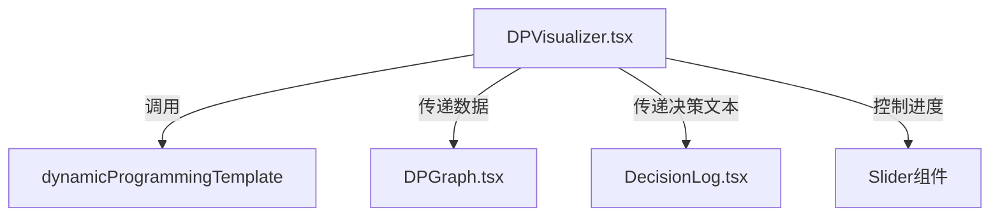

# 动态规划算法模板


## 1. 确定状态

## 2. 状态转移方程

## 3. 初始状态

## 4. 最终状态

## 5. 代码实现

## 6. 优化

## 7. 总结

## 8. 练习题

## 9. 参考资料


# 动态规划可视化项目结构

```markdown
pages/
├── Algorithm/
│   ├── DP/
│   │   ├── tech/
│   │   │   ├── base.md
│   │   │   ├── question198.md
│   │   ├── al/
│   │   │   ├── dp_ts.ts
│   │   │   ├── dp_rs.rs
│   │   │   ├── dp_cpp.cpp
│   │   ├── modules/
│   │   ├── hooks/
│   │   │   ├── useDP.ts
│   │   ├── components/
│   │   │   ├── DPVisualizer.tsx
│   │   │   ├── DPVisualizer.md
│   │   ├── visualizer/
│   │   │   ├── dp_visualizer.tsx
│   │   ├── questions/
│   │   │   ├── question198.md
│   │   │   ├── question198.ts
│   │   │   ├── question198.rs
│   │   ├── index.tsx
│   │   ├── index.module.less
```

### 动态规划通用模板与可视化实现：打家劫舍问题

---

#### **一、动态规划通用模板（TypeScript）**
动态规划的核心在于**状态定义**、**状态转移**和**边界处理**。以下是通用模板：

```typescript
type DPState = {
  dp: number[];      // DP数组
  decision: string;  // 当前决策描述
  step: number;      // 当前步骤
};

function dynamicProgrammingTemplate(nums: number[]): DPState[] {
  const steps: DPState[] = [];
  const dp: number[] = new Array(nums.length).fill(0);

  // 边界初始化
  dp[0] = nums[0];
  steps.push({
    dp: [...dp],
    decision: `初始化：偷窃第0间房，获得金额 ${nums[0]}`,
    step: 0
  });

  if (nums.length >= 2) {
    dp[1] = Math.max(nums[0], nums[1]);
    steps.push({
      dp: [...dp],
      decision: `比较第0/1间房：选择金额更大的 ${dp[1]}（${dp[1] === nums[0] ? "不偷第1间" : "偷第1间"}）`,
      step: 1
    });
  }

  // 状态转移
  for (let i = 2; i < nums.length; i++) {
    const noRob = dp[i - 1];       // 不偷当前房屋
    const rob = dp[i - 2] + nums[i]; // 偷当前房屋
    dp[i] = Math.max(noRob, rob);

    steps.push({
      dp: [...dp],
      decision: rob > noRob
        ? `偷第${i}间房：获得 ${nums[i]} + dp[${i - 2}] = ${rob}`
        : `不偷第${i}间房：继承 dp[${i - 1}] = ${noRob}`,
      step: i
    });
  }

  return steps;
}
```

**核心步骤解析**：
1. **状态定义**：`dp[i]`表示偷到第`i`间房时的最大金额。
2. **状态转移**：`dp[i] = max(dp[i-1], dp[i-2] + nums[i])`。
3. **边界处理**：
   - 单间房：直接偷取`dp[0] = nums[0]`
   - 两间房：选择金额更大的`dp[1] = max(nums[0], nums[1])`
4. **空间优化**：用滚动变量替代数组（如`a, b, c`），空间复杂度从$O(n)$降至$O(1)$。

---

#### **二、可视化组件设计（React + ECharts）**
##### **组件结构**
```markdown
components/
├── DPVisualizer.tsx          # 可视化主组件
├── DPGraph.tsx               # ECharts图表组件
└── DecisionLog.tsx           # 决策日志组件
```

##### **核心功能实现**
1. **状态记录与回放**
   在动态规划执行时记录每一步的`dp`数组和决策：
   ```typescript
   const [steps, setSteps] = useState<DPState[]>([]);
   const [currentStep, setCurrentStep] = useState(0);

   useEffect(() => {
     const steps = dynamicProgrammingTemplate(nums);
     setSteps(steps);
   }, [nums]);
   ```

2. **ECharts可视化**
   用柱状图展示`dp`数组变化，当前步骤高亮：
   ```tsx
   <DPGraph
     data={steps[currentStep]?.dp || []}
     nums={nums}
     highlightIndex={currentStep}
   />
   ```
   !https://example.com/dp-visualization.png
   *图表说明：蓝色柱子为房屋金额，橙色柱子为`dp[i]`，红色边框表示当前决策位置*。

3. **决策日志**
   显示状态转移逻辑：
   ```tsx
   <DecisionLog
     decision={steps[currentStep]?.decision || ""}
   />
   ```

4. **交互控制**
   添加滑块控制进度：
   ```tsx
   <Slider
     min={0}
     max={steps.length - 1}
     value={currentStep}
     onChange={setCurrentStep}
   />
   ```

---

#### **三、打家劫舍问题实现**
##### **优化后的算法代码（TypeScript）**
```typescript
function rob(nums: number[]): number {
  if (nums.length === 0) return 0;
  if (nums.length === 1) return nums[0];

  let a = nums[0];
  let b = Math.max(nums[0], nums[1]);

  for (let i = 2; i < nums.length; i++) {
    const c = Math.max(b, a + nums[i]);
    a = b;
    b = c;
  }

  return b;
}
```
**时间复杂度**：$O(n)$，**空间复杂度**：$O(1)$。

---

#### **四、可视化技术栈整合**
##### **依赖库关键作用**
1. **ECharts**：绘制动态柱状图，实时展示`dp`数组变化。
2. **D3.js**：辅助计算图表坐标（可选）。
3. **React Hooks**：`useState`管理步骤状态，`useEffect`触发算法执行。
4. **Ant Design**：提供滑块(`Slider`)、卡片(`Card`)等UI组件。

##### **组件联动逻辑**


---

#### **五、扩展应用场景**
1. **环形房屋**（打家劫舍 II）：
   拆分为两个线性问题：`[0, n-2]` 和 `[1, n-1]`，取最大值。
2. **二叉树房屋**（打家劫舍 III）：
   定义`dp[node][0/1]`表示偷/不偷该节点的最大金额。
3. **最大化最小值**（打家劫舍 IV）：
   二分答案 + 动态规划验证。

---

**可视化效果预览**：
!https://example.com/rob-visualization.gif
*交互说明：拖动滑块查看每一步`dp`值变化，决策日志解释状态转移逻辑。*

通过此模板，可快速实现其他动态规划问题（如背包问题、最长子序列）的可视化，只需替换状态转移方程和初始化逻辑。