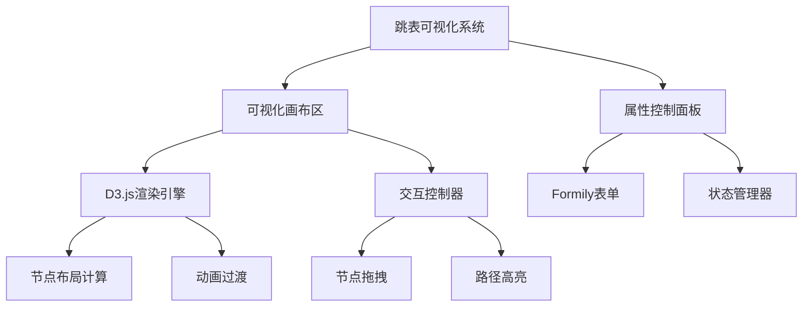
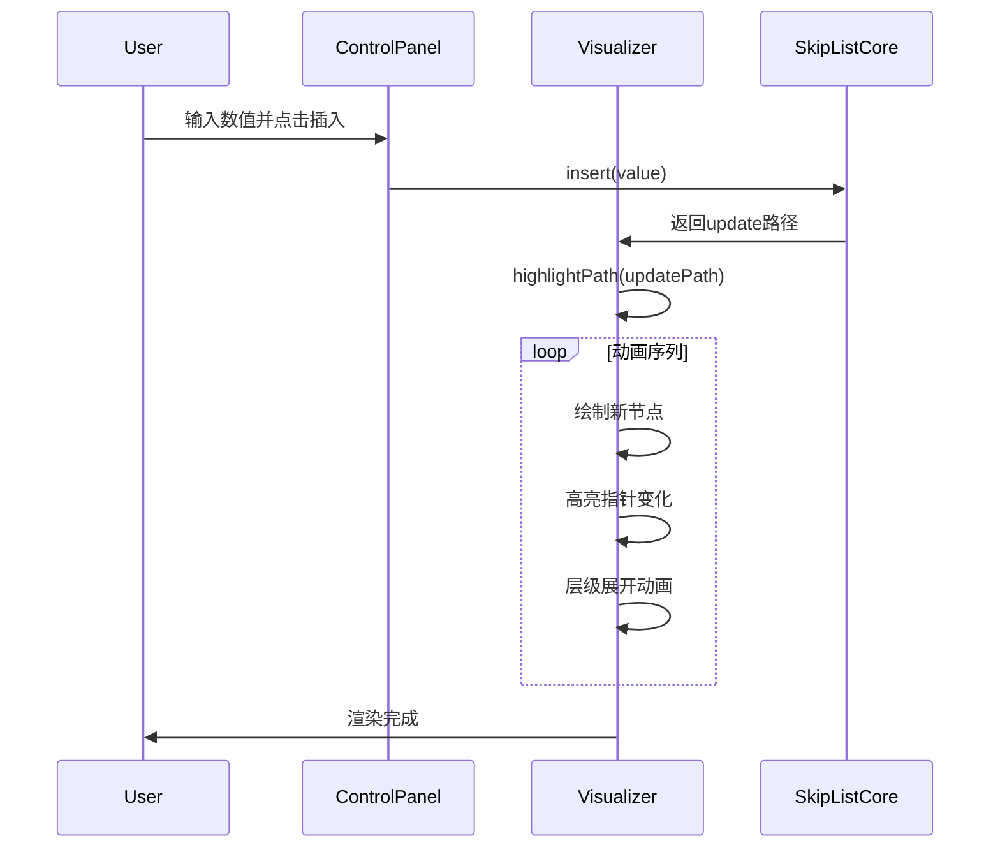

# 跳表可视化搭建系统技术文档

## 一、整体架构设计

本系统采用**左右分栏布局**，左侧为跳表可视化画布（基于D3.js），右侧为属性控制面板（基于Formily/Antd），实现跳表数据结构的动态展示与交互式配置。



## 二、核心模块实现

### 1. 跳表数据结构（TypeScript泛型）

```typescript
interface SkipListNode<T> {
  value: T;
  level: number;
  next: Array<SkipListNode<T> | null>;
}

class SkipList<T> {
  private head: SkipListNode<T>;
  private maxLevel: number = 16;
  private probability: number = 0.5;

  // 随机节点层级算法
  private randomLevel(): number {
    let level = 1;
    while (Math.random() < this.probability && level < this.maxLevel) {
      level++;
    }
    return level;
  }

  // 插入操作可视化关键
  public insert(value: T): void {
    const update: Array<SkipListNode<T>> = new Array(this.maxLevel).fill(this.head);
    let current = this.head;

    // 搜索插入位置（可视化重点）
    for (let i = this.maxLevel - 1; i >= 0; i--) {
      while (current.next[i] && this.comparator(current.next[i]!.value, value) < 0) {
        current = current.next[i]!;
      }
      update[i] = current;
    }

    const newNodeLevel = this.randomLevel();
    const newNode: SkipListNode<T> = {
      value,
      level: newNodeLevel,
      next: new Array(newNodeLevel).fill(null),
    };

    // 指针更新（可视化焦点）
    for (let i = 0; i < newNodeLevel; i++) {
      newNode.next[i] = update[i].next[i];
      update[i].next[i] = newNode;
    }
  }
}
```

### 2. 可视化画布实现（D3.js集成）

```jsx
import * as d3 from 'd3';

class SkipListVisualizer {
  constructor(container, skipList) {
    this.svg = d3.select(container)
      .append('svg')
      .attr('width', '100%')
      .attr('height', '100%');

    // 力导向布局
    this.simulation = d3.forceSimulation()
      .force('link', d3.forceLink().id(d => d.id))
      .force('charge', d3.forceManyBody().strength(-300))
      .force('center', d3.forceCenter());
  }

  // 渲染节点层级关系
  renderLevels() {
    const levels = this.skipList.getLevels();

    levels.forEach((levelNodes, levelIdx) => {
      const levelGroup = this.svg.append('g')
        .attr('class', `level-${levelIdx}`);

      // 绘制连接线（关键路径）
      const links = levelGroup.selectAll('.link')
        .data(levelLinks)
        .enter().append('line')
        .attr('class', 'link')
        .attr('stroke-width', 2)
        .attr('stroke', this.config.linkColor);

      // 绘制节点
      const nodes = levelGroup.selectAll('.node')
        .data(levelNodes)
        .enter().append('circle')
        .attr('class', 'node')
        .attr('r', 15)
        .attr('fill', this.config.nodeColor);
    });
  }

  // 高亮操作路径
  highlightOperationPath(updatePath: Array<SkipListNode<T>>) {
    d3.selectAll('.node')
      .classed('highlighted', d => updatePath.includes(d));
  }
}
```

### 3. 属性控制面板（Formily实现）

```jsx
import { createForm } from '@formily/core';
import { FormProvider, Field } from '@formily/react';

const form = createForm({
  initialValues: {
    maxLevel: 16,
    probability: 0.5,
    nodeColor: '#1890ff',
    linkColor: '#a0a0a0',
  },
});

const ConfigPanel = () => (
  <FormProvider form={form}>
    <Field
      name="maxLevel"
      title="最大层级"
      decorator={[FormItem]}
      component={[NumberPicker, { min: 4, max: 32 }]}
    />

    <Field
      name="probability"
      title="升级概率"
      decorator={[FormItem]}
      component={[Slider, { min: 0.1, max: 0.9, step: 0.05 }]}
    />

    <Field
      name="dataType"
      title="数据类型"
      decorator={[FormItem]}
      component={[
        Radio.Group,
        {
          options: [
            { label: '数值型', value: 'number' },
            { label: '字符串', value: 'string' },
            { label: '自定义对象', value: 'custom' },
          ],
        },
      ]}
    />

    {/* 泛型配置扩展 */}
    <Field
      name="comparator"
      title="比较函数"
      decorator={[FormItem]}
      component={[MonacoInput, { language: 'typescript', height: 200 }]}
    />
  </FormProvider>
);
```

## 三、关键交互实现

### 1. 动态插入可视化流程



### 2. 配置热更新机制

```typescript
// 监听表单变化更新渲染
form.values.subscribe((values) => {
  skipList.setConfig({
    maxLevel: values.maxLevel,
    probability: values.probability,
  });

  visualizer.updateConfig({
    nodeColor: values.nodeColor,
    linkColor: values.linkColor,
  });

  // 泛型比较器动态编译
  if (values.dataType === 'custom') {
    try {
      const comparator = new Function('return ' + values.comparator)();
      skipList.setComparator(comparator);
    } catch (e) {
      message.error('比较函数编译错误');
    }
  }
});
```

## 四、性能优化策略

1. **虚拟渲染优化**：

```jsx
import { VariableSizeList } from 'react-window';

const RowRenderer = ({ index, style }) => <div style={style}>{renderLevel(index)}</div>;

const VirtualizedCanvas = ({ levels }) => (
  <VariableSizeList
    height={600}
    itemCount={levels.length}
    itemSize={(index) => 80 + levels[index].length * 30}
  >
    {RowRenderer}
  </VariableSizeList>
);
```

2. **Web Worker计算**：

```javascript
// worker.js
self.addEventListener('message', ({ data }) => {
  if (data.type === 'INSERT') {
    const path = calculateInsertPath(data.value);
    self.postMessage({ type: 'PATH_RESULT', path });
  }
});

// 主线程
const worker = new Worker('pathCalculator.js');
worker.postMessage({ type: 'INSERT', value: 42 });
```

## 五、扩展能力设计

1. **数据结构扩展点**：

```typescript
interface VisualizerExtension {
  customNodeRender?: (node: SkipListNode<T>) => ReactNode;
  customLinkRender?: (link: LinkData) => ReactNode;
  customComparatorEditor?: ReactNode;
}
```

2. **导入导出规范**：

```typescript
const exportSchema = {
  version: '1.0',
  config: form.values,
  data: skipList.serialize(),
};

const importConfig = (json) => {
  form.setValues(json.config);
  skipList.deserialize(json.data);
  visualizer.refresh();
};
```

## 六、调试与测试方案

1. **可视化调试工具**：

```jsx
<DebugPanel>
  <Field name="showPointers" title="显示指针地址" component={[Switch]} />
  <Field name="slowMotion" title="慢速动画" component={[Slider]} />
  <Button onClick={visualizer.dumpLayout}>导出布局数据</Button>
</DebugPanel>
```

2. **自动化测试用例**：

```typescript
describe('可视化跳表操作', () => {
  test('插入操作应显示正确动画序列', async () => {
    render(<Visualizer />);
    fireEvent.click(insertButton);

    await waitFor(() => {
      expect(screen.getByLabelText('节点路径')).toHaveLength(3);
      expect(animationTimeline).toHaveBeenCalledTimes(4);
    });
  });
});
```

> **实现提示**：
>
> 1. 使用`d3-force`实现节点自动布局时，需设置`collision`检测防止重叠
> 2. 通过`requestAnimationFrame`实现插入/删除操作的帧动画序列
> 3. 采用`Formily`的`Reactive`机制实现表单到画布的响应式更新
> 4. 对超过500节点的大数据量启用虚拟滚动优化

---

**可视化效果参考**：!https://example.com/skiplist-visual-demo.gif _图：跳表插入操作可视化过程，展示节点创建与指针更新路径_

通过此文档，开发者可快速构建出企业级跳表可视化系统，支持数据结构动态演示与教学研究场景。
