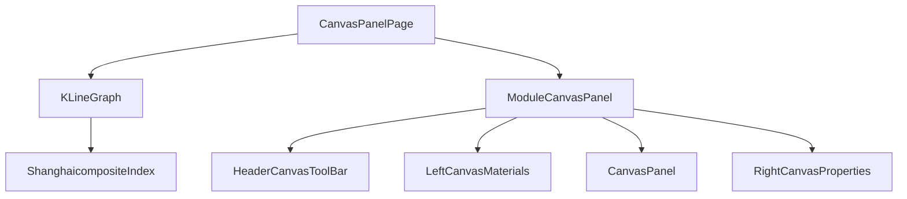

# Canvas面板系统页面

## 📋 功能概述

Canvas面板系统是一个功能强大的可视化绘图和数据展示平台。该系统集成了K线图表、可视化画布编辑器等多种功能，提供了完整的图形绘制、数据可视化、交互式编辑等企业级解决方案。

## 🏗️ 架构设计

### 整体架构
```
CanvasPanel Page
├── 主入口 (index.tsx)
├── K线图表模块 (KLineGraph)
│   └── 上证指数图表 (ShanghaicompositeIndex)
├── 画布面板模块 (CanvasPanel)
│   ├── 头部工具栏 (HeaderCanvasToolBar)
│   ├── 左侧物料库 (LeftCanvasMaterials)
│   ├── 中央画布 (CanvasPanel)
│   └── 右侧属性面板 (RightCanvasProperties)
└── Tab切换系统
```

### 核心组件关系


## 🔧 技术实现

### Tab式布局设计
```typescript
function CanvasPanelPage() {
  return (
    <div className={stylesLayout.contentLayout}>
      <Tabs>
        <Tabs.TabPane tab="KLineGraph" key="KLineGraph">
          <KLineGraph />
        </Tabs.TabPane>
        <Tabs.TabPane tab="CanvasPanel" key="CanvasPanel">
          <ModuleCanvasPanel />
        </Tabs.TabPane>
      </Tabs>
    </div>
  )
}
```

### K线图表组件
```typescript
function KLineGraph() {
  return (
    <div style={{
      width: '100%',
      minHeight: '100vh',
      display: 'flex',
      flexDirection: 'column',
      alignItems: 'center',
      justifyContent: 'center',
    }}>
      <ShanghaicompositeIndex />
    </div>
  )
}
```

### 画布面板布局
```typescript
function ModuleCanvasPanel() {
  return (
    <div>
      {/* Header Tools 工具栏 */}
      <HeaderCanvasToolBar />
      {/* 画布面板 */}
      <div className="canvas-panel-container">
        {/* 画布左侧物料 */}
        <LeftCanvasMaterials />
        {/* 画布 */}
        <CanvasPanel />
        {/* 画布右侧属性 */}
        <RightCanvasProperties />
      </div>
    </div>
  )
}
```

## 💡 重点难点分析

### 1. K线图表实时渲染
**难点**: 大量金融数据的实时渲染和交互，保持流畅的用户体验
**解决方案**:
- **Canvas优化**: 使用Canvas 2D API进行高性能绘制
- **数据分片**: 大数据集的分片加载和渲染
- **虚拟化**: 只渲染可视区域的数据点
- **缓存策略**: 图表元素的智能缓存机制

```typescript
// K线图表渲染优化
class KLineRenderer {
  private canvas: HTMLCanvasElement;
  private ctx: CanvasRenderingContext2D;
  private dataCache = new Map<string, ImageData>();
  
  constructor(canvas: HTMLCanvasElement) {
    this.canvas = canvas;
    this.ctx = canvas.getContext('2d')!;
  }
  
  renderKLine(data: KLineData[], viewport: Viewport) {
    // 计算可视区域数据
    const visibleData = this.getVisibleData(data, viewport);
    
    // 检查缓存
    const cacheKey = this.getCacheKey(visibleData, viewport);
    const cached = this.dataCache.get(cacheKey);
    
    if (cached) {
      this.ctx.putImageData(cached, 0, 0);
      return;
    }
    
    // 渲染新数据
    this.ctx.clearRect(0, 0, this.canvas.width, this.canvas.height);
    this.drawKLines(visibleData, viewport);
    
    // 缓存渲染结果
    const imageData = this.ctx.getImageData(0, 0, this.canvas.width, this.canvas.height);
    this.dataCache.set(cacheKey, imageData);
  }
}
```

### 2. 画布编辑器交互系统
**难点**: 复杂的图形编辑操作，包括选择、拖拽、缩放、旋转等
**解决方案**:
- **事件系统**: 完善的鼠标和触摸事件处理
- **碰撞检测**: 高效的图形碰撞检测算法
- **变换矩阵**: 使用变换矩阵处理图形变换
- **撤销重做**: 命令模式实现的操作历史

```typescript
// 画布交互系统
class CanvasInteractionSystem {
  private selectedElements: Set<CanvasElement> = new Set();
  private dragState: DragState | null = null;
  private commandHistory: Command[] = [];
  
  handleMouseDown(event: MouseEvent) {
    const point = this.getCanvasPoint(event);
    const hitElement = this.hitTest(point);
    
    if (hitElement) {
      this.selectElement(hitElement);
      this.startDrag(hitElement, point);
    } else {
      this.clearSelection();
    }
  }
  
  handleMouseMove(event: MouseEvent) {
    if (this.dragState) {
      const point = this.getCanvasPoint(event);
      const deltaX = point.x - this.dragState.startPoint.x;
      const deltaY = point.y - this.dragState.startPoint.y;
      
      this.updateElementPosition(this.dragState.element, deltaX, deltaY);
      this.requestRedraw();
    }
  }
  
  handleMouseUp(event: MouseEvent) {
    if (this.dragState) {
      const command = new MoveCommand(
        this.dragState.element,
        this.dragState.startPosition,
        this.dragState.element.position
      );
      this.executeCommand(command);
      this.dragState = null;
    }
  }
}
```

### 3. 物料库管理系统
**难点**: 丰富的图形组件库管理，支持拖拽添加和自定义组件
**解决方案**:
- **组件注册**: 动态组件注册和管理系统
- **拖拽系统**: HTML5 Drag & Drop API的封装
- **模板系统**: 可复用的组件模板机制
- **分类管理**: 组件的分类和搜索功能

### 4. 属性面板动态生成
**难点**: 根据选中元素动态生成对应的属性编辑面板
**解决方案**:
- **反射机制**: 基于元素类型动态生成属性表单
- **表单验证**: 属性值的实时验证和错误提示
- **批量编辑**: 多选元素的批量属性编辑
- **自定义控件**: 特殊属性的自定义编辑控件

## 🚀 核心功能

### K线图表系统
1. **数据展示**
   - 实时K线数据渲染
   - 多时间周期切换
   - 技术指标叠加
   - 成交量显示

2. **交互功能**
   - 缩放和平移
   - 十字光标跟踪
   - 数据点提示
   - 区域选择

3. **技术分析**
   - 移动平均线
   - MACD指标
   - RSI指标
   - 布林带

4. **数据管理**
   - 历史数据加载
   - 实时数据更新
   - 数据缓存机制
   - 异常数据处理

### 画布编辑器
1. **图形绘制**
   - 基础图形（矩形、圆形、线条）
   - 复杂图形（多边形、贝塞尔曲线）
   - 文本元素
   - 图片元素

2. **编辑操作**
   - 选择和多选
   - 拖拽移动
   - 缩放变换
   - 旋转操作

3. **图层管理**
   - 图层顺序调整
   - 图层锁定和隐藏
   - 图层分组
   - 图层样式

4. **导入导出**
   - SVG格式导出
   - PNG/JPEG导出
   - JSON格式保存
   - 模板导入

### 工具栏系统
1. **绘图工具**
   - 选择工具
   - 绘制工具
   - 文本工具
   - 图片工具

2. **编辑工具**
   - 撤销重做
   - 复制粘贴
   - 对齐工具
   - 分布工具

3. **视图工具**
   - 缩放控制
   - 网格显示
   - 标尺显示
   - 全屏模式

### 物料库系统
1. **组件分类**
   - 基础图形
   - 业务组件
   - 图标库
   - 自定义组件

2. **组件管理**
   - 组件搜索
   - 收藏功能
   - 最近使用
   - 组件预览

3. **拖拽添加**
   - 拖拽到画布
   - 自动对齐
   - 智能吸附
   - 碰撞检测

## 📊 使用场景

### 金融数据可视化
- **股票分析**: K线图、技术指标分析
- **期货交易**: 实时行情展示和分析
- **基金管理**: 净值走势和收益分析
- **风险控制**: 风险指标的可视化监控

### 图形设计工具
- **UI设计**: 界面原型设计和布局
- **流程图**: 业务流程和系统架构图
- **海报设计**: 营销海报和宣传图片
- **数据图表**: 业务数据的图表化展示

### 教育培训
- **数学教学**: 几何图形和函数图像
- **物理实验**: 实验数据的可视化展示
- **编程教学**: 算法和数据结构的可视化
- **艺术创作**: 数字艺术创作工具

## 🔍 技术亮点

### 1. 高性能渲染引擎
```typescript
// 渲染引擎优化
class HighPerformanceRenderer {
  private offscreenCanvas: OffscreenCanvas;
  private worker: Worker;
  
  constructor() {
    this.offscreenCanvas = new OffscreenCanvas(800, 600);
    this.worker = new Worker('/canvas-worker.js');
  }
  
  async renderInWorker(renderData: RenderData): Promise<ImageBitmap> {
    return new Promise((resolve) => {
      this.worker.postMessage({
        type: 'render',
        data: renderData,
        canvas: this.offscreenCanvas
      }, [this.offscreenCanvas]);
      
      this.worker.onmessage = (event) => {
        if (event.data.type === 'renderComplete') {
          resolve(event.data.imageBitmap);
        }
      };
    });
  }
}
```

### 2. 智能布局算法
```typescript
// 自动布局算法
class AutoLayoutEngine {
  calculateOptimalLayout(elements: CanvasElement[]): LayoutResult {
    const constraints = this.analyzeConstraints(elements);
    const conflicts = this.detectConflicts(elements);
    
    // 使用遗传算法优化布局
    const optimizer = new GeneticLayoutOptimizer();
    const solution = optimizer.optimize(elements, constraints, conflicts);
    
    return {
      positions: solution.positions,
      score: solution.fitness,
      conflicts: solution.remainingConflicts
    };
  }
  
  private analyzeConstraints(elements: CanvasElement[]): Constraint[] {
    return elements.flatMap(element => [
      new AlignmentConstraint(element),
      new DistanceConstraint(element),
      new SizeConstraint(element)
    ]);
  }
}
```

### 3. 实时协作系统
```typescript
// 实时协作功能
class CollaborationManager {
  private websocket: WebSocket;
  private operationQueue: Operation[] = [];
  
  constructor(roomId: string) {
    this.websocket = new WebSocket(`ws://localhost:8080/collab/${roomId}`);
    this.setupEventHandlers();
  }
  
  broadcastOperation(operation: Operation) {
    // 操作变换处理冲突
    const transformedOp = this.transformOperation(operation);
    
    this.websocket.send(JSON.stringify({
      type: 'operation',
      operation: transformedOp,
      timestamp: Date.now()
    }));
  }
  
  private transformOperation(operation: Operation): Operation {
    // 基于操作变换算法处理并发冲突
    return this.operationQueue.reduce((op, queuedOp) => {
      return OperationalTransform.transform(op, queuedOp);
    }, operation);
  }
}
```

## 🎯 最佳实践

### 开发建议
1. **性能优化**: 合理使用Canvas和SVG，避免过度绘制
2. **内存管理**: 及时清理不需要的图形对象和事件监听器
3. **用户体验**: 提供流畅的交互反馈和加载状态
4. **兼容性**: 考虑不同浏览器和设备的兼容性

### 架构建议
1. **模块化设计**: 保持各个功能模块的独立性
2. **插件系统**: 支持第三方插件扩展功能
3. **数据分离**: 将数据层和渲染层分离
4. **状态管理**: 使用合适的状态管理方案

## 📈 技术栈

- **React 19**: 最新的React版本
- **TypeScript**: 类型安全开发
- **Canvas API**: 高性能图形渲染
- **WebGL**: 3D图形和GPU加速
- **Web Workers**: 后台计算处理
- **WebSocket**: 实时协作通信

## 🔮 扩展方向

### 功能扩展
- **3D图形支持**: WebGL和Three.js集成
- **动画系统**: 关键帧动画和缓动函数
- **滤镜效果**: 图像滤镜和特效处理
- **AI辅助**: 智能布局和设计建议

### 性能优化
- **GPU加速**: 更多GPU计算的应用
- **增量渲染**: 只渲染变化的部分
- **预测性加载**: 基于用户行为的预加载
- **内存池**: 对象池模式减少GC压力

这个Canvas面板系统为用户提供了专业级的图形编辑和数据可视化能力，通过高性能的渲染引擎和丰富的交互功能，满足了从简单绘图到复杂数据分析的各种需求。