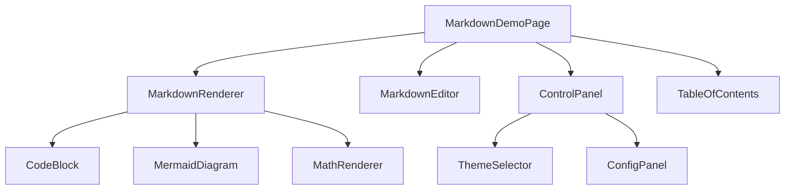

# Markdown渲染系统页面

## 📋 功能概述

Markdown渲染系统是一个功能强大的Markdown文档处理和展示平台。该系统支持标准Markdown语法的同时，还扩展了Mermaid图表、数学公式、代码高亮、表格等高级功能，提供了完整的文档编辑、预览和管理解决方案。

## 🏗️ 架构设计

### 整体架构
```
RenderMD Page
├── 主入口 (index.tsx)
├── 核心组件 (components/)
│   ├── MarkdownDemoPage.tsx (主演示页面)
│   ├── MarkdownRenderer.tsx (渲染器)
│   ├── MarkdownEditor.tsx (编辑器)
│   ├── CodeBlock.tsx (代码块)
│   ├── MermaidDiagram.tsx (图表)
│   ├── TableOfContents.tsx (目录)
│   ├── ControlPanel.tsx (控制面板)
│   └── PerformancePanel.tsx (性能监控)
├── 模块系统 (modules/)
│   ├── 主题系统 (theme/)
│   ├── 解析器 (parser/)
│   ├── 渲染器 (renderer/)
│   └── 插件系统 (plugins/)
├── 工具集 (tools/)
├── 类型定义 (types/)
└── 配置系统 (config/)
```

### 核心组件关系


## 🔧 技术实现

### 配置系统
```typescript
interface MarkdownConfig {
  theme: 'light' | 'dark' | 'sepia';
  enableCache: boolean;
  enableVirtualScroll: boolean;
  enableToc: boolean;
  enableMath: boolean;
  enableGfm: boolean;
  enableSanitize: boolean;
  linkTarget: '_blank' | '_self';
}
```

### 主题系统
```typescript
enum ThemeName {
  LIGHT = 'light',
  DARK = 'dark',
  SEPIA = 'sepia'
}

const handleThemeChange = (theme: ThemeName) => {
  setCurrentTheme(theme);
  setConfig(prev => ({ ...prev, theme }));
  document.documentElement.setAttribute('data-theme', theme);
};
```

### 内容管理
```typescript
const getExampleContent = () => {
  switch (activeTab) {
    case 'mermaid': return mermaidExample;
    case 'math': return mathExample;
    case 'table': return tableExample;
    case 'code': return codeExample;
    case 'combined': return combinedExample;
    default: return combinedExample;
  }
};
```

## 💡 重点难点分析

### 1. Mermaid图表渲染
**难点**: 动态渲染复杂的Mermaid图表，处理语法错误和性能问题
**解决方案**:
- **异步渲染**: 使用Web Workers进行图表渲染，避免阻塞主线程
- **错误处理**: 完善的语法错误检测和用户友好的错误提示
- **缓存机制**: 图表渲染结果缓存，避免重复计算
- **主题适配**: 图表主题与整体主题的自动同步

```typescript
const renderMermaidChart = async (chartDefinition: string, theme: string) => {
  try {
    const { svg } = await mermaid.render('mermaid-chart', chartDefinition);
    return svg;
  } catch (error) {
    console.error('Mermaid rendering error:', error);
    return `<div class="mermaid-error">图表渲染失败: ${error.message}</div>`;
  }
};
```

### 2. 数学公式渲染
**难点**: LaTeX语法的解析和渲染，支持行内和块级公式
**解决方案**:
- **KaTeX集成**: 使用KaTeX进行高性能数学公式渲染
- **语法支持**: 支持完整的LaTeX数学语法
- **响应式设计**: 公式在不同屏幕尺寸下的自适应显示
- **错误恢复**: 公式语法错误的优雅降级处理

### 3. 代码高亮系统
**难点**: 支持多种编程语言的语法高亮，保持高性能
**解决方案**:
- **Prism.js集成**: 使用Prism.js提供30+种语言支持
- **按需加载**: 语言包的动态加载，减少初始包大小
- **主题同步**: 代码高亮主题与整体主题的一致性
- **行号显示**: 可选的行号显示和代码复制功能

### 4. 性能优化
**难点**: 大文档的渲染性能和内存管理
**解决方案**:
- **虚拟滚动**: 长文档的虚拟化渲染
- **增量更新**: 只重新渲染变更的部分
- **内存管理**: 及时清理不需要的DOM节点和事件监听器
- **懒加载**: 图片和复杂组件的懒加载

## 🚀 核心功能

### Markdown扩展功能
1. **标准Markdown**
   - 标题、段落、列表
   - 粗体、斜体、删除线
   - 链接、图片、引用
   - 代码块和行内代码

2. **GitHub Flavored Markdown (GFM)**
   - 表格支持
   - 任务列表
   - 删除线
   - 自动链接

3. **数学公式**
   - 行内公式: `$E=mc^2$`
   - 块级公式: `$$\int_{a}^{b} f(x) dx$$`
   - 矩阵、分数、积分等复杂公式

4. **Mermaid图表**
   - 流程图 (Flowchart)
   - 时序图 (Sequence Diagram)
   - 类图 (Class Diagram)
   - 甘特图 (Gantt Chart)

### 编辑器功能
1. **实时预览**
   - 分屏编辑和预览
   - 同步滚动
   - 实时语法检查

2. **编辑辅助**
   - 语法高亮
   - 自动补全
   - 快捷键支持
   - 撤销/重做

3. **导入导出**
   - Markdown文件导入
   - HTML导出
   - PDF导出
   - 图片导出

### 主题系统
1. **内置主题**
   - 浅色主题 (Light)
   - 深色主题 (Dark)
   - 护眼主题 (Sepia)

2. **自定义主题**
   - CSS变量系统
   - 主题配置面板
   - 实时主题切换

### 性能监控
1. **渲染性能**
   - 渲染时间统计
   - 内存使用监控
   - FPS监控

2. **用户体验**
   - 加载时间分析
   - 交互响应时间
   - 错误率统计

## 📊 使用场景

### 文档编写
- **技术文档**: API文档、技术规范
- **博客文章**: 支持丰富格式的博客内容
- **学术论文**: 数学公式和图表的学术写作
- **项目文档**: README、CHANGELOG等项目文档

### 教育培训
- **在线课程**: 支持图表和公式的教学内容
- **技术分享**: 演示文稿和技术分享
- **代码教学**: 代码示例和算法演示

### 企业应用
- **知识库**: 企业内部知识管理
- **产品文档**: 产品说明和用户手册
- **流程图**: 业务流程和系统架构图

## 🔍 技术亮点

### 1. 模块化架构
```typescript
// 插件系统设计
interface MarkdownPlugin {
  name: string;
  version: string;
  install: (renderer: MarkdownRenderer) => void;
  uninstall: (renderer: MarkdownRenderer) => void;
}

class MarkdownRenderer {
  private plugins: Map<string, MarkdownPlugin> = new Map();

  use(plugin: MarkdownPlugin) {
    this.plugins.set(plugin.name, plugin);
    plugin.install(this);
  }

  unuse(pluginName: string) {
    const plugin = this.plugins.get(pluginName);
    if (plugin) {
      plugin.uninstall(this);
      this.plugins.delete(pluginName);
    }
  }
}
```

### 2. 智能缓存系统
```typescript
// 渲染结果缓存
class RenderCache {
  private cache = new Map<string, CacheEntry>();

  get(key: string): string | null {
    const entry = this.cache.get(key);
    if (entry && !this.isExpired(entry)) {
      return entry.content;
    }
    return null;
  }

  set(key: string, content: string, ttl: number = 300000) {
    this.cache.set(key, {
      content,
      timestamp: Date.now(),
      ttl
    });
  }

  private isExpired(entry: CacheEntry): boolean {
    return Date.now() - entry.timestamp > entry.ttl;
  }
}
```

### 3. 响应式设计
```typescript
// 自适应布局
const useResponsiveLayout = () => {
  const [layout, setLayout] = useState<'desktop' | 'tablet' | 'mobile'>('desktop');

  useEffect(() => {
    const handleResize = () => {
      const width = window.innerWidth;
      if (width < 768) {
        setLayout('mobile');
      } else if (width < 1024) {
        setLayout('tablet');
      } else {
        setLayout('desktop');
      }
    };

    window.addEventListener('resize', handleResize);
    handleResize();

    return () => window.removeEventListener('resize', handleResize);
  }, []);

  return layout;
};
```

## 🎯 最佳实践

### 开发建议
1. **性能优先**: 大文档的渲染优化
2. **用户体验**: 流畅的编辑和预览体验
3. **扩展性**: 插件系统的合理设计
4. **兼容性**: 多浏览器和设备的兼容

### 使用建议
1. **内容组织**: 合理的文档结构和目录
2. **图表使用**: 适当使用Mermaid图表增强表达
3. **公式编写**: 正确的LaTeX语法使用
4. **主题选择**: 根据使用场景选择合适主题

## 📈 技术栈

- **React 19**: 最新的React版本
- **TypeScript**: 类型安全开发
- **Ant Design**: UI组件库
- **Mermaid**: 图表渲染引擎
- **KaTeX**: 数学公式渲染
- **Prism.js**: 代码语法高亮
- **Marked**: Markdown解析器

这个Markdown渲染系统为用户提供了功能完整、性能优秀的文档处理解决方案，通过丰富的扩展功能和优秀的用户体验，满足了从简单文档到复杂技术文档的各种需求。