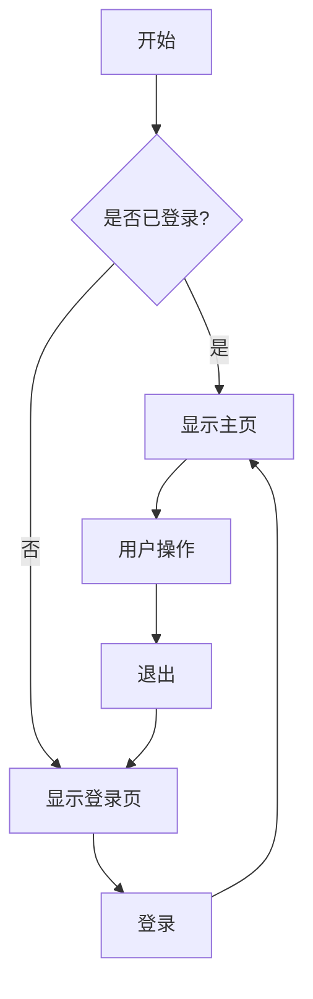
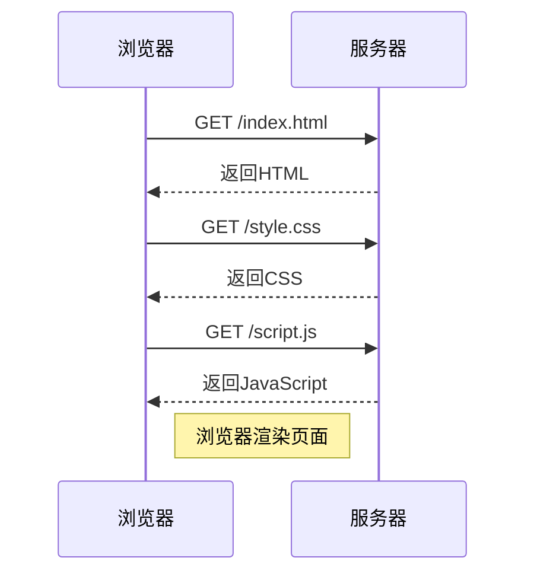
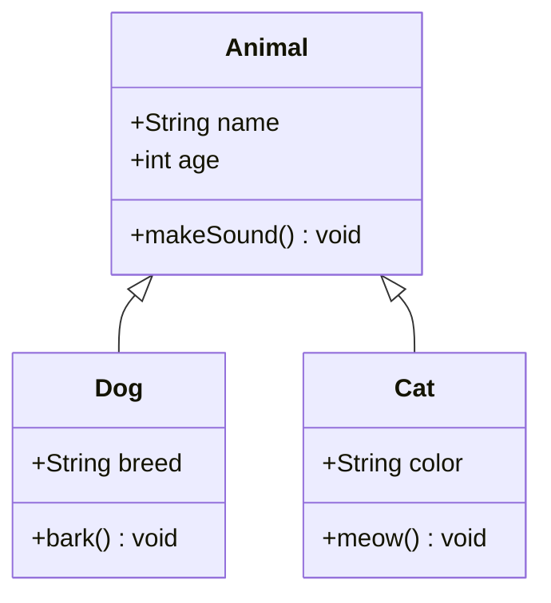
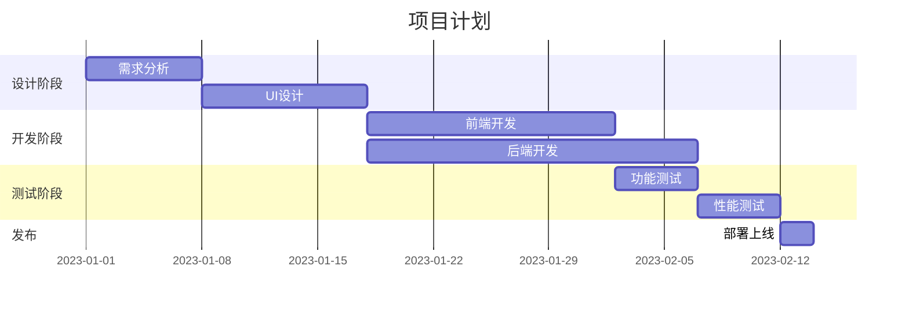
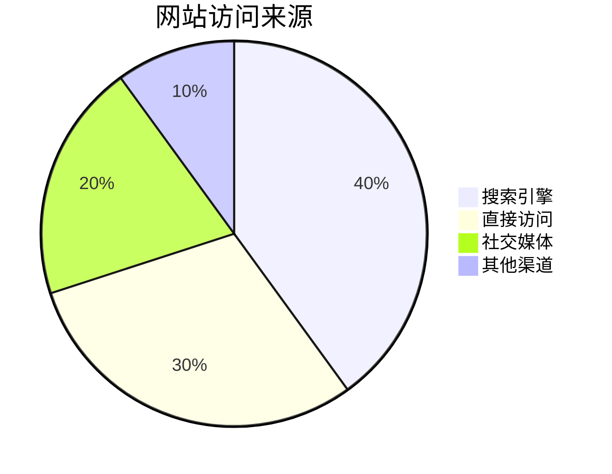
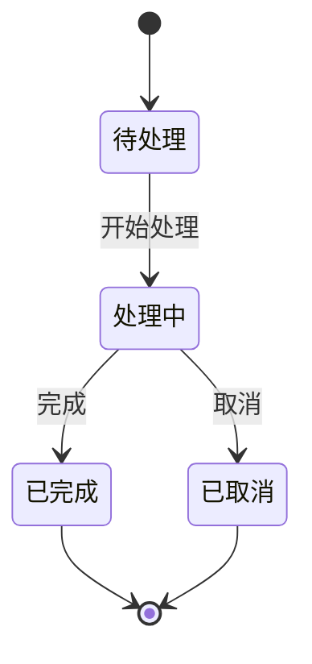
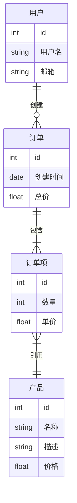

# Mermaid图表示例

Mermaid是一个基于JavaScript的图表和图形工具，它使用类似Markdown的语法来创建和修改图表。

## 流程图示例

```mermaid
flowchart TD
    A[开始] --> B{是否已登录?}
    B -->|是| C[显示主页]
    B -->|否| D[显示登录页]
    C --> E[用户操作]
    D --> F[登录]
    F --> C
    E --> G[退出]
    G --> D
```

## 序列图示例

```mermaid
sequenceDiagram
    participant 浏览器
    participant 服务器
    浏览器->>服务器: GET /index.html
    服务器-->>浏览器: 返回HTML
    浏览器->>服务器: GET /style.css
    服务器-->>浏览器: 返回CSS
    浏览器->>服务器: GET /script.js
    服务器-->>浏览器: 返回JavaScript
    Note right of 浏览器: 浏览器渲染页面
```

## 类图示例

```mermaid
classDiagram
    class Animal {
        +String name
        +int age
        +makeSound() void
    }
    class Dog {
        +String breed
        +bark() void
    }
    class Cat {
        +String color
        +meow() void
    }
    Animal <|-- Dog
    Animal <|-- Cat
```

## 甘特图示例

```mermaid
gantt
    title 项目计划
    dateFormat  YYYY-MM-DD
    section 设计阶段
    需求分析        :a1, 2023-01-01, 7d
    UI设计          :a2, after a1, 10d
    section 开发阶段
    前端开发        :a3, after a2, 15d
    后端开发        :a4, after a2, 20d
    section 测试阶段
    功能测试        :a5, after a3, 5d
    性能测试        :a6, after a5, 5d
    section 发布
    部署上线        :a7, after a6, 2d
```

## 饼图示例

```mermaid
pie title 网站访问来源
    "搜索引擎" : 40
    "直接访问" : 30
    "社交媒体" : 20
    "其他渠道" : 10
```

## 状态图示例

```mermaid
stateDiagram-v2
    [*] --> 待处理
    待处理 --> 处理中: 开始处理
    处理中 --> 已完成: 完成
    处理中 --> 已取消: 取消
    已完成 --> [*]
    已取消 --> [*]
```

## 实体关系图示例

```mermaid
erDiagram
    用户 ||--o{ 订单 : 创建
    用户 {
        int id
        string 用户名
        string 邮箱
    }
    订单 ||--|{ 订单项 : 包含
    订单 {
        int id
        date 创建时间
        float 总价
    }
    订单项 }|--|| 产品 : 引用
    订单项 {
        int id
        int 数量
        float 单价
    }
    产品 {
        int id
        string 名称
        string 描述
        float 价格
    }
```

使用Mermaid可以让技术文档更加直观，帮助读者更好地理解复杂的概念和流程。
