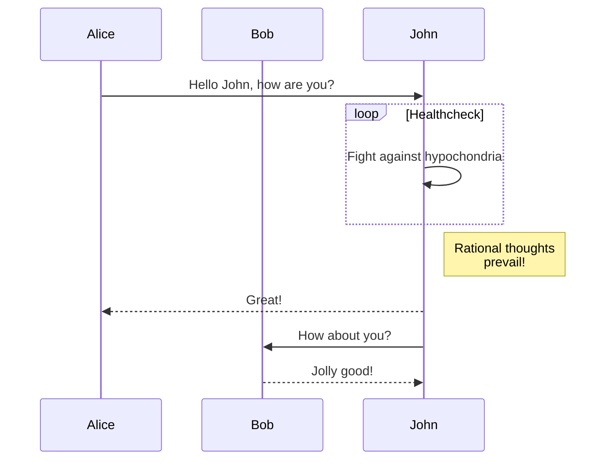

# 简单Mermaid示例

这是一个最简单的Mermaid流程图示例：

```mermaid
graph TD;
    A-->B;
    A-->C;
    B-->D;
    C-->D;
```

这是一个简单的序列图：

```mermaid
sequenceDiagram
    participant Alice
    participant Bob
    Alice->>John: Hello John, how are you?
    loop Healthcheck
        John->>John: Fight against hypochondria
    end
    Note right of John: Rational thoughts <br/>prevail!
    John-->>Alice: Great!
    John->>Bob: How about you?
    Bob-->>John: Jolly good!
```
