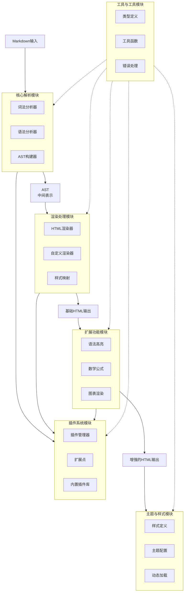
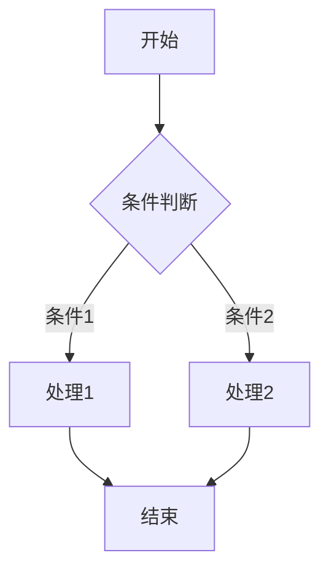

好的，我将按照六大模块为你详细介绍如何实现一个Markdown文档渲染可视化学习Web应用。这份指南将帮助你快速理解各模块的技术要点和实现方案。

# Markdown文档渲染可视化系统技术实现指南

## 1 系统架构概述

Markdown渲染系统的核心架构包含**六大模块**，它们协同工作以实现高效、安全的Markdown文档解析与渲染。系统接收原始Markdown文本输入，通过解析、处理和渲染流程，最终输出美观的可视化内容。整体架构基于模块化设计原则，各个模块职责分明且易于扩展，既保证了核心功能的稳定性，又为自定义需求提供了灵活的扩展点。

以下是系统架构的核心模块及其协作关系：



本系统采用**组件化设计**，各个模块可以独立开发、测试和替换。AST（抽象语法树）作为中间表示是连接解析模块和渲染模块的关键数据结构，保证了数据在不同处理阶段的一致性。插件系统允许开发者在不修改核心代码的情况下扩展功能，大大提高了系统的可维护性和可扩展性。

## 2 核心解析模块实现

核心解析模块负责将原始Markdown文本转换为结构化的中间表示（AST），这是整个渲染系统的基础。该模块的性能和准确性直接决定了整个系统的渲染质量。

### 2.1 词法分析器(Lexer)

词法分析器是解析过程的第一步，它将连续的Markdown文本分割成一系列有意义的标记（tokens）。这个过程包括识别Markdown中的特殊符号和语法结构，如标题标识(`#`)、粗体标识(`**`)、链接标识(``)等。

实现词法分析器时，通常采用**有限状态机(FSM)**模型来处理文本流。状态机根据当前输入的字符切换到不同的状态，从而识别出不同类型的标记：

```javascript
// 简化的词法分析器状态机示例
function tokenize(markdownText) {
  const tokens = [];
  let position = 0;
  let state = 'default';
  let buffer = '';

  while (position < markdownText.length) {
    const char = markdownText[position];

    switch (state) {
      case 'default':
        if (char === '#') {
          // 处理标题标记
          tokens.push({ type: 'heading', level: 1 });
          state = 'in_heading';
        } else if (char === '*') {
          // 处理粗体开始
          tokens.push({ type: 'bold_open' });
          state = 'in_bold';
        } else {
          // 普通文本
          buffer += char;
        }
        break;
      // 其他状态处理...
    }

    position++;
  }

  return tokens;
}
```

### 2.2 语法分析器(Parser)

语法分析器接收词法分析器产生的标记序列，并根据Markdown语法规则构建抽象语法树(AST)。AST是文档结构的抽象表示，它用树状结构描述了各元素之间的层次关系。

常见的Markdown元素包括：
- **块级元素**：段落、标题、代码块、引用块、列表等
- **行内元素**：粗体、斜体、行内代码、链接、图片等

语法分析器需要正确处理这些元素的嵌套关系，例如列表项中可以包含段落，段落中可以包含粗体文本等。

### 2.3 AST构建器

AST构建器创建具有层次结构的节点树，每个节点代表文档中的一个元素。典型的AST节点可能包含以下信息：

```javascript
// AST节点结构示例
{
  type: 'paragraph',
  children: [
    {
      type: 'text',
      content: '这是普通文本'
    },
    {
      type: 'bold',
      children: [
        {
          type: 'text',
          content: '这是粗体文本'
        }
      ]
    }
  ]
}
```

### 2.4 常用解析库比较

在实际开发中，通常不需要从头实现解析器，可以选择成熟的开源库：

1.  **marked.js**：轻量且快速的Markdown解析器，解析速度快，API简单易用
2.  **markdown-it**：高度可配置的解析器，支持丰富的插件生态系统
3.  **remark**：基于Unified体系的现代化Markdown处理工具，插件生态丰富

以下是三种流行解析库的特性对比表：

| 特性 | marked.js | markdown-it | remark |
|------|-----------|-------------|--------|
| 性能 | 高 | 中高 | 中 |
| 扩展性 | 基础 | 丰富 | 非常丰富 |
| 兼容性 | CommonMark | CommonMark+扩展 | GFM+扩展 |
| 大小 | 小(~24KB) | 中(~45KB) | 较大(需要统一生态系统) |
| 学习曲线 | 简单 | 中等 | 较陡峭 |

选择解析库时，需要根据项目需求权衡各方面因素。如果注重性能和简单性，marked.js是不错的选择；如果需要高度可定制性，markdown-it或remark更为合适。

## 3 渲染处理模块详解

渲染处理模块负责将AST转换为目标输出格式（通常是HTML），并管理样式映射关系。这个模块决定了最终用户看到的视觉效果和交互体验。

### 3.1 HTML渲染器

HTML渲染器遍历AST节点，将每个节点转换为对应的HTML元素。这个过程通常使用**递归方式**处理节点的层次结构：

```javascript
// 简化的HTML渲染器实现
function renderToHTML(node) {
  if (node.type === 'root') {
    return node.children.map(child => renderToHTML(child)).join('');
  }

  switch (node.type) {
    case 'heading':
      return `<h${node.level}>${renderInline(node)}</h${node.level}>`;
    case 'paragraph':
      return `<p>${renderInline(node)}</p>`;
    case 'bold':
      return `<strong>${renderInline(node)}</strong>`;
    case 'text':
      return escapeHTML(node.content);
    case 'code_block':
      return `<pre><code class="language-${node.lang}">${escapeHTML(node.content)}</code></pre>`;
    // 其他节点类型处理...
    default:
      return renderInline(node);
  }
}

function renderInline(node) {
  if (!node.children) return '';
  return node.children.map(child => renderToHTML(child)).join('');
}
```

### 3.2 自定义渲染器

大多数Markdown解析库允许开发者**自定义渲染逻辑**，以便对特定类型的节点进行特殊处理。以下是markdown-it自定义渲染器的示例：

```javascript
const md = require('markdown-it')();
// 自定义渲染规则
const defaultRenderer = md.renderer.rules.link_open ||
  function(tokens, idx, options, env, self) {
    return self.renderToken(tokens, idx, options);
  };

md.renderer.rules.link_open = function (tokens, idx, options, env, self) {
  // 为所有链接添加target="_blank"属性
  const aIndex = tokens[idx].attrIndex('target');
  if (aIndex < 0) {
    tokens[idx].attrPush(['target', '_blank']);
  } else {
    tokens[idx].attrs[aIndex][1] = '_blank';
  }
  // 添加rel="noopener noreferrer"属性以增强安全性
  const rIndex = tokens[idx].attrIndex('rel');
  if (rIndex < 0) {
    tokens[idx].attrPush(['rel', 'noopener noreferrer']);
  } else {
    tokens[idx].attrs[rIndex][1] = 'noopener noreferrer';
  }
  return defaultRenderer(tokens, idx, options, env, self);
};
```

这种自定义能力非常有用，可以用于：
- 为特定元素添加CSS类名
- 优化SEO（如为图片添加alt属性）
- 增强安全性（如处理潜在XSS攻击）
- 集成第三方服务（如将视频链接转换为嵌入播放器）

### 3.3 样式映射

样式映射系统将语义化的元素与视觉表现分离，使得可以轻松切换主题而不影响内容结构：

```css
/* Markdown元素基础样式 */
.markdown-body {
  font-family: -apple-system, BlinkMacSystemFont, "Segoe UI", Roboto, sans-serif;
  line-height: 1.6;
  color: #24292e;
  max-width: 800px;
  margin: 0 auto;
  padding: 20px;
}

.markdown-body h1, .markdown-body h2, .markdown-body h3 {
  margin-top: 24px;
  margin-bottom: 16px;
  font-weight: 600;
  border-bottom: 1px solid #eaecef;
}

.markdown-body code {
  background-color: rgba(27,31,35,0.05);
  border-radius: 3px;
  padding: 0.2em 0.4em;
  font-family: SFMono-Regular, Consolas, "Liberation Mono", Menlo, monospace;
}

.markdown-body pre {
  background-color: #f6f8fa;
  border-radius: 6px;
  padding: 16px;
  overflow: auto;
}

.markdown-body blockquote {
  padding: 0 1em;
  color: #6a737d;
  border-left: 0.25em solid #dfe2e5;
  margin: 0;
}
```

通过良好的样式设计，可以使渲染后的Markdown内容在视觉上更加美观和易读，同时保持与原始Markdown文本的结构一致性。

## 4 插件系统模块设计

插件系统是现代化Markdown渲染器的核心特性，它允许开发者扩展语法支持和渲染功能，而无需修改核心库代码。良好的插件设计大大增强了系统的灵活性和可扩展性。

### 4.1 插件管理器

插件管理器负责插件的注册、初始化和执行调度。它维护一个插件注册表，并提供统一的API来管理插件生命周期：

```javascript
class PluginManager {
  constructor() {
    this.plugins = new Map();
    this.extensions = {
      preParse: [],      // 解析前预处理
      syntax: [],        // 语法扩展
      postParse: [],     // 解析后处理
      preRender: [],     // 渲染前处理
      postRender: []     // 渲染后处理
    };
  }

  // 注册插件
  register(plugin, options = {}) {
    const pluginId = options.id || plugin.name;
    if (this.plugins.has(pluginId)) {
      throw new Error(`Plugin ${pluginId} already registered`);
    }

    // 初始化插件
    const pluginInstance = plugin(options);
    this.plugins.set(pluginId, pluginInstance);

    // 注册插件到相应的扩展点
    if (pluginInstance.preParse) {
      this.extensions.preParse.push(pluginInstance.preParse.bind(pluginInstance));
    }
    if (pluginInstance.syntax) {
      this.extensions.syntax.push(pluginInstance.syntax.bind(pluginInstance));
    }
    // 其他扩展点注册...

    return pluginId;
  }

  // 执行扩展点
  async executeHook(hookName, data, context) {
    for (const extension of this.extensions[hookName]) {
      data = await extension(data, context) || data;
    }
    return data;
  }
}
```

### 4.2 扩展点设计

合理的扩展点设计是插件系统的关键。常见的扩展点包括：

1.  **preParse**：在解析前对原始Markdown文本进行预处理
2.  **syntax**：扩展语法规则，添加新的元素类型
3.  **postParse**：对生成的AST进行后处理
4.  **preRender**：在渲染前对AST或渲染上下文进行处理
5.  **postRender**：对渲染后的HTML进行后处理

以下是一个处理表情符号的插件示例：

```javascript
// 表情符号插件
function emojiPlugin(options = {}) {
  const emojiMap = {
    ':smile:': '😄',
    ':laughing:': '😆',
    ':heart:': '❤️',
    // 更多表情映射...
  };

  return {
    // 在解析后处理AST，替换表情符号文本
    postParse: (ast) => {
      function processNode(node) {
        if (node.type === 'text') {
          for (const [shortcut, emoji] of Object.entries(emojiMap)) {
            node.content = node.content.replace(new RegExp(shortcut, 'g'), emoji);
          }
        }
        if (node.children) {
          node.children.forEach(processNode);
        }
        return node;
      }

      return processNode(ast);
    },

    // 在渲染后处理HTML，添加表情样式
    postRender: (html) => {
      return html.replace(/<span class="emoji">(.*?)<\/span>/g,
        '<span style="font-size:1.2em">$1</span>');
    }
  };
}
```

### 4.3 内置插件库

一个完善的Markdown渲染系统通常会提供一系列内置插件，用于处理常见需求：

1.  **代码高亮插件**：使用highlight.js或Prism.js实现代码语法高亮
2.  **目录生成插件**：从标题自动生成文档目录
3.  **数学公式插件**：集成KaTeX或MathJax渲染数学公式
4.  **图表插件**：集成Mermaid.js绘制流程图、时序图等
5.  **多媒体嵌入插件**：将视频链接转换为嵌入式播放器

以下是使用markdown-it插件生态系统的示例：

```javascript
const md = require('markdown-it')()
  .use(require('markdown-it-highlightjs'), {
    auto: false,
    code: true
  })
  .use(require('markdown-it-emoji'))
  .use(require('markdown-it-anchor'), {
    permalink: true,
    permalinkSymbol: '§'
  })
  .use(require('markdown-it-table-of-contents'), {
    includeLevel: [2, 3]
  })
  .use(require('markdown-it-katex'));

// 渲染包含多种扩展语法的Markdown
const html = md.render(markdownText);
```

通过插件系统，开发者可以根据项目需求灵活组合功能，而不必担心核心库变得臃肿或难以维护。

## 5 扩展功能模块实现

扩展功能模块为Markdown渲染系统提供增强功能，如代码高亮、数学公式渲染、图表绘制等。这些功能大大丰富了Markdown的表现力，使其能够满足更复杂的内容展示需求。

### 5.1 语法高亮

语法高亮是技术文档中最常用的扩展功能，它通过分析代码的语言特性，为关键字、变量、字符串等添加样式类，从而提高代码的可读性。

**实现方案**：
1.  **使用highlight.js**：
    ```javascript
    import hljs from 'highlight.js';
    import 'highlight.js/styles/github.css';

    // 配置marked.js使用highlight.js进行代码高亮
    marked.setOptions({
      highlight: function(code, language) {
        const validLanguage = hljs.getLanguage(language) ? language : 'plaintext';
        return hljs.highlight(validLanguage, code).value;
      }
    });
    ```

2.  **使用Prism.js**：
    ```javascript
    import Prism from 'prismjs';
    import 'prismjs/themes/prism.css';

    // 按需加载语言支持
    import 'prismjs/components/prism-javascript';
    import 'prismjs/components/prism-python';
    import 'prismjs/components/prism-java';

    // 配置Prism.js
    marked.setOptions({
      highlight: function(code, lang) {
        if (Prism.languages[lang]) {
          return Prism.highlight(code, Prism.languages[lang], lang);
        } else {
          return code;
        }
      }
    });
    ```

为了提高性能，可以采用**异步加载**策略，仅当代码块需要高亮时才加载对应的语言模块：

```javascript
async function highlightCode(code, lang) {
  // 动态导入所需语言模块
  if (!Prism.languages[lang]) {
    try {
      await import(`prismjs/components/prism-${lang}`);
    } catch (e) {
      console.warn(`未找到语言支持: ${lang}`);
    }
  }

  return Prism.languages[lang]
    ? Prism.highlight(code, Prism.languages[lang], lang)
    : code;
}
```

### 5.2 数学公式渲染

数学公式渲染通过集成专门的数学库来处理LaTeX语法，将其转换为可视化的数学公式。

**集成KaTeX**：
```html
<!-- 引入KaTeX资源 -->
<link rel="stylesheet" href="https://cdn.jsdelivr.net/npm/katex@0.15.3/dist/katex.min.css">
<script src="https://cdn.jsdelivr.net/npm/katex@0.15.3/dist/katex.min.js"></script>

<script>
// 配置Markdown渲染器处理数学公式
const md = window.markdownit({
  highlight: function (code, lang) {
    // 代码高亮逻辑
  }
});

// 添加数学公式支持
md.inline.ruler.before('escape', 'math', function(state, silent) {
  // 识别行内数学公式语法
});

md.block.ruler.before('fence', 'math', function(state, startLine, endLine, silent) {
  // 识别块级数学公式语法
});

// 渲染后初始化数学公式
function renderMarkdownWithMath(content) {
  const html = md.render(content);
  // 使用KaTeX渲染公式
  renderMathInElement(document.getElementById('content'), {
    delimiters: [
      {left: '$$', right: '$$', display: true},
      {left: '$', right: '$', display: false}
    ],
    throwOnError: false
  });
  return html;
}
</script>
```

### 5.3 图表与流程图

通过集成专业图表库，可以在Markdown中创建丰富的图表和流程图。

**集成Mermaid.js**：
```javascript
import mermaid from 'mermaid';

// 初始化Mermaid配置
mermaid.initialize({
  startOnLoad: false,
  theme: 'default',
  flowchart: {
    useMaxWidth: true,
    htmlLabels: true
  }
});

// 处理Markdown中的Mermaid代码块
function renderMermaid() {
  document.querySelectorAll('code.language-mermaid').forEach(el => {
    const code = el.textContent;
    const container = document.createElement('div');
    container.className = 'mermaid';
    container.textContent = code;
    el.parentNode.replaceWith(container);
  });

  // 异步渲染所有Mermaid图表
  setTimeout(() => {
    mermaid.run({
      querySelector: '.mermaid'
    });
  }, 10);
}

// 在Markdown渲染完成后调用
function onMarkdownRendered() {
  renderMermaid();
  // 其他后处理...
}
```

在Markdown文档中使用Mermaid语法创建流程图：

````markdown

````

### 5.4 高级扩展功能

除了上述常见扩展功能，还可以实现更多高级功能：

1.  **自定义容器**：
    ```markdown
    ::: warning
    这是一个警告框
    :::

    ::: tip
    这是一个提示框
    :::
    ```

2.  **任务列表**：
    ```markdown
    - [x] 已完成的任务
    - [ ] 未完成的任务
    ```

3.  **多媒体嵌入**：
    ```markdown
    !video[https://example.com/video.mp4]
    ```

4.  **交互式组件**：
    ```markdown
    !button[点击我]{#my-button}
    ```

这些扩展功能极大地增强了Markdown的表现力，使其从简单的文档格式转变为功能丰富的内容创作工具。

## 6 主题与样式模块

主题与样式模块负责管理Markdown渲染结果的视觉外观，包括颜色方案、字体、间距、布局等视觉属性。良好的主题设计可以显著提升阅读体验，并使内容呈现更加专业和一致。

### 6.1 样式定义系统

现代Markdown渲染系统通常采用CSS变量和设计令牌(Design Tokens)来管理样式，以便实现灵活的主题切换：

```css
/* 设计令牌定义 */
:root {
  /* 颜色系统 */
  --color-primary: #0366d6;
  --color-text: #24292e;
  --color-text-secondary: #586069;
  --color-background: #ffffff;
  --color-border: #e1e4e8;
  --color-accent: #f9826c;

  /* 字体系统 */
  --font-family: -apple-system, BlinkMacSystemFont, "Segoe UI", Helvetica, Arial, sans-serif;
  --font-family-mono: SFMono-Regular, Consolas, "Liberation Mono", Menlo, monospace;
  --font-size-base: 16px;
  --font-size-sm: 14px;
  --font-size-lg: 18px;

  /* 间距系统 */
  --spacing-unit: 8px;
  --spacing-1: var(--spacing-unit);
  --spacing-2: calc(var(--spacing-unit) * 2);
  --spacing-3: calc(var(--spacing-unit) * 3);
  --spacing-4: calc(var(--spacing-unit) * 4);

  /* 边框圆角 */
  --border-radius: 6px;
  --border-radius-sm: 3px;
}

/* 基于设计令牌的Markdown元素样式 */
.markdown-body {
  color: var(--color-text);
  background-color: var(--color-background);
  font-family: var(--font-family);
  font-size: var(--font-size-base);
  line-height: 1.6;
  padding: var(--spacing-4);
}

.markdown-body h1,
.markdown-body h2,
.markdown-body h3 {
  color: var(--color-primary);
  margin-top: var(--spacing-4);
  margin-bottom: var(--spacing-2);
  padding-bottom: var(--spacing-1);
  border-bottom: 1px solid var(--color-border);
}

.markdown-body code {
  font-family: var(--font-family-mono);
  font-size: var(--font-size-sm);
  background-color: rgba(27, 31, 35, 0.05);
  border-radius: var(--border-radius-sm);
  padding: 0.2em 0.4em;
}

.markdown-body pre {
  background-color: #f6f8fa;
  border-radius: var(--border-radius);
  padding: var(--spacing-3);
  overflow: auto;
}
```

### 6.2 主题配置与管理

实现主题切换功能需要设计一个灵活的主题管理系统，支持动态加载和切换不同主题：

```javascript
class ThemeManager {
  constructor() {
    this.currentTheme = 'light';
    this.themes = {
      light: {
        name: 'Light',
        variables: {
          'color-text': '#24292e',
          'color-background': '#ffffff',
          'color-border': '#e1e4e8'
        }
      },
      dark: {
        name: 'Dark',
        variables: {
          'color-text': '#f0f6fc',
          'color-background': '#0d1117',
          'color-border': '#30363d'
        }
      },
      solarized: {
        name: 'Solarized',
        variables: {
          'color-text': '#586e75',
          'color-background': '#fdf6e3',
          'color-border': '#93a1a1'
        }
      }
    };
  }

  // 加载主题
  loadTheme(themeName) {
    const theme = this.themes[themeName];
    if (!theme) {
      console.warn(`主题 ${themeName} 不存在`);
      return;
    }

    // 应用CSS变量
    const root = document.documentElement;
    Object.entries(theme.variables).forEach(([key, value]) => {
      root.style.setProperty(`--${key}`, value);
    });

    this.currentTheme = themeName;
    this.savePreference(themeName);

    // 触发主题变更事件
    document.dispatchEvent(new CustomEvent('themeChanged', {
      detail: { theme: themeName }
    }));
  }

  // 保存用户偏好
  savePreference(themeName) {
    try {
      localStorage.setItem('markdown-theme', themeName);
    } catch (e) {
      console.warn('无法保存主题偏好:', e);
    }
  }

  // 加载用户偏好
  loadPreference() {
    try {
      const savedTheme = localStorage.getItem('markdown-theme');
      if (savedTheme && this.themes[savedTheme]) {
        this.loadTheme(savedTheme);
      }
    } catch (e) {
      console.warn('无法加载主题偏好:', e);
    }
  }

  // 获取可用主题列表
  getAvailableThemes() {
    return Object.keys(this.themes);
  }
}

// 初始化主题管理器
const themeManager = new ThemeManager();
themeManager.loadPreference(); // 加载保存的偏好

// 添加主题切换UI
function createThemeSelector() {
  const selector = document.createElement('select');
  themeManager.getAvailableThemes().forEach(themeName => {
    const option = document.createElement('option');
    option.value = themeName;
    option.textContent = themeManager.themes[themeName].name;
    option.selected = themeName === themeManager.currentTheme;
    selector.appendChild(option);
  });

  selector.addEventListener('change', (e) => {
    themeManager.loadTheme(e.target.value);
  });

  return selector;
}
```

### 6.3 响应式设计与可访问性

良好的Markdown渲染应该在不同设备上都能提供良好的阅读体验，并满足可访问性要求：

```css
/* 响应式设计 */
.markdown-body {
  max-width: 800px;
  margin: 0 auto;
  padding: var(--spacing-4);
}

/* 移动设备适配 */
@media (max-width: 768px) {
  .markdown-body {
    padding: var(--spacing-2);
    font-size: var(--font-size-sm);
  }

  .markdown-body h1 {
    font-size: 1.8em;
  }

  .markdown-body pre {
    padding: var(--spacing-2);
    overflow-x: auto;
  }
}

/* 可访问性支持 */
.markdown-body {
  /* 高对比度支持 */
  --color-text: #000000;
  --color-background: #ffffff;

  /* 减少动画 */
  animation: none;
  transition: none;
}

@media (prefers-reduced-motion: reduce) {
  .markdown-body {
    animation: none;
    transition: none;
  }
}

/* 屏幕阅读器支持 */
.markdown-body [aria-hidden="true"] {
  display: none;
}

/* 键盘导航支持 */
.markdown-body a:focus,
.markdown-body button:focus {
  outline: 2px solid var(--color-primary);
  outline-offset: 2px;
}
```

### 6.4 主题定制与扩展

允许用户定制主题是高级Markdown渲染器的重要特性。可以提供主题编辑器让用户自定义样式：

```javascript
class ThemeEditor {
  constructor(themeManager) {
    this.themeManager = themeManager;
    this.customThemes = this.loadCustomThemes();
  }

  // 创建新主题
  createTheme(name, baseTheme = 'light') {
    const baseVariables = {...this.themeManager.themes[baseTheme].variables};
    const newTheme = {
      name,
      variables: baseVariables,
      custom: true
    };

    this.customThemes[name] = newTheme;
    this.saveCustomThemes();

    return newTheme;
  }

  // 更新主题变量
  updateThemeVariable(themeName, variable, value) {
    if (this.customThemes[themeName]) {
      this.customThemes[themeName].variables[variable] = value;
      this.saveCustomThemes();

      // 如果当前正在使用这个主题，立即应用更改
      if (this.themeManager.currentTheme === themeName) {
        this.themeManager.loadTheme(themeName);
      }
    }
  }

  // 保存自定义主题
  saveCustomThemes() {
    try {
      localStorage.setItem('markdown-custom-themes',
        JSON.stringify(this.customThemes));
    } catch (e) {
      console.warn('无法保存自定义主题:', e);
    }
  }

  // 加载自定义主题
  loadCustomThemes() {
    try {
      return JSON.parse(localStorage.getItem('markdown-custom-themes') || '{}');
    } catch (e) {
      console.warn('无法加载自定义主题:', e);
      return {};
    }
  }
}
```

通过完善的主题与样式系统，Markdown渲染器可以提供美观、一致且可定制的视觉体验，满足不同用户的偏好和需求。

## 7 工具与工具模块

工具与工具模块为Markdown渲染系统提供基础设施支持，包括公共类型定义、实用函数和错误处理机制。这个模块是其他模块的支撑基础，确保了代码的一致性、可维护性和可靠性。

### 7.1 类型定义系统

在TypeScript项目中，明确定义类型是保证代码质量的关键。以下是Markdown AST节点的类型定义示例：

```typescript
// 基础节点类型
interface BaseNode {
  type: string;
  position?: {
    start: { line: number; column: number; offset: number };
    end: { line: number; column: number; offset: number };
  };
  data?: { [key: string]: any };
}

// 文本节点
interface TextNode extends BaseNode {
  type: 'text';
  value: string;
}

// 元素节点（包含子节点）
interface ElementNode extends BaseNode {
  type: 'element';
  tagName: string;
  properties?: { [key: string]: any };
  children?: Array<TextNode | ElementNode>;
}

// 特定Markdown元素类型
interface HeadingNode extends ElementNode {
  tagName: 'h1' | 'h2' | 'h3' | 'h4' | 'h5' | 'h6';
  depth: number;
}

interface CodeNode extends ElementNode {
  tagName: 'code';
  lang?: string;
  meta?: string;
}

interface LinkNode extends ElementNode {
  tagName: 'a';
  url: string;
  title?: string;
}

// 联合类型表示所有可能的节点
type MarkdownNode = TextNode | ElementNode | HeadingNode | CodeNode | LinkNode;

// AST根类型
interface RootNode extends BaseNode {
  type: 'root';
  children: MarkdownNode[];
}

// 解析器配置类型
interface ParserOptions {
  gfm?: boolean;
  breaks?: boolean;
  pedantic?: boolean;
  allowDangerousHtml?: boolean;
  sanitize?: boolean;
  smartLists?: boolean;
  smartypants?: boolean;
  // 其他选项...
}

// 渲染器配置类型
interface RendererOptions {
  safe?: boolean;
  smartypants?: boolean;
  linkify?: boolean;
  // 其他选项...
}
```

### 7.2 工具函数库

工具函数库包含各种实用功能，被其他模块重复使用：

```javascript
// 字符串处理工具
const StringUtils = {
  // HTML转义
  escapeHTML: (str) => {
    return str.replace(/[&<>"']/g, (m) => ({
      '&': '&amp;',
      '<': '&lt;',
      '>': '&gt;',
      '"': '&quot;',
      "'": '&#39;'
    }[m]));
  },

  // 生成唯一ID
  generateId: (prefix = 'id') => {
    return `${prefix}-${Math.random().toString(36).substr(2, 9)}`;
  },

  // 截断字符串
  truncate: (str, length, suffix = '...') => {
    return str.length > length
      ? str.substr(0, length) + suffix
      : str;
  },

  // 驼峰命名转换
  camelCase: (str) => {
    return str.replace(/[-_\s]+(.)?/g, (_, c) =>
      c ? c.toUpperCase() : ''
    );
  }
};

// DOM操作工具
const DOMUtils = {
  // 安全设置innerHTML
  setHTML: (element, html) => {
    element.innerHTML = DOMPurify.sanitize(html);
  },

  // 动态加载脚本
  loadScript: (url, options = {}) => {
    return new Promise((resolve, reject) => {
      const script = document.createElement('script');
      script.src = url;
      script.async = options.async || true;
      script.defer = options.defer || true;

      script.onload = resolve;
      script.onerror = reject;

      document.head.appendChild(script);
    });
  },

  // 动态加载样式
  loadStyle: (url, options = {}) => {
    return new Promise((resolve, reject) => {
      const link = document.createElement('link');
      link.rel = 'stylesheet';
      link.href = url;

      link.onload = resolve;
      link.onerror = reject;

      document.head.appendChild(link);
    });
  }
};

// 数据结构工具
const DataUtils = {
  // 深拷贝
  deepClone: (obj) => {
    if (obj === null || typeof obj !== 'object') return obj;
    if (obj instanceof Date) return new Date(obj);
    if (obj instanceof RegExp) return new RegExp(obj);

    const clone = Array.isArray(obj) ? [] : {};
    for (const key in obj) {
      if (obj.hasOwnProperty(key)) {
        clone[key] = DataUtils.deepClone(obj[key]);
      }
    }
    return clone;
  },

  // 合并对象
  merge: (target, ...sources) => {
    return sources.reduce((acc, source) => {
      if (!source || typeof source !== 'object') return acc;

      for (const key in source) {
        if (source.hasOwnProperty(key)) {
          if (source[key] && typeof source[key] === 'object' &&
              acc[key] && typeof acc[key] === 'object') {
            acc[key] = DataUtils.merge(acc[key], source[key]);
          } else {
            acc[key] = DataUtils.deepClone(source[key]);
          }
        }
      }
      return acc;
    }, DataUtils.deepClone(target));
  }
};
```

### 7.3 错误处理机制

健壮的错误处理机制是高质量软件的基础：

```javascript
// 错误类型定义
class MarkdownError extends Error {
  constructor(message, code, details = {}) {
    super(message);
    this.name = 'MarkdownError';
    this.code = code;
    this.details = details;
    this.timestamp = new Date().toISOString();
  }

  toJSON() {
    return {
      name: this.name,
      message: this.message,
      code: this.code,
      details: this.details,
      timestamp: this.timestamp,
      stack: this.stack
    };
  }
}

// 特定错误类型
class ParseError extends MarkdownError {
  constructor(message, details) {
    super(message, 'PARSE_ERROR', details);
    this.name = 'ParseError';
  }
}

class RenderError extends MarkdownError {
  constructor(message, details) {
    super(message, 'RENDER_ERROR', details);
    this.name = 'RenderError';
  }
}

class PluginError extends MarkdownError {
  constructor(message, details) {
    super(message, 'PLUGIN_ERROR', details);
    this.name = 'PluginError';
  }
}

// 错误处理器
class ErrorHandler {
  constructor(options = {}) {
    this.options = {
      logToConsole: true,
      sendToServer: false,
      serverEndpoint: '/api/error',
      ...options
    };

    this.initialized = false;
  }

  // 初始化错误处理
  initialize() {
    if (this.initialized) return;

    // 全局错误捕获
    window.addEventListener('error', (event) => {
      this.handle(event.error || new Error(event.message));
    });

    // Promise rejection捕获
    window.addEventListener('unhandledrejection', (event) => {
      this.handle(event.reason);
    });

    this.initialized = true;
  }

  // 处理错误
  handle(error, context = {}) {
    const normalizedError = this.normalizeError(error);

    // 控制台日志
    if (this.options.logToConsole) {
      console.error('Markdown渲染错误:', normalizedError);
    }

    // 服务端上报
    if (this.options.sendToServer) {
      this.reportToServer(normalizedError, context);
    }

    // 触发错误事件
    this.triggerErrorEvent(normalizedError, context);

    return normalizedError;
  }

  // 错误标准化
  normalizeError(error) {
    if (error instanceof MarkdownError) {
      return error;
    }

    if (error instanceof Error) {
      return new MarkdownError(
        error.message,
        'UNKNOWN_ERROR',
        { originalError: error }
      );
    }

    return new MarkdownError(
      String(error),
      'UNKNOWN_ERROR'
    );
  }

  // 服务端上报
  async reportToServer(error, context) {
    try {
      const response = await fetch(this.options.serverEndpoint, {
        method: 'POST',
        headers: {
          'Content-Type': 'application/json'
        },
        body: JSON.stringify({
          error: error.toJSON(),
          context,
          userAgent: navigator.userAgent,
          url: window.location.href
        })
      });

      if (!response.ok) {
        console.warn('错误上报失败:', response.status);
      }
    } catch (e) {
      console.warn('错误上报请求失败:', e);
    }
  }

  // 触发自定义错误事件
  triggerErrorEvent(error, context) {
    const event = new CustomEvent('markdownError', {
      detail: { error, context }
    });

    document.dispatchEvent(event);
  }
}

// 全局错误处理器实例
const globalErrorHandler = new ErrorHandler({
  logToConsole: true,
  sendToServer: true,
  serverEndpoint: '/api/log-error'
});

// 初始化错误处理
globalErrorHandler.initialize();
```

### 7.4 性能监控工具

性能监控工具帮助开发者识别和优化性能瓶颈：

```javascript
// 性能测量工具
class PerformanceMonitor {
  constructor() {
    this.markers = new Map();
    this.metrics = new Map();
  }

  // 开始测量
  start(markerName) {
    this.markers.set(markerName, {
      start: performance.now(),
      end: null,
      duration: null
    });
  }

  // 结束测量
  end(markerName) {
    const marker = this.markers.get(markerName);
    if (marker && !marker.end) {
      marker.end = performance.now();
      marker.duration = marker.end - marker.start;

      // 记录指标
      this.recordMetric(markerName, marker.duration);
    }
  }

  // 记录性能指标
  recordMetric(name, value) {
    if (!this.metrics.has(name)) {
      this.metrics.set(name, []);
    }

    const metrics = this.metrics.get(name);
    metrics.push({
      value,
      timestamp: Date.now()
    });

    // 保持最近100条记录
    if (metrics.length > 100) {
      metrics.shift();
    }
  }

  // 获取测量结果
  getResult(markerName) {
    return this.markers.get(markerName);
  }

  // 获取性能报告
  getReport() {
    const report = {};

    for (const [name, markers] of this.markers) {
      if (markers.duration) {
        report[name] = markers.duration;
      }
    }

    return report;
  }

  // 获取性能指标统计
  getMetricStats(metricName) {
    const metrics = this.metrics.get(metricName) || [];
    if (metrics.length === 0) return null;

    const values = metrics.map(m => m.value);
    const sum = values.reduce((a, b) => a + b, 0);
    const avg = sum / values.length;
    const max = Math.max(...values);
    const min = Math.min(...values);

    return { avg, min, max, count: values.length };
  }
}

// 全局性能监控器
const performanceMonitor = new PerformanceMonitor();

// 性能测量装饰器
function measurePerformance(target, propertyKey, descriptor) {
  const originalMethod = descriptor.value;

  descriptor.value = function(...args) {
    performanceMonitor.start(propertyKey);
    const result = originalMethod.apply(this, args);

    if (result && typeof result.then === 'function') {
      // 异步方法
      return result.then((value) => {
        performanceMonitor.end(propertyKey);
        return value;
      });
    } else {
      // 同步方法
      performanceMonitor.end(propertyKey);
      return result;
    }
  };

  return descriptor;
}

// 使用示例
class MarkdownParser {
  @measurePerformance
  parse(markdownText) {
    // 解析逻辑...
  }

  @measurePerformance
  async parseAsync(markdownText) {
    // 异步解析逻辑...
  }
}
```

通过完善的工具与工具模块，Markdown渲染系统可以获得更好的开发体验、更高的代码质量和更稳定的运行时性能。

## 总结

本文详细介绍了Markdown文档渲染可视化学习Web应用的六大核心模块实现方案。从核心解析模块的词法分析和语法分析，到渲染处理模块的HTML输出和自定义渲染；从插件系统的扩展机制，到扩展功能模块的代码高亮和数学公式渲染；再到主题与样式模块的视觉管理，以及工具模块的基础设施支持，每个模块都扮演着不可或缺的角色。

实现一个完整的Markdown渲染系统需要考虑多方面因素：**性能**方面需要关注解析速度、渲染效率和资源加载；**可扩展性**方面需要设计良好的插件架构和扩展点；**用户体验**方面需要提供美观的主题、响应式设计和可访问性支持；**稳定性**方面需要健壮的错误处理和性能监控。

现代Markdown渲染系统已经远远超越了简单的文本转换，发展成为功能丰富的内容处理平台。通过合理的模块化设计和持续的性能优化，可以构建出既强大又灵活的系统，满足各种复杂的内容渲染需求。

希望这份技术文档能为你的Cursor编码任务提供清晰的指导，帮助你高效地实现一个功能完善的Markdown文档渲染可视化学习Web应用。