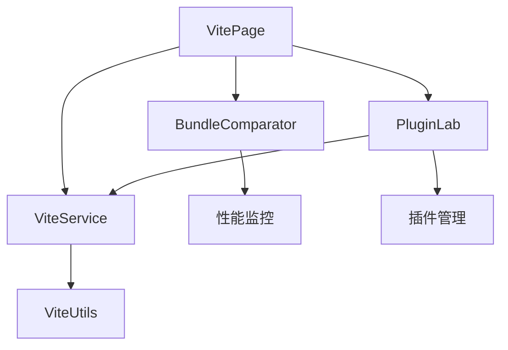

# Vite学习中心页面

## 📋 功能概述

Vite学习中心是一个专门用于学习和体验Vite构建工具的综合平台。该页面提供了构建性能对比、插件实验室等功能，帮助开发者深入理解Vite的核心特性、性能优势以及插件生态系统，为现代前端开发提供最佳实践指导。

## 🏗️ 架构设计

### 整体架构
```
Vite Page
├── 主入口 (index.tsx)
├── 构建性能对比 (BundleComparator.tsx)
├── 插件实验室 (PluginLab.tsx)
├── 服务层 (services/viteService)
├── 工具库 (utils/viteUtils)
└── 样式文件 (index.less)
```

### 核心组件关系


## 🔧 技术实现

### Tab式布局管理
```typescript
const VitePage: React.FC = () => {
  const [activeTab, setActiveTab] = useState<string>('comparator');

  const handleApplyPlugins = async (plugins: VitePlugin[]) => {
    const result = await applyVitePlugins(plugins);
    if (result.success) {
      message.success(result.message);
    } else {
      message.error(result.message);
    }
  };

  return (
    <Tabs activeKey={activeTab} onChange={setActiveTab}>
      <TabPane tab="构建性能对比" key="comparator">
        <BundleComparator />
      </TabPane>
      <TabPane tab="插件实验室" key="plugins">
        <PluginLab onApplyPlugins={handleApplyPlugins} />
      </TabPane>
    </Tabs>
  );
};
```

### 插件系统集成
```typescript
// Vite插件类型定义
interface VitePlugin {
  name: string;
  version: string;
  description: string;
  config: Record<string, any>;
  enabled: boolean;
  category: 'development' | 'build' | 'optimization' | 'framework';
}

// 插件应用服务
const applyVitePlugins = async (plugins: VitePlugin[]) => {
  try {
    const enabledPlugins = plugins.filter(p => p.enabled);
    const result = await viteService.applyPlugins(enabledPlugins);
    return { success: true, message: '插件应用成功' };
  } catch (error) {
    return { success: false, message: '插件应用失败' };
  }
};
```

## 💡 重点难点分析

### 1. 构建性能对比系统
**难点**: 准确测量和对比Vite与其他构建工具的性能差异
**解决方案**:
- **基准测试**: 标准化的性能测试套件
- **多维度对比**: 开发服务器启动、热更新、生产构建等多个维度
- **实时监控**: 实时性能指标收集和展示
- **可视化展示**: 直观的性能对比图表和分析

```typescript
// 构建性能监控系统
interface BuildMetrics {
  startupTime: number;
  hmrTime: number;
  buildTime: number;
  bundleSize: number;
  chunkCount: number;
}

class PerformanceComparator {
  private metrics: Map<string, BuildMetrics> = new Map();
  
  async measureVite(projectPath: string): Promise<BuildMetrics> {
    const startTime = performance.now();
    
    // 启动Vite开发服务器
    const devServer = await this.startViteDevServer(projectPath);
    const startupTime = performance.now() - startTime;
    
    // 测量HMR性能
    const hmrTime = await this.measureHMR(devServer);
    
    // 测量构建性能
    const buildStart = performance.now();
    const buildResult = await this.buildVite(projectPath);
    const buildTime = performance.now() - buildStart;
    
    return {
      startupTime,
      hmrTime,
      buildTime,
      bundleSize: buildResult.bundleSize,
      chunkCount: buildResult.chunkCount
    };
  }
  
  async measureWebpack(projectPath: string): Promise<BuildMetrics> {
    // 类似的Webpack性能测量逻辑
    // ...
  }
  
  comparePerformance(viteMetrics: BuildMetrics, webpackMetrics: BuildMetrics) {
    return {
      startupImprovement: (webpackMetrics.startupTime - viteMetrics.startupTime) / webpackMetrics.startupTime,
      hmrImprovement: (webpackMetrics.hmrTime - viteMetrics.hmrTime) / webpackMetrics.hmrTime,
      buildImprovement: (webpackMetrics.buildTime - viteMetrics.buildTime) / webpackMetrics.buildTime,
      bundleSizeComparison: viteMetrics.bundleSize / webpackMetrics.bundleSize
    };
  }
}
```

### 2. 插件实验室系统
**难点**: 动态加载和配置Vite插件，提供实时预览功能
**解决方案**:
- **插件注册**: 动态插件注册和管理系统
- **配置界面**: 可视化的插件配置界面
- **实时应用**: 插件配置的实时应用和预览
- **冲突检测**: 插件间冲突的检测和解决

```typescript
// 插件实验室核心实现
class PluginLaboratory {
  private availablePlugins: Map<string, VitePluginDefinition> = new Map();
  private activePlugins: Map<string, VitePlugin> = new Map();
  
  registerPlugin(definition: VitePluginDefinition) {
    this.availablePlugins.set(definition.name, definition);
  }
  
  async enablePlugin(pluginName: string, config: Record<string, any>): Promise<void> {
    const definition = this.availablePlugins.get(pluginName);
    if (!definition) {
      throw new Error(`Plugin ${pluginName} not found`);
    }
    
    // 检查插件依赖
    await this.checkDependencies(definition);
    
    // 检查插件冲突
    this.checkConflicts(definition);
    
    // 创建插件实例
    const plugin: VitePlugin = {
      name: pluginName,
      version: definition.version,
      description: definition.description,
      config,
      enabled: true,
      category: definition.category
    };
    
    this.activePlugins.set(pluginName, plugin);
    
    // 应用插件配置
    await this.applyPluginConfig(plugin);
  }
  
  private async checkDependencies(definition: VitePluginDefinition): Promise<void> {
    for (const dep of definition.dependencies || []) {
      if (!this.activePlugins.has(dep)) {
        throw new Error(`Plugin ${definition.name} requires ${dep} to be enabled first`);
      }
    }
  }
  
  private checkConflicts(definition: VitePluginDefinition): void {
    const conflicts = definition.conflicts || [];
    for (const conflict of conflicts) {
      if (this.activePlugins.has(conflict)) {
        throw new Error(`Plugin ${definition.name} conflicts with ${conflict}`);
      }
    }
  }
  
  private async applyPluginConfig(plugin: VitePlugin): Promise<void> {
    // 动态应用插件配置到Vite
    const viteConfig = await this.generateViteConfig();
    await this.reloadViteServer(viteConfig);
  }
  
  generateViteConfig(): ViteConfig {
    const plugins = Array.from(this.activePlugins.values())
      .filter(p => p.enabled)
      .map(p => this.createPluginInstance(p));
    
    return {
      plugins,
      // 其他配置...
    };
  }
}
```

### 3. 实时配置预览
**难点**: 插件配置变更的实时预览和热更新
**解决方案**:
- **配置监听**: 监听插件配置变更
- **增量更新**: 只更新变更的配置部分
- **错误处理**: 配置错误的优雅处理和回滚
- **状态同步**: 配置状态的实时同步

### 4. 性能基准测试
**难点**: 建立公平、准确的性能基准测试
**解决方案**:
- **标准化环境**: 统一的测试环境和条件
- **多场景测试**: 不同项目规模和复杂度的测试
- **统计分析**: 多次测试结果的统计分析
- **趋势追踪**: 性能变化的长期趋势追踪

## 🚀 核心功能

### 构建性能对比
1. **启动性能**
   - 开发服务器启动时间
   - 首次编译时间
   - 内存使用情况
   - CPU使用率

2. **热更新性能**
   - HMR响应时间
   - 文件变更检测速度
   - 增量编译效率
   - 浏览器刷新时间

3. **生产构建**
   - 构建总时间
   - 打包文件大小
   - 代码分割效果
   - 优化程度对比

4. **可视化展示**
   - 性能对比图表
   - 实时性能监控
   - 历史趋势分析
   - 详细性能报告

### 插件实验室
1. **插件管理**
   - 插件浏览和搜索
   - 插件安装和卸载
   - 版本管理
   - 依赖关系管理

2. **配置界面**
   - 可视化配置编辑
   - 实时配置预览
   - 配置验证
   - 配置模板

3. **实时预览**
   - 插件效果实时预览
   - 配置变更即时生效
   - 错误提示和调试
   - 性能影响分析

4. **插件开发**
   - 插件开发指南
   - API文档和示例
   - 调试工具
   - 发布和分享

### Vite特性展示
1. **ES模块支持**
   - 原生ES模块加载
   - 动态导入演示
   - 模块联邦支持
   - Tree Shaking效果

2. **开发体验**
   - 极速冷启动
   - 即时热更新
   - 错误覆盖层
   - 开发工具集成

3. **构建优化**
   - Rollup集成
   - 代码分割策略
   - 资源优化
   - 现代浏览器支持

## 📊 使用场景

### 学习场景
- **Vite入门**: 通过实际操作学习Vite基础概念
- **性能理解**: 理解Vite相比传统工具的性能优势
- **插件生态**: 探索Vite丰富的插件生态系统
- **最佳实践**: 学习Vite开发的最佳实践

### 开发场景
- **工具选型**: 为项目选择合适的构建工具
- **性能优化**: 基于性能对比优化构建配置
- **插件定制**: 开发和测试自定义Vite插件
- **迁移评估**: 评估从其他工具迁移到Vite的收益

### 团队协作
- **技术分享**: 团队内部的Vite技术分享
- **标准制定**: 建立团队的Vite使用标准
- **培训教学**: 新成员的Vite培训
- **问题排查**: 协作解决Vite相关问题

## 🔍 技术亮点

### 1. 智能性能分析
```typescript
// 智能性能分析系统
class IntelligentPerformanceAnalyzer {
  private baselineMetrics: BuildMetrics;
  private currentMetrics: BuildMetrics;
  
  analyzePerformance(metrics: BuildMetrics): PerformanceAnalysis {
    const analysis: PerformanceAnalysis = {
      score: this.calculatePerformanceScore(metrics),
      bottlenecks: this.identifyBottlenecks(metrics),
      recommendations: this.generateRecommendations(metrics),
      trends: this.analyzeTrends(metrics)
    };
    
    return analysis;
  }
  
  private calculatePerformanceScore(metrics: BuildMetrics): number {
    const weights = {
      startupTime: 0.3,
      hmrTime: 0.3,
      buildTime: 0.2,
      bundleSize: 0.2
    };
    
    const normalizedScores = {
      startupTime: Math.max(0, 100 - (metrics.startupTime / 1000) * 10),
      hmrTime: Math.max(0, 100 - (metrics.hmrTime / 100) * 10),
      buildTime: Math.max(0, 100 - (metrics.buildTime / 10000) * 10),
      bundleSize: Math.max(0, 100 - (metrics.bundleSize / 1000000) * 10)
    };
    
    return Object.entries(weights).reduce((score, [key, weight]) => {
      return score + normalizedScores[key] * weight;
    }, 0);
  }
  
  private identifyBottlenecks(metrics: BuildMetrics): string[] {
    const bottlenecks: string[] = [];
    
    if (metrics.startupTime > 5000) {
      bottlenecks.push('开发服务器启动时间过长');
    }
    
    if (metrics.hmrTime > 1000) {
      bottlenecks.push('热更新响应时间过长');
    }
    
    if (metrics.buildTime > 60000) {
      bottlenecks.push('生产构建时间过长');
    }
    
    if (metrics.bundleSize > 5000000) {
      bottlenecks.push('打包文件过大');
    }
    
    return bottlenecks;
  }
}
```

### 2. 插件生态系统
```typescript
// 插件生态系统管理
class PluginEcosystem {
  private registry: Map<string, PluginMetadata> = new Map();
  private categories: Map<string, string[]> = new Map();
  
  registerPlugin(metadata: PluginMetadata) {
    this.registry.set(metadata.name, metadata);
    
    // 按类别分组
    const category = metadata.category;
    if (!this.categories.has(category)) {
      this.categories.set(category, []);
    }
    this.categories.get(category)!.push(metadata.name);
  }
  
  searchPlugins(query: string, filters: PluginFilters = {}): PluginMetadata[] {
    let results = Array.from(this.registry.values());
    
    // 文本搜索
    if (query) {
      results = results.filter(plugin => 
        plugin.name.toLowerCase().includes(query.toLowerCase()) ||
        plugin.description.toLowerCase().includes(query.toLowerCase()) ||
        plugin.keywords.some(keyword => 
          keyword.toLowerCase().includes(query.toLowerCase())
        )
      );
    }
    
    // 类别过滤
    if (filters.category) {
      results = results.filter(plugin => plugin.category === filters.category);
    }
    
    // 评分过滤
    if (filters.minRating) {
      results = results.filter(plugin => plugin.rating >= filters.minRating);
    }
    
    // 排序
    return results.sort((a, b) => {
      if (filters.sortBy === 'popularity') {
        return b.downloads - a.downloads;
      } else if (filters.sortBy === 'rating') {
        return b.rating - a.rating;
      } else {
        return a.name.localeCompare(b.name);
      }
    });
  }
  
  getRecommendations(currentPlugins: string[]): PluginMetadata[] {
    const recommendations: PluginMetadata[] = [];
    
    // 基于当前插件推荐相关插件
    currentPlugins.forEach(pluginName => {
      const plugin = this.registry.get(pluginName);
      if (plugin?.relatedPlugins) {
        plugin.relatedPlugins.forEach(relatedName => {
          const related = this.registry.get(relatedName);
          if (related && !currentPlugins.includes(relatedName)) {
            recommendations.push(related);
          }
        });
      }
    });
    
    return recommendations.slice(0, 5); // 返回前5个推荐
  }
}
```

### 3. 实时配置同步
```typescript
// 实时配置同步系统
class ConfigSyncManager {
  private websocket: WebSocket;
  private configCache: Map<string, any> = new Map();
  
  constructor(serverUrl: string) {
    this.websocket = new WebSocket(serverUrl);
    this.setupEventHandlers();
  }
  
  private setupEventHandlers() {
    this.websocket.onmessage = (event) => {
      const message = JSON.parse(event.data);
      
      switch (message.type) {
        case 'config-update':
          this.handleConfigUpdate(message.data);
          break;
        case 'build-complete':
          this.handleBuildComplete(message.data);
          break;
        case 'error':
          this.handleError(message.data);
          break;
      }
    };
  }
  
  updateConfig(key: string, value: any) {
    this.configCache.set(key, value);
    
    // 发送配置更新到服务器
    this.websocket.send(JSON.stringify({
      type: 'config-change',
      key,
      value
    }));
  }
  
  private handleConfigUpdate(data: any) {
    // 处理服务器端配置更新
    this.configCache.set(data.key, data.value);
    
    // 触发UI更新
    this.notifyConfigChange(data.key, data.value);
  }
  
  private notifyConfigChange(key: string, value: any) {
    // 通知相关组件配置已更新
    window.dispatchEvent(new CustomEvent('vite-config-change', {
      detail: { key, value }
    }));
  }
}
```

## 🎯 最佳实践

### 开发建议
1. **渐进式迁移**: 逐步从传统工具迁移到Vite
2. **插件选择**: 根据项目需求选择合适的插件
3. **性能监控**: 持续监控构建性能变化
4. **配置优化**: 定期优化Vite配置以获得最佳性能

### 使用建议
1. **环境配置**: 为不同环境配置专门的Vite设置
2. **插件管理**: 合理管理插件依赖和版本
3. **缓存策略**: 充分利用Vite的缓存机制
4. **调试技巧**: 掌握Vite的调试工具和技巧

## 📈 技术栈

- **React 19**: 最新的React版本
- **TypeScript**: 类型安全开发
- **Ant Design**: UI组件库
- **Vite**: 现代构建工具
- **Rollup**: 生产构建
- **WebSocket**: 实时通信

## 🔮 扩展方向

### 功能扩展
- **更多构建工具对比**: 支持更多构建工具的性能对比
- **插件开发工具**: 完整的插件开发和调试工具链
- **云端构建**: 云端构建服务的集成
- **团队协作**: 团队配置共享和协作功能

### 技术演进
- **Vite 5**: 最新版本特性的支持
- **ESBuild集成**: 更深度的ESBuild集成
- **Web Workers**: 利用Web Workers提升性能
- **边缘计算**: 边缘计算环境的构建优化

这个Vite学习中心为开发者提供了全面的Vite学习和实践平台，通过性能对比、插件实验和最佳实践指导，帮助开发者充分利用Vite的优势，提升前端开发效率和体验。