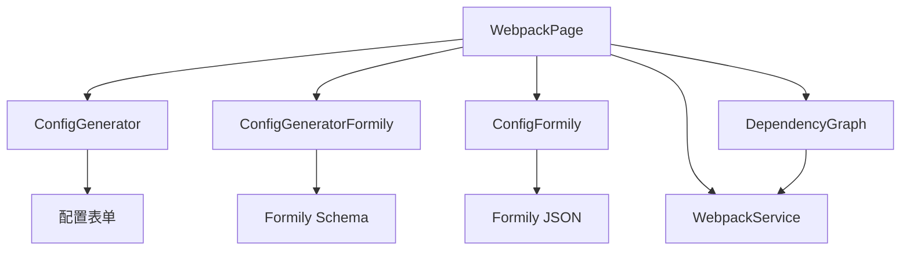

# Webpack学习中心页面

## 📋 功能概述

Webpack学习中心是一个专门用于学习和实践Webpack配置的综合平台。该页面提供了多种Webpack配置生成器、依赖关系图可视化、以及基于Formily的动态表单配置等功能，帮助开发者深入理解和掌握Webpack的各种特性和最佳实践。

## 🏗️ 架构设计

### 整体架构
```md
Webpack Page
├── 主入口 (index.tsx)
├── 配置生成器模块 (modules/)
│   ├── ConfigGenerator (普通配置生成器)
│   ├── ConfigGeneratorFormily (Formily Schema配置生成器)
│   └── ConfigFormily (Formily JSON配置生成器)
├── 依赖关系图 (DependencyGraph/)
├── 服务层 (services/webpackService)
└── 样式文件 (index.less)
```

### 核心组件关系


## 🔧 技术实现

### Tab式布局管理
```typescript
const WebpackPage: React.FC = () => {
  const [activeTab, setActiveTab] = useState<string>('config');
  const [statsData, setStatsData] = useState<any>(null);
  const [loading, setLoading] = useState<boolean>(false);

  const handleTabChange = (key: string) => {
    setActiveTab(key);

    // 如果切换到依赖图选项卡，加载统计数据
    if (key === 'dependency' && !statsData) {
      loadStatsData();
    }
  };

  const loadStatsData = async () => {
    setLoading(true);
    try {
      const data = await getWebpackStats();
      setStatsData(data);
    } catch (error) {
      console.error('加载统计数据失败', error);
    } finally {
      setLoading(false);
    }
  };
};
```

### 服务层集成
```typescript
// Webpack统计数据服务
import { getWebpackStats } from '../../services/webpackService';

// 异步加载统计数据
const statsData = await getWebpackStats();
```

## 💡 重点难点分析

### 1. Webpack配置生成器
**难点**: 动态生成复杂的Webpack配置，支持多种场景和选项
**解决方案**:
- **模板系统**: 预定义的配置模板和最佳实践
- **动态表单**: 基于配置选项动态生成表单界面
- **实时预览**: 配置变更的实时预览和验证
- **代码生成**: 自动生成可用的webpack.config.js文件

```typescript
// Webpack配置生成器核心逻辑
interface WebpackConfigOptions {
  entry: string | string[] | Record<string, string>;
  output: {
    path: string;
    filename: string;
    publicPath?: string;
  };
  mode: 'development' | 'production' | 'none';
  devtool: string | false;
  module: {
    rules: Rule[];
  };
  plugins: Plugin[];
  optimization?: OptimizationOptions;
}

class WebpackConfigGenerator {
  private baseConfig: Partial<WebpackConfigOptions> = {};

  constructor(options: Partial<WebpackConfigOptions> = {}) {
    this.baseConfig = options;
  }

  generateConfig(userOptions: Partial<WebpackConfigOptions>): WebpackConfigOptions {
    const config = { ...this.baseConfig, ...userOptions };

    // 根据模式设置默认配置
    if (config.mode === 'development') {
      config.devtool = config.devtool || 'eval-source-map';
      config.optimization = {
        ...config.optimization,
        minimize: false
      };
    } else if (config.mode === 'production') {
      config.devtool = config.devtool || 'source-map';
      config.optimization = {
        ...config.optimization,
        minimize: true,
        splitChunks: {
          chunks: 'all'
        }
      };
    }

    return this.validateConfig(config);
  }

  private validateConfig(config: Partial<WebpackConfigOptions>): WebpackConfigOptions {
    // 配置验证逻辑
    if (!config.entry) {
      throw new Error('Entry point is required');
    }

    if (!config.output?.path) {
      throw new Error('Output path is required');
    }

    return config as WebpackConfigOptions;
  }
}
```

### 2. Formily集成
**难点**: 集成Formily表单库实现动态配置表单
**解决方案**:
- **Schema驱动**: 使用JSON Schema定义表单结构
- **动态渲染**: 根据Schema动态渲染表单组件
- **联动控制**: 表单字段间的联动和依赖关系
- **验证机制**: 完善的表单验证和错误提示

```typescript
// Formily Schema配置
const webpackConfigSchema = {
  type: 'object',
  properties: {
    mode: {
      type: 'string',
      title: '构建模式',
      enum: ['development', 'production', 'none'],
      'x-decorator': 'FormItem',
      'x-component': 'Select',
      'x-component-props': {
        placeholder: '请选择构建模式'
      }
    },
    entry: {
      type: 'string',
      title: '入口文件',
      'x-decorator': 'FormItem',
      'x-component': 'Input',
      'x-component-props': {
        placeholder: '请输入入口文件路径'
      },
      'x-validator': [
        {
          required: true,
          message: '入口文件不能为空'
        }
      ]
    },
    output: {
      type: 'object',
      title: '输出配置',
      properties: {
        path: {
          type: 'string',
          title: '输出路径',
          'x-decorator': 'FormItem',
          'x-component': 'Input'
        },
        filename: {
          type: 'string',
          title: '文件名',
          'x-decorator': 'FormItem',
          'x-component': 'Input'
        }
      }
    }
  }
};
```

### 3. 依赖关系图可视化
**难点**: 解析和可视化复杂的模块依赖关系
**解决方案**:
- **数据解析**: 解析Webpack stats数据提取依赖信息
- **图形渲染**: 使用D3.js或其他图形库渲染依赖图
- **交互功能**: 支持缩放、拖拽、搜索等交互操作
- **性能优化**: 大型项目的依赖图性能优化

```typescript
// 依赖关系图数据处理
interface DependencyNode {
  id: string;
  name: string;
  size: number;
  type: 'entry' | 'module' | 'chunk';
  dependencies: string[];
}

interface DependencyGraph {
  nodes: DependencyNode[];
  edges: Array<{
    source: string;
    target: string;
    weight: number;
  }>;
}

class DependencyAnalyzer {
  analyzeDependencies(statsData: any): DependencyGraph {
    const nodes: DependencyNode[] = [];
    const edges: Array<{ source: string; target: string; weight: number }> = [];

    // 解析模块信息
    statsData.modules?.forEach((module: any) => {
      nodes.push({
        id: module.id,
        name: module.name,
        size: module.size,
        type: 'module',
        dependencies: module.reasons?.map((r: any) => r.moduleId) || []
      });

      // 构建依赖边
      module.reasons?.forEach((reason: any) => {
        edges.push({
          source: reason.moduleId,
          target: module.id,
          weight: 1
        });
      });
    });

    return { nodes, edges };
  }

  findCircularDependencies(graph: DependencyGraph): string[][] {
    // 检测循环依赖
    const visited = new Set<string>();
    const recursionStack = new Set<string>();
    const cycles: string[][] = [];

    const dfs = (nodeId: string, path: string[]): void => {
      visited.add(nodeId);
      recursionStack.add(nodeId);
      path.push(nodeId);

      const node = graph.nodes.find(n => n.id === nodeId);
      node?.dependencies.forEach(depId => {
        if (!visited.has(depId)) {
          dfs(depId, [...path]);
        } else if (recursionStack.has(depId)) {
          // 发现循环依赖
          const cycleStart = path.indexOf(depId);
          cycles.push(path.slice(cycleStart));
        }
      });

      recursionStack.delete(nodeId);
    };

    graph.nodes.forEach(node => {
      if (!visited.has(node.id)) {
        dfs(node.id, []);
      }
    });

    return cycles;
  }
}
```

### 4. 配置验证和优化建议
**难点**: 提供智能的配置验证和优化建议
**解决方案**:
- **规则引擎**: 基于规则的配置验证系统
- **性能分析**: 配置对构建性能的影响分析
- **最佳实践**: 内置的最佳实践建议
- **自动优化**: 自动优化配置的建议和应用

## 🚀 核心功能

### 配置生成器 (普通)
1. **基础配置**
   - 入口和输出配置
   - 模式选择 (development/production)
   - DevTool配置
   - 公共路径设置

2. **模块配置**
   - Loader规则配置
   - 文件类型处理
   - 预处理器集成
   - 模块解析规则

3. **插件配置**
   - 常用插件选择
   - 插件参数配置
   - 自定义插件支持
   - 插件执行顺序

4. **优化配置**
   - 代码分割策略
   - 压缩优化选项
   - Tree Shaking配置
   - 缓存策略

### Formily配置生成器
1. **Schema驱动**
   - JSON Schema定义
   - 动态表单渲染
   - 字段联动控制
   - 条件显示逻辑

2. **表单验证**
   - 实时验证
   - 自定义验证规则
   - 错误信息提示
   - 批量验证

3. **数据绑定**
   - 双向数据绑定
   - 数据格式转换
   - 默认值设置
   - 数据持久化

### 依赖关系图
1. **可视化展示**
   - 模块依赖关系图
   - 交互式图形界面
   - 缩放和拖拽操作
   - 搜索和过滤功能

2. **依赖分析**
   - 循环依赖检测
   - 依赖深度分析
   - 模块大小统计
   - 依赖路径追踪

3. **性能分析**
   - 构建时间分析
   - 模块加载性能
   - 代码分割效果
   - 优化建议

## 📊 使用场景

### 学习场景
- **Webpack入门**: 通过可视化界面学习Webpack配置
- **配置理解**: 理解不同配置选项的作用和影响
- **最佳实践**: 学习Webpack配置的最佳实践
- **问题诊断**: 通过依赖图诊断构建问题

### 开发场景
- **快速配置**: 快速生成项目的Webpack配置
- **配置优化**: 优化现有的Webpack配置
- **依赖管理**: 分析和管理项目依赖关系
- **性能调优**: 基于分析结果进行性能优化

### 团队协作
- **配置标准化**: 建立团队的配置标准
- **知识分享**: 分享Webpack配置经验
- **问题排查**: 协作排查构建问题
- **培训教学**: 团队内部的Webpack培训

## 🔍 技术亮点

### 1. 智能配置生成
```typescript
// 智能配置推荐系统
class ConfigRecommendationEngine {
  private rules: ConfigRule[] = [];

  addRule(rule: ConfigRule) {
    this.rules.push(rule);
  }

  recommend(projectInfo: ProjectInfo): ConfigRecommendation[] {
    const recommendations: ConfigRecommendation[] = [];

    this.rules.forEach(rule => {
      if (rule.condition(projectInfo)) {
        recommendations.push({
          type: rule.type,
          message: rule.message,
          config: rule.generateConfig(projectInfo),
          priority: rule.priority
        });
      }
    });

    return recommendations.sort((a, b) => b.priority - a.priority);
  }
}

// 使用示例
const engine = new ConfigRecommendationEngine();

engine.addRule({
  type: 'optimization',
  condition: (info) => info.isProduction && info.hasLargeAssets,
  message: '建议启用代码分割以优化加载性能',
  generateConfig: (info) => ({
    optimization: {
      splitChunks: {
        chunks: 'all',
        cacheGroups: {
          vendor: {
            test: /[\\/]node_modules[\\/]/,
            name: 'vendors',
            chunks: 'all'
          }
        }
      }
    }
  }),
  priority: 8
});
```

### 2. 实时配置预览
```typescript
// 配置预览系统
class ConfigPreviewSystem {
  private previewContainer: HTMLElement;
  private highlighter: CodeHighlighter;

  constructor(container: HTMLElement) {
    this.previewContainer = container;
    this.highlighter = new CodeHighlighter('javascript');
  }

  updatePreview(config: WebpackConfigOptions) {
    const configString = this.formatConfig(config);
    const highlightedCode = this.highlighter.highlight(configString);

    this.previewContainer.innerHTML = `
      <div class="config-preview">
        <div class="config-header">
          <h3>webpack.config.js</h3>
          <button class="copy-btn" onclick="this.copyToClipboard()">复制</button>
        </div>
        <pre><code>${highlightedCode}</code></pre>
      </div>
    `;
  }

  private formatConfig(config: WebpackConfigOptions): string {
    return `module.exports = ${JSON.stringify(config, null, 2)
      .replace(/"([^"]+)":/g, '$1:')
      .replace(/"/g, "'")};`;
  }
}
```

### 3. 性能监控集成
```typescript
// 构建性能监控
class BuildPerformanceMonitor {
  private metrics: BuildMetrics = {};

  startMonitoring() {
    const startTime = performance.now();

    return {
      recordPhase: (phase: string) => {
        this.metrics[phase] = {
          startTime: performance.now(),
          duration: 0
        };
      },

      endPhase: (phase: string) => {
        if (this.metrics[phase]) {
          this.metrics[phase].duration = performance.now() - this.metrics[phase].startTime;
        }
      },

      getReport: (): PerformanceReport => {
        const totalTime = performance.now() - startTime;

        return {
          totalTime,
          phases: this.metrics,
          recommendations: this.generateRecommendations()
        };
      }
    };
  }

  private generateRecommendations(): string[] {
    const recommendations: string[] = [];

    if (this.metrics.compilation?.duration > 5000) {
      recommendations.push('编译时间较长，建议启用缓存或优化Loader配置');
    }

    if (this.metrics.optimization?.duration > 3000) {
      recommendations.push('优化阶段耗时较长，建议检查压缩和代码分割配置');
    }

    return recommendations;
  }
}
```

## 🎯 最佳实践

### 开发建议
1. **配置模块化**: 将复杂配置拆分为多个模块
2. **环境区分**: 为不同环境创建专门的配置
3. **性能优先**: 始终关注构建性能和输出质量
4. **文档维护**: 保持配置文档的及时更新

### 学习建议
1. **循序渐进**: 从基础配置开始逐步深入
2. **实践验证**: 通过实际项目验证配置效果
3. **社区参与**: 关注Webpack社区的最新发展
4. **工具使用**: 充分利用各种Webpack工具和插件

## 📈 技术栈

- **React 19**: 最新的React版本
- **TypeScript**: 类型安全开发
- **Ant Design**: UI组件库
- **Formily**: 动态表单解决方案
- **D3.js**: 数据可视化
- **Monaco Editor**: 代码编辑器

## 🔮 扩展方向

### 功能扩展
- **配置模板库**: 更多预定义的配置模板
- **插件市场**: 第三方插件的集成和管理
- **性能基准**: 配置性能的基准测试
- **云端配置**: 配置的云端存储和同步

### 技术演进
- **Webpack 5**: 最新版本特性的支持
- **Vite集成**: 与Vite等新工具的对比和集成
- **微前端**: 微前端架构的配置支持
- **AI辅助**: AI驱动的配置优化建议

这个Webpack学习中心为开发者提供了全面的Webpack学习和实践平台，通过可视化的配置生成、依赖分析和最佳实践指导，帮助开发者快速掌握Webpack的核心概念和高级特性。