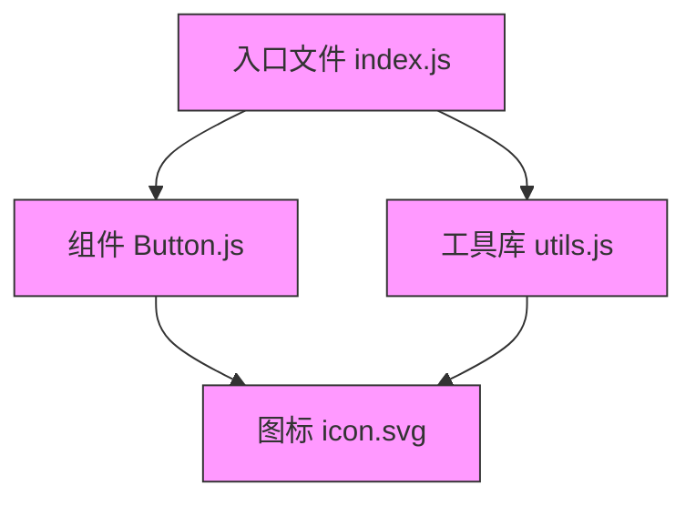

# Webpack 在线学习网站

## 功能概述

Webpack 学习中心提供了交互式的学习环境，帮助开发者理解和掌握 Webpack 的配置与使用。主要功能包括：

1. **配置生成器**：通过可视化界面生成 webpack.config.js 配置文件
2. **依赖关系图**：可视化展示模块之间的依赖关系
3. **实时预览**：配置修改后实时查看生成的配置代码

## 技术实现

- 使用 React 函数组件和 Hooks 构建用户界面
- 采用 Antd 组件库提供统一的 UI 体验
- 集成 Monaco Editor 实现代码编辑和高亮
- 使用 D3.js 绘制模块依赖关系图
- 提供沙盒环境安全执行构建过程

## 核心模块

### 配置生成器 (ConfigGenerator)

交互式配置界面，支持：
- 基本配置（mode、entry、output）
- 优化配置（代码分割、压缩）
- Loader 配置（处理各类文件）
- 插件配置（增强构建功能）

### 依赖关系图 (DependencyGraph)

可视化模块依赖，功能包括：
- 力导向图展示模块关系
- 模块大小与类型区分
- 交互式查看模块详情
- 缩放和拖拽操作

## 使用指南

1. 在配置生成器中调整 Webpack 配置
2. 实时查看生成的配置代码
3. 切换到依赖关系图查看模块依赖
4. 点击节点查看模块详情

## 学习资源

- [Webpack 官方文档](https://webpack.js.org/concepts/)
- [Webpack 配置指南](https://webpack.js.org/configuration/)
- [Webpack 插件列表](https://webpack.js.org/plugins/)
- [Webpack Loader 列表](https://webpack.js.org/loaders/)

## 结合 formily 全家桶、用来配置表单部分

- [formily](https://formilyjs.org/zh-CN/guide/quick-start)
- [formily-antd](https://formilyjs.org/zh-CN/api/components/antd)
- [formily-react](https://formilyjs.org/zh-CN/api/components/react)
- [formily-core](https://formilyjs.org/zh-CN/api/core)
- [formily-reactive](https://formilyjs.org/zh-CN/api/reactive)
- [formily-reactive-react](https://formilyjs.org/zh-CN/api/reactive-react)


### Webpack 配置生成器

1. 基本配置
   1. mode
   2. entry
   3. output
2. 优化配置
   1. minimize
   2. splitChunks
3. Loader 配置
   1. test
   2. use
   3. exclude
5. 其他配置
   1. plugins
   2. module
   3. resolve
   4. devServer
   5. watch
   6. devtool
   7. optimization

### Webpack 依赖关系图

1. 模块依赖关系图
   1. 力导向图展示模块关系
   2. 模块大小与类型区分
   3. 交互式查看模块详情
   4. 缩放和拖拽操作
2. 模块详情
   1. 模块名称
   2. 模块大小
   3. 模块类型
   4. 模块依赖
   5. 模块代码

以下是 Webpack 和 Vite 的配置体系与依赖关系图解析，按照您的案例格式结构化输出：

---

### **一、Webpack 配置生成器**
#### **1. 基本配置**
| **配置项**   | **作用与示例**                                                                                               | **常用值/示例**                                                                 |
|--------------|-------------------------------------------------------------------------------------------------------------|-------------------------------------------------------------------------------|
| **`mode`**   | 定义构建环境，自动启用内置优化策略 。                                                   | `'development'`（启用热更新）、`'production'`（代码压缩/Tree Shaking）         |
| **`entry`**  | 入口文件路径，支持单入口（字符串）或多入口（对象）。                                 | `{ main: './src/index.js', vendor: './src/vendor.js' }`                       |
| **`output`** | 输出文件配置，控制文件名、路径和公共资源路径 。                                      | `{ path: path.resolve(__dirname, 'dist'), filename: '[name].[contenthash].js' }` |

#### **2. 优化配置**
| **配置项**         | **作用与示例**                                                                                                   | **常用值/示例**                                                                 |
|--------------------|-----------------------------------------------------------------------------------------------------------------|-------------------------------------------------------------------------------|
| **`minimize`**     | 是否压缩代码（生产模式默认启用）。                                                      | `true`（启用TerserPlugin压缩JS）                                              |
| **`splitChunks`**  | 代码分包策略，分离第三方库和公共模块 。                                                 | ```splitChunks: { chunks: 'all', minSize: 20000, cacheGroups: { vendors: { test: /node_modules/ } } }``` |

#### **3. Loader 配置**
```javascript
module: {
  rules: [
    {
      **test**: /\.js$/,          // 匹配文件类型
      **use**: 'babel-loader',    // 使用的Loader（支持数组链式处理）
      **exclude**: /node_modules/ // 排除目录
    },
    {
      test: /\.scss$/,
      use: ['style-loader', 'css-loader', 'sass-loader'] // 从右到左执行
    }
  ]
}
```

#### **4. 其他配置**
| **配置项**       | **作用与示例**                                                                                                 |
|------------------|---------------------------------------------------------------------------------------------------------------|
| **`plugins`**    | 扩展功能（如生成HTML、清理构建目录）。示例：`[new HtmlWebpackPlugin({ template: './public/index.html' })]` |
| **`resolve`**    | 模块解析规则，支持别名和扩展名 。示例：`{ alias: { '@': path.resolve(__dirname, 'src') }, extensions: ['.js', '.jsx'] }` |
| **`devServer`**  | 开发服务器配置（热更新、代理）。示例：`{ port: 3000, hot: true, proxy: { '/api': 'http://localhost:8080' } }` |
| **`devtool`**    | Source Map生成方式 。示例：`'source-map'`（生产环境）、`'eval-cheap-source-map'`（开发环境） |
| **`optimization`**| 高级优化（如运行时代码分离）。示例：`{ runtimeChunk: 'single' }`                      |

---

### **二、Webpack 依赖关系图**
#### **1. 模块依赖关系图**

- **力导向图**：展示模块间引用关系，节点大小反映文件体积 。
- **交互操作**：支持缩放/拖拽定位模块，悬停显示依赖路径 。
- **类型区分**：
  - 绿色：JS 模块
  - 橙色：CSS/SCSS
  - 蓝色：图片/字体

#### **2. 模块详情**
| **属性**       | **说明**                                  | **示例值**                          |
|----------------|------------------------------------------|-----------------------------------|
| **模块名称**   | 文件路径                                  | `./src/components/Button.js`      |
| **模块大小**   | 压缩后体积（KB）                         | `24.8 KB`                         |
| **模块类型**   | 文件类别                                  | `JavaScript`/`SASS`/`SVG`        |
| **直接依赖**   | 当前模块引用的子模块                     | `['./icon.svg', './style.scss']` |
| **被引用次数** | 反映模块复用率                           | `8`（被8个模块引用）              |

---

### **三、Vite 依赖关系图对比**
#### **1. 构建差异**
- **Webpack**：基于打包的依赖图，需完整构建后生成 。
- **Vite**：基于原生ES模块，依赖图实时生成（无需打包）。

#### **2. 依赖图特点**
| **特性**         | **Webpack**                            | **Vite**                              |
|------------------|----------------------------------------|---------------------------------------|
| **生成速度**     | 慢（需完整编译）                      | 快（按需编译）                       |
| **节点类型**     | 包含Loader处理后的资源                | 仅源码（如.jsx/.vue）                |
| **优化提示**     | 标记重复依赖/Tree Shaking失效模块     | 提示未使用的动态导入      |

#### **3. 交互功能**
- **共同点**：均支持力导向图、模块详情查看、缩放操作。
- **Vite 特有**：
  - 热模块替换（HMR）路径高亮
  - 第三方库预构建标记（如 `lodash-es`）

---

**总结**：
- **Webpack 配置** 覆盖构建全流程，核心在于 `loader` 链式处理、`splitChunks` 分包策略及环境优化。
- **依赖关系图** 直观暴露模块拓扑，Webpack 侧重构建后分析，Vite 强调实时按需加载。
- **生产建议**：
  - Webpack 生产环境启用 `mode: 'production'` + `contenthash` 文件名 。
  - Vite 利用原生ESM减少配置，适合现代浏览器项目 。