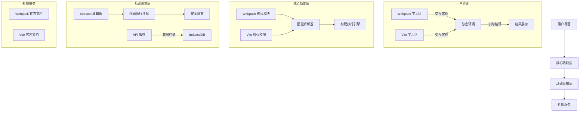
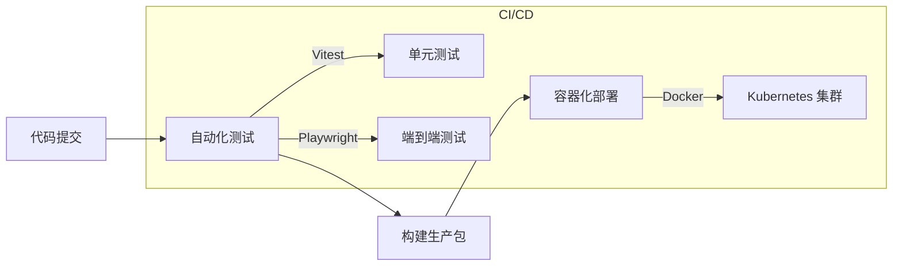
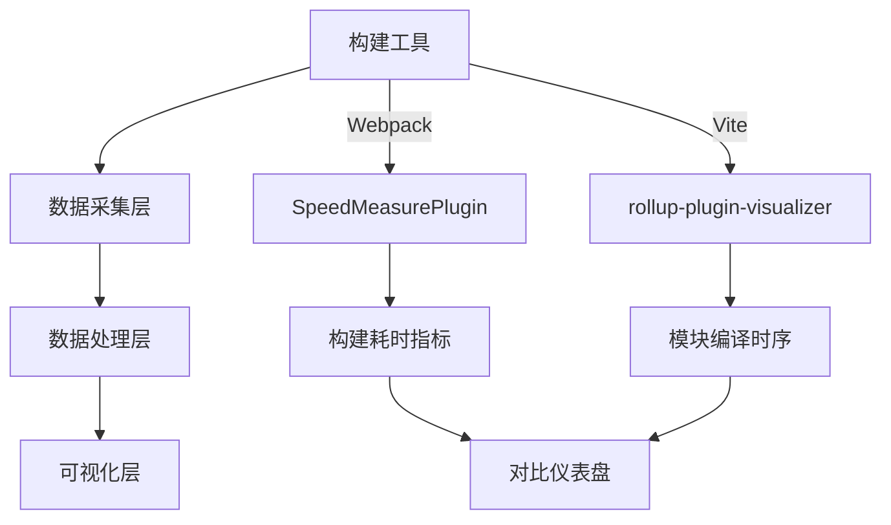

以下是为支持 Webpack 和 Vite 编译构建打包的在线学习网站设计的完整技术文档，结合 React + TypeScript 技术栈，基于您提供的项目配置和架构需求。

---

### **技术文档：Webpack & Vite 编译构建学习平台**

---

### **一、整体架构设计**
#### **架构流程图**


#### **架构分层说明**
1. **用户界面层（UI）**
   - 采用 **Atomic Design** 组件结构：`atoms`（按钮/输入框）、`molecules`（配置面板）、`organisms`（沙盒环境）。
   - 支持响应式布局，适配桌面/移动端。

2. **核心功能层**
   - **Webpack 模块**：实现配置生成、依赖分析、构建流程可视化。
   - **Vite 模块**：基于 ES Module 的按需编译、热更新模拟、预优化机制。
   - **统一构建引擎**：抽象公共接口（如 `build()`、`watch()`），通过适配器模式兼容 Webpack/Vite。

3. **基础设施层**
   - **沙盒环境**：使用 `iframe` + `postMessage` 实现代码安全隔离，支持实时构建预览。
   - **持久化存储**：利用 IndexedDB 缓存用户配置和实验记录。
   - **API 服务**：提供构建结果分析和错误日志上报。

---

### **二、关键技术实现**
#### **1. Webpack 学习模块**
- **功能设计**：
  - **配置向导**：通过表单生成 `webpack.config.ts`，实时验证配置有效性。
  - **依赖图谱可视化**：使用 D3.js 渲染模块依赖关系图（基于 `stats.json` 数据）。
  - **构建流程模拟**：分步演示 Loader/Plugin 执行顺序，支持断点调试。
- **代码示例**：
  ```tsx
  // apps/react-tutorial/src/pages/Webpack/ConfigGenerator.tsx
  import { useMemo } from 'react';
  import MonacoEditor from '@monaco-editor/react';

  const WebpackConfigEditor = ({ config }: { config: object }) => {
    const code = useMemo(() => JSON.stringify(config, null, 2), [config]);
    return (
      <MonacoEditor
        height="500px"
        language="json"
        value={code}
        options={{ readOnly: true }}
      />
    );
  };
  ```

#### **2. Vite 学习模块**
- **功能设计**：
  - **即时编译演示**：对比 Webpack 的 Bundle 与 Vite 的 ESM 加载速度差异。
  - **插件系统实验**：提供预设插件（如 `vite-plugin-react`），支持自定义插件注入。
  - **预优化分析**：展示 `node_modules` 模块的预构建结果。
- **代码示例**：
  ```tsx
  // apps/react-tutorial/src/pages/Vite/BundleComparator.tsx
  import { useState } from 'react';
  import { Button, Progress } from 'antd';

  const BundleComparator = () => {
    const [webpackTime, setWebpackTime] = useState(0);
    const [viteTime, setViteTime] = useState(0);

    const runBuild = async (tool: 'webpack' | 'vite') => {
      const start = Date.now();
      const response = await fetch(`/api/build/${tool}`);
      const time = Date.now() - start;
      tool === 'webpack' ? setWebpackTime(time) : setViteTime(time);
    };

    return (
      <div>
        <Button onClick={() => runBuild('webpack')}>运行 Webpack</Button>
        <Button onClick={() => runBuild('vite')}>运行 Vite</Button>
        <div>Webpack 耗时: {webpackTime}ms</div>
        <div>Vite 耗时: {viteTime}ms</div>
      </div>
    );
  };
  ```

#### **3. 沙盒环境**
- **安全机制**：
  - 使用 `sandbox="allow-scripts"` 限制 iframe 权限。
  - 通过 `Web Worker` 执行构建任务，避免阻塞主线程。
- **动态代码加载**：
  ```ts
  // apps/react-tutorial/src/utils/sandbox.ts
  const createSandbox = (code: string) => {
    const blob = new Blob([code], { type: 'text/javascript' });
    const url = URL.createObjectURL(blob);
    const worker = new Worker(url);
    worker.onmessage = (e) => postMessage(e.data);
  };
  ```

---

### **三、工程化规范**
#### **1. 代码结构**
```bash
src/
├── pages/
│   ├── Webpack/           # Webpack 学习模块
│   │   ├── ConfigGenerator.tsx
│   │   ├── DependencyGraph.tsx
│   │   └── index.less
│   └── Vite/              # Vite 学习模块
│       ├── BundleComparator.tsx
│       ├── PluginLab.tsx
│       └── index.less
├── components/
│   ├── atoms/             # 原子组件
│   ├── molecules/         # 分子组件（如配置面板）
│   └── organisms/         # 有机组件（如沙盒环境）
├── services/              # API 服务层
│   ├── webpackService.ts # 调用 Webpack API
│   └── viteService.ts     # 调用 Vite API
├── hooks/                 # 自定义 Hooks
│   ├── useBuildResult.ts  # 构建结果处理
│   └── useCodeSandbox.ts  # 沙盒环境管理
└── utils/                 # 工具函数
    ├── webpackUtils.ts    # Webpack 配置解析
    └── viteUtils.ts       # Vite 插件加载
```

#### **2. 类型定义规范**
- 所有 Props 需明确定义接口：
  ```ts
  interface BundleComparatorProps {
    onComplete?: (time: number) => void;
    tool: 'webpack' | 'vite';
  }
  ```
- 禁止使用 `any`，优先使用工具泛型（`Partial<Config>`、`Pick<Plugin, 'name'>`）。

#### **3. 性能优化**
- **构建提速**：
  - Vite 开发模式下启用 `esbuild` 转译 TS。
  - 使用 `vite-plugin-compression` 压缩静态资源。
- **渲染优化**：
  - 对重型组件（如依赖图谱）使用 `React.memo`。
  - 沙盒通信使用 `useCallback` 避免重复渲染。

---

### **四、安全与运维**
#### **1. 安全措施**
- **沙盒隔离**：限制 `postMessage` 只接收白名单事件。
- **输入过滤**：用户配置需经过 `schema` 验证（使用 `zod` 库）。
- **防 XSS**：对动态代码使用 `DOMPurify` 消毒。

#### **2. 部署流程**


---

### **五、扩展性设计**
1. **插件机制**
   - 支持用户开发自定义 Loader/Plugin，通过动态导入（`import()`）加载。
2. **多框架适配**
   - 预留 Rollup 接口，未来支持其他构建工具。
3. **离线能力**
   - 使用 Service Worker 缓存教学资源，支持 PWA 安装。

---

### **六、完整技术栈整合**
| 层          | 技术选型                  | 说明                                                                 |
|-------------|--------------------------|----------------------------------------------------------------------|
| **UI 框架** | React 19 + TypeScript    | 函数组件 + Hooks 模式，严格类型约束         |
| **状态管理** | Context API + Immer      | 轻量级状态管理，配合 Immer 实现不可变更新               |
| **构建工具** | Vite 5                   | 开发环境秒级启动，生产构建使用 Rollup      |
| **测试工具** | Vitest + Playwright      | 单元测试覆盖核心逻辑，E2E 测试验证用户流程              |
| **监控**    | Sentry + 自定义日志       | 构建错误实时上报，性能数据可视化                                     |

---

### **七、附录：关键依赖说明**
- **`@monaco-editor/react`**：提供代码编辑能力，支持 Webpack/Vite 配置高亮。
- **`d3`**：用于构建依赖关系可视化图谱。
- **`loadable-components`**：实现路由级代码分割，优化首屏加载。
- **`vite-plugin-node-polyfills`**：解决 Node 模块在浏览器的兼容问题。

此设计可直接用于 Cursor 开发，所有模块均按功能解耦，支持并行编码。实际开发时需注意：
> 沙盒环境需优先实现安全隔离机制，构建结果分析模块可复用 `webpack-bundle-analyzer` 的逻辑。

## 实现Webpack和Vite构建过程的实时可视化对比？
实现Webpack和Vite构建过程的实时可视化对比，需结合性能监控工具、自定义指标采集和可视化面板开发。以下是完整方案及技术实现细节：

---

### 一、核心架构设计


---

### 二、具体实现步骤

#### 1. **数据采集层**
- **Webpack 监控工具**
  - **SpeedMeasurePlugin**：捕获Loader/Plugin耗时
    ```javascript
    // webpack.config.js
    const SpeedMeasurePlugin = require("speed-measure-webpack-plugin");
    const smp = new SpeedMeasurePlugin();
    module.exports = smp.wrap({
      // 原Webpack配置
    });
    ```
    *输出：各阶段耗时百分比、Loader/Plugin耗时排名*

  - **webpack-bundle-analyzer**：分析产物体积
    ```javascript
    const BundleAnalyzerPlugin = require('webpack-bundle-analyzer').BundleAnalyzerPlugin;
    module.exports.plugins.push(new BundleAnalyzerPlugin());
    ```

- **Vite 监控工具**
  - **rollup-plugin-visualizer**：生成构建产物树状图
    ```javascript
    // vite.config.js
    import visualizer from 'rollup-plugin-visualizer';
    export default defineConfig({
      plugins: [visualizer({ open: true, filename: 'stats-vite.html' })]
    });
    ```
    *输出：模块体积分布、依赖关系图*

  - **自定义性能钩子**：采集预构建/按需编译时序
    ```javascript
    // 拦截Vite编译请求
    server.middlewares.use((req, res, next) => {
      const start = Date.now();
      res.on('finish', () => {
        log(`[Vite] ${req.url} compiled in ${Date.now() - start}ms`);
      });
      next();
    });
    ```

---

#### 2. **数据处理层**
- **统一指标模型**
  ```typescript
  interface BuildMetric {
    tool: 'webpack' | 'vite';
    phase: 'cold' | 'hmr' | 'build'; // 阶段类型
    duration: number; // 耗时(ms)
    memory: number; // 内存占用(MB)
    moduleCount: number; // 涉及模块数
  }
  ```

- **数据存储方案**
  - 开发环境：使用IndexedDB实时存储
  - 生产环境：上报至Prometheus + Grafana

---

#### 3. **可视化层**
- **对比仪表盘功能**
  - **冷启动对比**：并排显示初始化时间、内存峰值
  - **HMR热更新**：双曲线图展示响应延迟（Webpack vs Vite）
  - **产物分析**：并排树状图显示模块体积分布

- **技术实现**
  ```javascript
  // 使用ECharts绘制对比图表
  import * as echarts from 'echarts';
  const chart = echarts.init(document.getElementById('chart'));
  chart.setOption({
    xAxis: { data: ['冷启动', 'HMR', '生产构建'] },
    yAxis: { type: 'value' },
    series: [
      { name: 'Webpack', type: 'bar', data: [4200, 1800, 28000] },
      { name: 'Vite', type: 'bar', data: [300, 50, 6200] }
    ]
  });
  ```

---

### 三、关键对比指标及解读
| **指标**          | **Webpack表现**               | **Vite表现**               | **技术原理差异**                     |
|-------------------|------------------------------|---------------------------|-----------------------------------|
| **冷启动时间**     | 随项目规模线性增长（5-30s）   | 恒定低延迟（<1s）          | Webpack需全量AST解析，Vite按需编译+预构建缓存 |
| **HMR延迟**       | 依赖链回溯（500ms-3s）       | 模块级更新（<100ms）       | Vite通过import.meta.hot直接替换模块 |
| **内存占用峰值**   | 高（1GB+）                   | 低（<500MB）              | Webpack维护完整依赖图，Vite无打包运行时 |
| **构建产物分布**   | 少量bundle文件               | 细粒度ESM模块             | Webpack合并模块，Vite保留原始结构 |

---

### 四、进阶优化实践
1. **Webpack深度调优**
   - 多进程压缩：`terser-webpack-plugin`开启`parallel: true`
   - 持久化缓存：`cache: { type: 'filesystem' }`

2. **Vite生产构建加速**
   - 预构建配置：强制更新第三方依赖
     ```javascript
     // vite.config.js
     optimizeDeps: {
       include: ['lodash-es'],
       force: true // 主动触发更新
     }
     ```
   - 并行压缩：`build: { minify: 'terser', terserOptions: { numWorkers: 4 } }`

---

### 五、完整技术栈方案
| **层级**       | **工具/库**                            | **作用**                     |
|---------------|---------------------------------------|----------------------------|
| 数据采集       | SpeedMeasurePlugin + rollup-plugin-visualizer | 原始指标捕获                |
| 数据存储       | IndexedDB + Prometheus                | 实时/长期存储               |
| 可视化引擎     | ECharts + Vue3                        | 对比图表渲染                |
| 构建环境       | Docker容器化                          | 确保Webpack/Vite环境一致性   |
| 自动化测试     | Jest + Puppeteer                      | 模拟用户操作触发构建         |

> **操作流程示例**：
> 1. 启动测试：`docker-compose up` 并行运行Webpack/Vite
> 2. 数据采集：插件自动记录`冷启动/HMR/构建`指标
> 3. 查看面板：访问`http://localhost:3000/dashboard` 查看对比报表

---

### 六、注意事项
1. **环境一致性**：需确保Webpack/Vite运行在相同硬件、网络条件下
2. **指标过滤**：排除首次预构建时间（Vite首次启动需预构建node_modules）
3. **浏览器限制**：Vite的ESM在IE11需`@vitejs/plugin-legacy`支持

通过此方案，可直观对比两者在**编译策略**（全量vs按需）、**资源加载**（Bundle vs ESM）、**缓存机制**上的本质差异，为技术选型提供数据支撑。