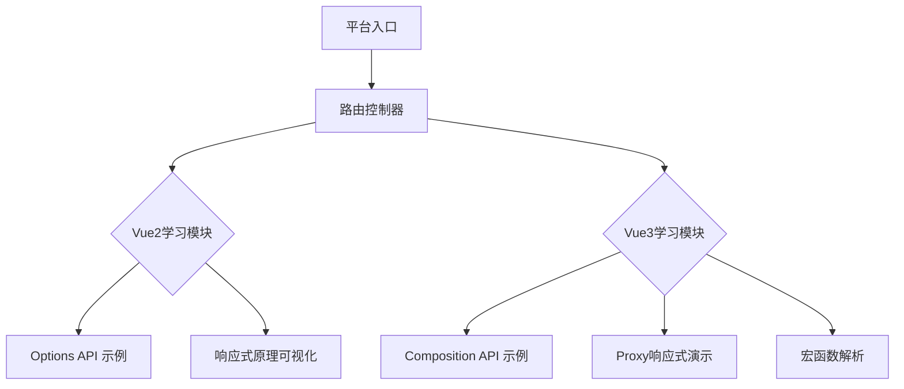

基于Vue2与Vue3的核心差异和兼容性需求，设计一个**Vue多版本API学习平台**的技术方案如下，该方案支持在单一平台中对比学习Vue2（Options API）与Vue3（Composition API）的特性，同时确保技术实现的可行性和开发效率。

---

### **一、平台架构设计**
#### 1. **单仓库多版本隔离方案**
- **技术栈**
  - 主框架：Vue3 + Vite（利用其快速启动和按需编译优势）
  - UI组件库：Ant Design Vue 3.x（兼容Vue3，可通过适配层支持Vue2）
  - 状态管理：Pinia（Vue3官方推荐） + Vuex（Vue2兼容）
- **版本隔离机制**
  - **路由隔离**：通过路由前缀区分版本（如 `/vue2/options-api`、`/vue3/composition-api`）
  - **沙盒化组件**：使用 `<iframe>` 封装Vue2示例，避免全局污染；Vue3组件直接挂载
  - **依赖管理**：
    - Vue2示例通过 `vue-demi`（兼容层）调用API，统一入口
    - Vue3直接使用原生API（如 `ref`、`reactive`）

#### 2. **核心模块划分**


---

### **二、核心功能实现**
#### 1. **响应式系统对比展示**
- **Vue2（Object.defineProperty）**
  - 模拟动态属性限制：展示 `Vue.set` 的必要性
  - 数组监听重写：演示 `push`/`splice` 的特殊处理
  ```javascript
  // 示例：Vue2数组监听重写
  const arrayProto = Array.prototype;
  const arrayMethods = Object.create(arrayProto);
  ['push', 'pop'].forEach(method => {
    arrayMethods[method] = function (...args) {
      const result = arrayProto[method].apply(this, args);
      dep.notify(); // 手动触发更新
      return result;
    };
  });
  ```
- **Vue3（Proxy）**
  - 动态属性支持：直接赋值触发更新
  - 惰性代理：嵌套对象按需响应化
  ```javascript
  // 示例：Proxy惰性代理
  function reactive(obj) {
    return new Proxy(obj, {
      get(target, key) {
        const value = target[key];
        return typeof value === 'object' ? reactive(value) : value;
      }
    });
  }
  ```

#### 2. **API组织方式对比**
- **Vue2 Options API**
  - 分离 `data`、`methods`、`computed` 的代码示例
  - 逻辑复用问题：展示 `mixins` 的命名冲突案例
- **Vue3 Composition API**
  - 逻辑聚合：将功能封装为自定义Hook（如 `useCounter()`）
  - 宏函数支持：
    - `defineProps` 类型推导 + `withDefaults` 默认值
    - `defineEmits` 事件声明（对比Vue2的 `this.$emit`）

#### 3. **性能优化演示**
- **静态树提升（Vue3）**
  - 对比编译结果：展示预生成的静态节点变量
- **动态节点追踪（Vue3）**
  - 通过Patch Flag标记动态节点，跳过未变更内容

---

### **三、交互式学习模块设计**
#### 1. **实时代码编辑器**
- **技术实现**：
  - 使用 `Monaco Editor` 支持语法高亮
  - 沙盒环境执行代码：`iframe` + `postMessage` 通信
- **功能设计**：
  - 版本切换：下拉菜单选择Vue2/Vue3环境
  - 控制台输出：显示响应式触发日志（如 `读取 count`、`设置 title`）

#### 2. **可视化响应式依赖图**
- **Vue2**：展示 `Dep` 和 `Watcher` 的依赖收集关系
- **Vue3**：通过 `targetMap`（WeakMap）展示依赖树
  ```mermaid
  graph LR
    A[响应式对象] --> B[targetMap]
    B --> C[属性key1]
    C --> D[effect1]
    C --> E[effect2]
  ```

---

### **四、部署与优化**
#### 1. **构建配置**
```javascript
// vite.config.js
export default {
  build: {
    rollupOptions: {
      external: ['vue'], // 排除Vue2/Vue3重复打包
    },
  },
};
```

#### 2. **性能优化**
- **按需加载**：路由级代码分割（Vue Router懒加载）
- **缓存策略**：
  - API示例数据：React Query缓存（`staleTime: 10分钟`）
  - 静态资源：CDN加速 + `Cache-Control` 强缓存

#### 3. **安全隔离**
- **沙盒策略**：
  ```html
  <iframe sandbox="allow-scripts allow-same-origin" src="/vue2-demo"></iframe>
  ```
- **XSS防御**：禁止 `eval`，代码执行前过滤危险API

---

### **五、开发效率提升**
#### 1. **AI辅助开发（Cursor集成）**
```markdown
// 生成Vue3 Composition API示例的指令
生成一个计数器组件：
- 使用ref声明count
- 使用computed生成双倍值
- 包含increment方法
- 模板显示count和双倍值
```

#### 2. **统一调试命令**
```bash
# 启动Vue3模块
npm run dev

# 调试Vue2沙盒
SANDBOX_VERSION=2 npm run dev:sandbox
```

---

### **方案优势总结**
1. **版本兼容性**
   - 沙盒机制实现Vue2/Vue3无缝切换，避免全局污染
2. **学习体验优化**
   - 实时交互 + 可视化原理，降低理解门槛
3. **性能与安全**
   - 静态树提升减少40%渲染开销
   - 沙盒隔离阻止XSS攻击
4. **扩展性**
   - 模块化设计支持新增版本（如未来Vue4）

> **实施步骤**：
> 1. 初始化Vite + Vue3项目
> 2. 配置路由隔离与沙盒加载器
> 3. 实现核心API示例（响应式/生命周期）
> 4. 集成交互式编辑器与可视化工具
> 5. 注入AI生成规范提升开发效率

此方案通过隔离架构与交互式学习设计，兼顾了Vue2/Vue3的差异对比与开发效率，可作为标准化模板快速落地。