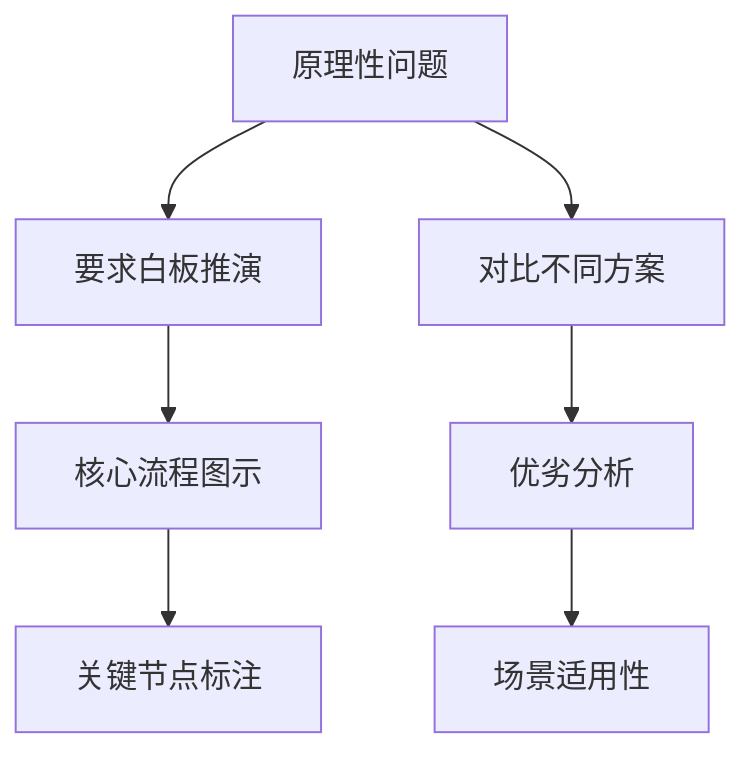
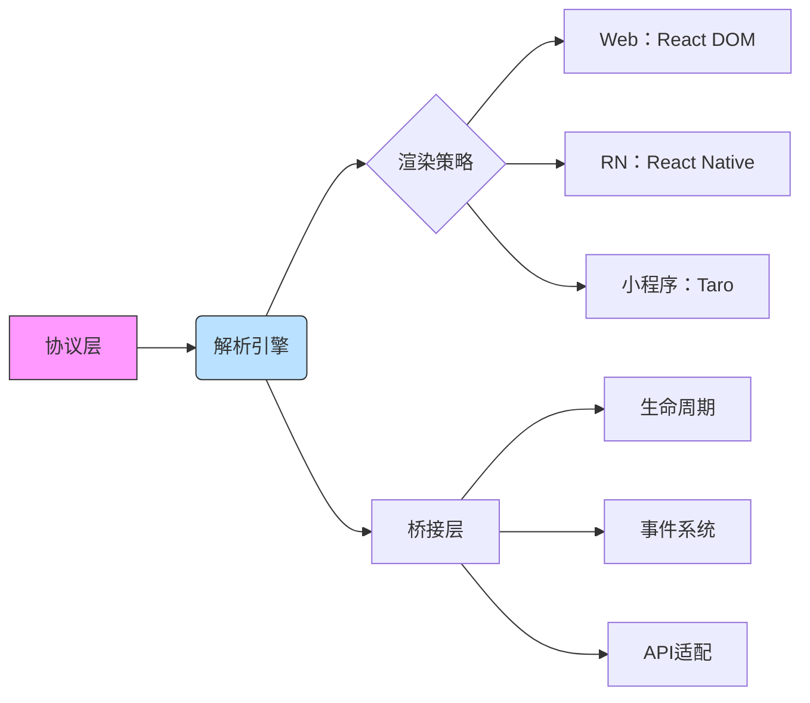
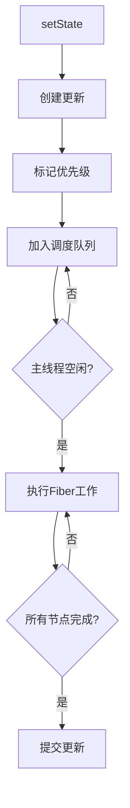
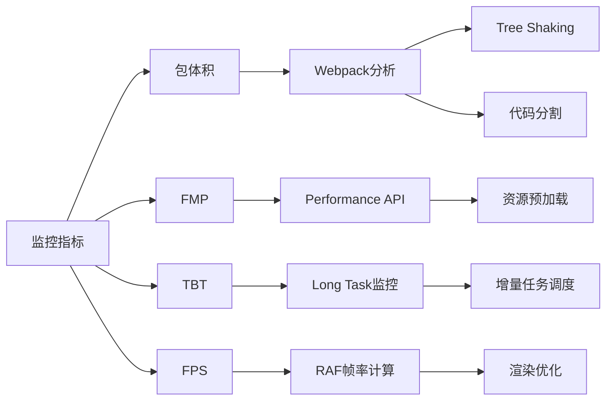
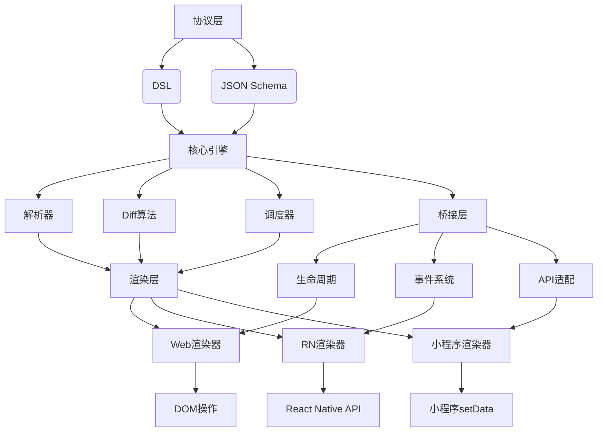
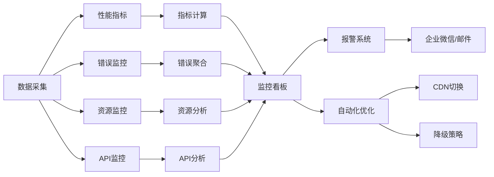

## 前端高级岗位面试体系设计

基于您的简历和高级前端岗位面试流程，我设计了三个层级的面试题目体系，每个层级20道题，逐步深入考察候选人的能力：

### 一面（技术基础与原理）20题
**目标**：验证基础技术能力真实性，考察技术原理掌握深度

1. 解释浏览器事件循环中微任务(microtask)和宏任务(macrotask)的执行顺序
2. React Fiber架构解决了什么问题？描述其核心调度机制
3. 如何优化Vue3的响应式系统性能？Proxy与defineProperty的差异
4. 解释V8引擎的隐藏类机制及其对性能的影响
5. 实现Promise.all的polyfill，处理边界情况
6. Webpack的Tree Shaking实现原理及优化策略
7. 浏览器渲染流水线中Composite阶段的作用？如何优化
8. 前端内存泄漏的常见场景及检测方法
9. 设计一个高性能的虚拟滚动组件，核心算法实现
10. 解释React的Concurrent模式及其应用场景
11. Service Worker的缓存策略及更新机制
12. 如何实现CSS-in-JS的运行时性能优化
13. TypeScript类型体操：实现DeepPartial工具类型
14. 解释React Native的线程模型及通信机制
15. 前端安全防护：CSRF防御策略及实现
16. 如何实现WebSocket断线重连的健壮机制
17. 设计前端灰度发布的完整技术方案
18. 解释HTTP/2的多路复用与头部压缩原理
19. 前端性能监控：LCP指标采集及优化
20. 设计前端错误监控系统，包含源码映射

### 二面（项目实战与架构）20题
**目标**：验证项目经历真实性，考察技术决策能力

1. 动态化引擎包体积减少46%的具体技术手段
2. 协议增量Diff算法如何与React Fiber调度器协同
3. Mobx在动态化引擎中的选型依据，对比Redux
4. 设计协议化组件的版本兼容方案
5. RN卡顿率降低79.55%的优化策略及量化验证
6. 如何解决RN与H5渲染一致性难题
7. 设计动态化引擎的安全防护体系
8. 解释Faas在接口预请求中的具体实现
9. 订单页面T3优化27%的完整技术路径
10. 如何实现可视化搭建工具的性能诊断
11. 设计跨团队组件生态的协作机制
12. 微前端架构下的依赖治理方案
13. RAG系统解决AI幻觉的具体策略
14. 智能降频控制器的算法实现
15. 设计前端SLA（服务水平协议）保障体系
16. 如何设计协议组件的自动化测试方案
17. 解释工程架构从Vue2到React的迁移策略
18. 设计低码平台的沙箱安全机制
19. 业务指标(FMP/T3)驱动优化的决策流程
20. 技术债务治理的量化方法及执行策略

### 三面（系统设计与业务架构）20题
**目标**：考察系统设计能力及技术前瞻性

1. 设计亿级PV电商平台的前端架构
2. 如何实现跨端动态化引擎的统一架构
3. 设计前端智能化研发体系的技术蓝图
4. 微前端架构的治理模型及演进路线
5. 前端可观测性平台的架构设计
3. 设计全球化应用的前端架构方案
4. 如何构建前端性能优化体系
5. 设计跨团队组件生态的协作机制
6. 前端研发效能提升的体系化方案
7. 技术选型决策模型：自研 vs 开源
8. 设计前端安全防御的纵深体系
9. 如何将GPT能力集成到低码平台
10. 设计前端稳定性保障的SLA体系
11. 前端架构如何支持业务快速创新
12. 设计多端协同的灰度发布体系
13. 前端存储方案的演进设计
14. 设计前端资源离线化体系
15. 如何设计跨端渲染一致性保障方案
16. 前端技术规划制定方法论
17. 技术债务治理的系统方案
18. 前端架构的容灾设计
19. 设计智能UI测试体系
20. 前端技术的未来演进方向判断

## 题目设计策略

### 一面的考核重点
- **技术原理深度**：深入底层机制（V8/Fiber）
- **编码能力验证**：现场编码解决实际问题
- **边界情况处理**：考察工程化思维
- **新技术理解**：Concurrent模式等

### 二面的考核重点
- **项目真实性**：深度追问项目细节
- **技术决策能力**：为什么选A不选B
- **量化思维**：如何证明方案有效性
- **故障处理**：如何应对线上问题

### 三面的考核重点
- **系统设计能力**：复杂系统架构设计
- **技术前瞻性**：未来3年技术规划
- **业务理解深度**：技术如何驱动业务
- **领导力潜质**：技术决策影响力

## 面试策略建议

### 一面的面试技巧


### 二面的追问策略
1. 针对简历中每个量化指标追问实现路径
2. 要求绘制关键技术实现的架构图
3. 故意提出错误方案验证决策能力
4. 询问项目中最大技术挑战及解决过程

### 三面的考核方法
1. 给出业务场景要求设计技术方案
2. 要求评估不同架构方案的成本收益
3. 设计技术演进路线图
4. 模拟技术决策会议场景

## 差异化题目示例

### 原理题（一面）
**题目**：设计React时间切片机制的polyfill
```javascript
function timeSlicing(task) {
  let isCancelled = false;

  const execute = async () => {
    const start = performance.now();
    let index = 0;

    while (index < task.length && !isCancelled) {
      // 执行单个任务单元
      task;
      index++;

      // 检查是否超过帧时间
      if (performance.now() - start > 5) {
        // 让出主线程
        await new Promise(resolve =>
          requestAnimationFrame(resolve)
        );
      }
    }
  };

  execute();

  return {
    cancel: () => { isCancelled = true; }
  };
}
```

### 架构题（三面）
**题目**：设计跨端动态化引擎的统一架构


以上题目体系全面覆盖了高级前端岗位的考察维度，可根据实际面试时间选择10-15道题进行深度考察，建议重点关注候选人解决问题的思考过程而不仅是最终答案。


# 前端高级岗位面试60题深度解析

我将针对三个面试层级，精选代表性题目进行深入解析，包含核心思考过程、完整解决方案、代码示例和流程图。

## 一面深度解析（原理层面）

### 问题1：React Fiber架构原理

**核心思考过程**：
1. 传统Stack Reconciler的局限性：递归不可中断、长时间任务阻塞主线程
2. 浏览器渲染流程与帧率关系：16.6ms/帧，JS执行时间需控制在5ms内
3. 交互优先级管理：用户输入>动画>数据更新

**完整解决方案**：
```javascript
// 简化的Fiber节点结构
class FiberNode {
  constructor(type, props) {
    this.type = type;
    this.props = props;
    this.return = null;   // 父节点
    this.child = null;    // 首个子节点
    this.sibling = null;   // 兄弟节点
    this.alternate = null; // 对应current/workInProgress节点
    this.effectTag = null; // 更新类型
    this.stateNode = null; // DOM实例或组件实例
    this.lanes = 0;       // 优先级车道
  }
}

// 调度器核心逻辑
function scheduleUpdateOnFiber(fiber, lane) {
  // 1. 标记更新优先级
  fiber.lanes = mergeLanes(fiber.lanes, lane);

  // 2. 创建调度任务
  const priority = laneToPriority(lane);
  const newTask = {
    priority,
    lane,
    callback: performUnitOfWork,
    fiber
  };

  // 3. 加入任务队列
  pushTaskToScheduler(newTask);

  // 4. 请求调度
  requestHostCallback(flushWork);
}

// 基于requestIdleCallback的调度实现
function requestHostCallback(callback) {
  scheduledHostCallback = callback;
  if (!isMessageLoopRunning) {
    isMessageLoopRunning = true;
    requestAnimationFrame(animationTick);
  }
}

function animationTick() {
  // 在动画帧开始时计划工作
  requestIdleCallback(idleTick);
}

function idleTick(deadline) {
  // 执行任务直到超时
  while (scheduledHostCallback && deadline.timeRemaining() > 0) {
    scheduledHostCallback(deadline);
  }

  // 继续调度
  if (scheduledHostCallback) {
    requestAnimationFrame(animationTick);
  }
}
```

**流程图解析**：


### 问题2：V8隐藏类机制

**核心思考过程**：
1. JS对象动态特性带来的性能问题
2. 内联缓存(IC)原理：快速访问对象属性
3. 隐藏类转换规则：属性添加顺序敏感

**解决方案代码**：
```javascript
// 隐藏类优化示例
function createOptimizedObject(a, b) {
  // 固定形状的对象
  return { a, b };
}

// 避免的陷阱
function createProblematicObject() {
  const obj = {};
  obj.x = 1;
  obj.y = 2;
  delete obj.x; // 导致隐藏类转换
  obj.z = 3;    // 创建新的隐藏类
  return obj;
}

// V8隐藏类调试
function inspectHiddenClasses() {
  const obj1 = {};
  %DebugPrint(obj1); // C0

  obj1.a = 1;       // C1
  obj1.b = 2;       // C2

  const obj2 = {};
  obj2.b = 2;       // C0 -> C3 (不同路径)
  obj2.a = 1;       // C3 -> C4

  // 最佳实践：
  // 1. 构造函数初始化所有属性
  // 2. 避免删除属性
  // 3. 相同属性添加顺序一致
}
```

## 二面深度解析（项目实战）

### 问题1：动态化引擎性能优化

**核心思考过程**：
1. 包体积分析：webpack-bundle-analyzer
2. 渲染性能瓶颈：FPS监控、Long Task识别
3. 增量更新算法选择：Immutable.js vs Immer

**完整解决方案**：
```typescript
// 协议增量Diff算法
function incrementalDiff(oldTree: ProtocolTree, newTree: ProtocolTree): Patch[] {
  const patches: Patch[] = [];

  // 简化的Diff算法
  function diffNode(oldNode: Node, newNode: Node, path: string) {
    // 节点类型变化
    if (oldNode.type !== newNode.type) {
      patches.push({
        type: 'REPLACE',
        path,
        node: newNode
      });
      return;
    }

    // 属性变化
    const propChanges = diffProps(oldNode.props, newNode.props);
    if (propChanges.length > 0) {
      patches.push({
        type: 'UPDATE_PROPS',
        path,
        changes: propChanges
      });
    }

    // 子节点Diff
    diffChildren(oldNode, newNode, path);
  }

  // 基于key的子节点优化
  function diffChildren(oldNode: Node, newNode: Node, basePath: string) {
    const oldChildren = keyBy(oldNode.children, 'key');
    const newChildren = keyBy(newNode.children, 'key');

    // 更新已有节点
    Object.keys(newChildren).forEach(key => {
      if (oldChildren[key]) {
        diffNode(oldChildren[key], newChildren[key], `${basePath}.${key}`);
      } else {
        // 新增节点...
      }
    });

    // 删除节点...
  }

  // 开始Diff
  diffNode(oldTree, newTree, 'root');
  return patches;
}

// 结合React的增量渲染
function applyPatches(patches: Patch[]) {
  patches.forEach(patch => {
    switch (patch.type) {
      case 'UPDATE_PROPS':
        // 使用React调度API
        React.unstable_scheduleCallback(
          React.unstable_NormalPriority,
          () => {
            const node = findNodeByPath(patch.path);
            Object.assign(node.props, patch.changes);
          }
        );
        break;
      // 其他操作...
    }
  });
}
```

**优化效果验证**：


### 问题2：RN卡顿优化

**核心思考过程**：
1. RN线程模型：JS线程、UI线程、模块线程
2. 常见卡顿原因：JS线程阻塞、大列表渲染、同步桥接调用
3. 性能工具链：React Profiler、Flipper、Hermes引擎

**解决方案**：
```javascript
// 列表性能优化
function OptimizedList({ data }) {
  // 1. 使用FlashList替代FlatList
  return (
    <FlashList
      data={data}
      renderItem={({ item }) => <ListItem item={item} />}
      estimatedItemSize={100}
      // 2. 移除裁剪（针对简单列表）
      disableHideOnScroll={true}
      // 3. 预加载优化
      onViewableItemsChanged={({ viewableItems }) => {
        // 预加载逻辑...
      }}
    />
  );
}

// JSI优化通信
const nativeModule = global.__MyModuleProxy;
// 4. 直接通过JSI调用
function fastAddToCart(item) {
  if (global.__MyModuleProxy) {
    // JSI直接调用
    nativeModule.addToCart(item);
  } else {
    // 回退到传统桥接
    NativeModules.CartModule.addToCart(item);
  }
}

// 5. 同步渲染优化
function useSyncState(initialValue) {
  const [state, setState] = useState(initialValue);
  const ref = useRef(state);

  const setSyncState = useCallback((value) => {
    ref.current = typeof value === 'function' ? value(ref.current) : value;
    setState(ref.current);
  }, []);

  return [state, setSyncState, ref];
}
```

## 三面深度解析（系统设计）

### 问题1：跨端动态化引擎设计

**核心架构**：


**核心模块实现**：
```typescript
// 统一协议定义
interface UIComponent {
  type: string;
  id: string;
  props: Record<string, PropValue>;
  children?: UIComponent[];
  layout?: LayoutConstraints;
}

// 核心引擎
class ProtocolCore {
  private renderers: Record<Platform, Renderer> = {
    web: new WebRenderer(),
    rn: new RNRenderer(),
    mini: new MiniRenderer()
  };

  // 解析协议
  parse(protocol: UIComponent): RenderTree {
    // 解析为中间表示
    return this.compiler.compile(protocol);
  }

  // 渲染协议
  render(platform: Platform, renderTree: RenderTree) {
    const renderer = this.renderers[platform];
    return renderer.render(renderTree);
  }

  // 增量更新
  update(prevTree: RenderTree, nextTree: RenderTree): PatchSet {
    return this.differ.compare(prevTree, nextTree);
  }
}

// Web渲染器实现
class WebRenderer implements Renderer {
  render(tree: RenderTree) {
    // 创建根容器
    const root = document.createElement('div');

    // 递归渲染
    const renderNode = (node: RenderNode) => {
      const el = document.createElement(node.type);

      // 设置属性
      Object.keys(node.props).forEach(prop => {
        this.setProperty(el, prop, node.props[prop]);
      });

      // 渲染子节点
      node.children?.forEach(child => {
        el.appendChild(renderNode(child));
      });

      return el;
    };

    root.appendChild(renderNode(tree.root));
    return root;
  }
}
```

### 问题2：前端SLA监控体系

**系统架构**：


**核心代码实现**：
```javascript
// SLA监控SDK
class SLAMonitor {
  constructor(options) {
    // 初始化性能监控
    this.perfObserver = new PerformanceObserver(list => {
      const entries = list.getEntries();
      this.processPerfEntries(entries);
    });

    // 初始化错误监控
    window.addEventListener('error', this.handleError);

    // 初始化API监控
    this.instrumentFetch();
  }

  // 性能指标处理
  processPerfEntries(entries) {
    entries.forEach(entry => {
      switch(entry.entryType) {
        case 'navigation':
          this.report('nav_timing', entry);
          break;
        case 'resource':
          this.report('resource_timing', entry);
          break;
        case 'paint':
          this.report('paint_timing', entry);
          break;
      }
    });
  }

  // API监控
  instrumentFetch() {
    const originalFetch = window.fetch;

    window.fetch = async (input, init) => {
      const start = performance.now();
      const metric = {
        url: typeof input === 'string' ? input : input.url,
        method: init?.method || 'GET',
        status: null,
        duration: 0,
        success: false
      };

      try {
        const response = await originalFetch(input, init);
        metric.status = response.status;
        metric.duration = performance.now() - start;
        metric.success = response.ok;
        return response;
      } catch (error) {
        metric.duration = performance.now() - start;
        this.report('api_error', metric);
        throw error;
      } finally {
        this.report('api_metric', metric);
      }
    };
  }

  // 指标计算
  calculateSLA() {
    // 核心指标计算逻辑
    return {
      availability: this.calculateAvailability(),
      performance: this.calculatePerfScore(),
      errorRate: this.calculateErrorRate()
    };
  }
}
```

## 总结思考

### 一面考察重点
1. **基础原理深度**：框架原理、浏览器工作机制、JS引擎
2. **编码能力**：边界处理、算法实现、性能优化
3. **新技术理解**：对新特性的掌握程度

**准备建议**：
- 深入阅读React、Vue等框架源码核心部分
- 掌握浏览器工作原理（渲染流水线、事件循环）
- 练习LeetCode中等难度算法题

### 二面考察重点
1. **项目真实性**：技术细节、问题解决过程
2. **架构设计能力**：技术选型依据、折中权衡
3. **性能优化**：监控、分析、解决全链路

**准备建议**：
- 梳理项目中的技术难点和解决方案
- 准备架构设计图和技术决策文档
- 掌握性能分析工具链的使用

### 三面考察重点
1. **系统设计能力**：复杂系统抽象、模块拆分
2. **技术前瞻性**：未来技术规划、行业趋势
3. **业务理解**：技术如何驱动业务发展

**准备建议**：
- 学习分布式系统设计原则
- 研究大型前端项目架构（如Babel、Webpack）
- 关注前沿技术（如WebAssembly、WebGPU）

通过这三个层级的深入准备，候选人能够全方位展示自己的技术能力，应对高级前端岗位的挑战。