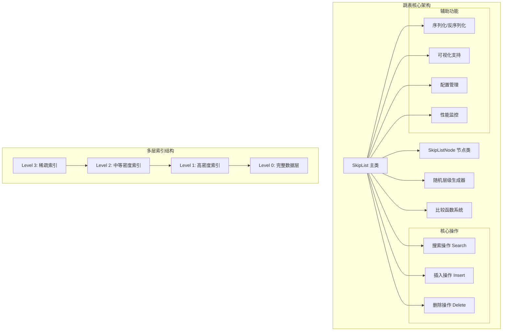

# 跳表 (Skip List) 架构设计深度分析

## 概述

跳表（Skip List）是一种基于概率平衡的多层链表数据结构，通过随机化层级实现平均 O(log n) 时间复杂度的查找、插入和删除操作。本实现提供了 TypeScript 和 Rust 两种语言版本，具备完整的功能特性和可视化支持。

## 架构设计

### 整体架构



### 设计原则

1. **概率平衡**：通过随机层级分配实现期望平衡，避免复杂的重平衡操作
2. **多层索引**：构建多级快速通道，实现跳跃式查找
3. **泛型支持**：支持任意可比较类型，提供灵活的比较函数机制
4. **内存安全**：Rust版本提供零成本抽象和内存安全保证
5. **可视化友好**：提供完整的结构信息导出，支持算法可视化

## 模块拆分策略

### 核心模块划分

#### 1. SkipListNode - 节点抽象层
**职责**：
- 节点数据存储
- 多层指针管理
- 节点层级信息维护

**TypeScript实现**：
```typescript
export class SkipListNode<T> {
  value: T;                              // 节点值
  next: Array<SkipListNode<T> | null>;   // 多层指针数组
  level: number;                         // 节点层级

  constructor(value: T, level: number) {
    this.value = value;
    this.level = level;
    this.next = new Array(level).fill(null);
  }
}
```

**Rust实现**：
```rust
pub struct SkipListNode<T> {
    pub value: T,                           // 节点值
    pub level: usize,                       // 节点层级
    pub next: Vec<*mut SkipListNode<T>>,    // 多层指针数组（原始指针）
}
```

#### 2. SkipList - 主控制器
**职责**：
- 跳表结构管理
- 操作算法实现
- 配置参数控制
- 生命周期管理

**关键属性**：
- `maxLevel`: 最大层级限制
- `head`: 哨兵头节点
- `level`: 当前最高层级
- `probability`: 层级提升概率
- `compareFn`: 自定义比较函数
- `size`: 节点数量统计

#### 3. 随机层级生成器
**职责**：
- 概率化层级分配
- 平衡性保证
- 性能优化

**算法实现**：
```typescript
private randomLevel(): number {
  let level = 1;
  while (Math.random() < this.probability && level < this.maxLevel) {
    level++;
  }
  return level;
}
```

#### 4. 比较函数系统
**职责**：
- 元素大小比较
- 自定义排序规则
- 类型安全保证

**默认实现**：
```typescript
this.compareFn = compareFn || ((a: T, b: T) => {
  if (a < b) return -1;
  if (a > b) return 1;
  return 0;
});
```

## 重点难点分析

### 难点1：多层指针管理与更新

**技术挑战**：
- 插入/删除时需要同时更新多个层级的指针
- 指针更新顺序错误可能导致链表断裂
- 层级动态变化时的指针维护

**解决方案**：

1. **Update数组机制**：
```typescript
// 记录每层需要更新的前驱节点
const update: Array<SkipListNode<T>> = new Array(this.maxLevel).fill(this.head);
let current = this.head;

// 从最高层向下查找插入位置
for (let i = this.level; i >= 0; i--) {
  while (current.next[i] && this.compareFn(current.next[i]!.value, value) < 0) {
    current = current.next[i]!;
  }
  update[i] = current; // 记录每层的前驱节点
}
```

2. **原子性指针更新**：
```typescript
// 创建新节点后，按层级顺序更新指针
for (let i = 0; i < newLevel; i++) {
  newNode.next[i] = update[i].next[i];  // 先设置新节点的next
  update[i].next[i] = newNode;          // 再更新前驱节点的next
}
```

### 难点2：概率平衡与性能保证

**技术挑战**：
- 随机性可能导致极端不平衡情况
- 概率参数选择影响性能表现
- 最坏情况下退化为链表

**解决方案**：

1. **理论最优概率**：
```typescript
// 使用 p=0.5 作为默认概率，理论上最优
constructor(maxLevel: number = 16, probability: number = 0.5) {
  this.probability = probability;
  // 期望层数为 log₂(n)，第k层期望节点数为 n/2^k
}
```

2. **层级限制机制**：
```typescript
// 限制最大层级，防止过度增长
if (newLevel > this.level) {
  for (let i = this.level + 1; i < newLevel; i++) {
    update[i] = this.head;
  }
  this.level = newLevel - 1; // 更新当前最高层级
}
```

3. **动态层级调整**：
```typescript
// 删除节点后，检查并降低不必要的层级
while (this.level > 0 && !this.head.next[this.level]) {
  this.level--;
}
```

### 难点3：内存管理与安全性（Rust版本）

**技术挑战**：
- 原始指针操作的内存安全
- 循环引用的避免
- 节点释放时的悬垂指针

**解决方案**：

1. **Box智能指针管理**：
```rust
// 使用Box分配堆内存，自动管理生命周期
let new_node = Box::into_raw(Box::new(SkipListNode::new(value, new_level)));

// 释放节点时使用Box::from_raw回收内存
let _ = Box::from_raw(current);
```

2. **RAII模式实现**：
```rust
impl<T: Ord + Clone + Debug> Drop for SkipList<T> {
    fn drop(&mut self) {
        self.clear();           // 清理所有节点
        unsafe {
            let _ = Box::from_raw(self.head); // 释放头节点
        }
    }
}
```

3. **安全的指针操作**：
```rust
unsafe {
    // 在unsafe块中进行指针操作，确保操作的正确性
    while !(*current).next[i].is_null() 
        && (*(*current).next[i]).value < *value {
        current = (*current).next[i];
    }
}
```

### 难点4：泛型支持与类型安全

**技术挑战**：
- 支持任意可比较类型
- 自定义比较逻辑
- 类型推断与约束

**解决方案**：

1. **TypeScript泛型约束**：
```typescript
export class SkipList<T> {
  private compareFn: (a: T, b: T) => number;
  
  constructor(
    maxLevel: number = 16,
    probability: number = 0.5,
    compareFn?: (a: T, b: T) => number  // 可选的自定义比较函数
  ) {
    // 默认比较函数，适用于原始类型
    this.compareFn = compareFn || ((a: T, b: T) => {
      if (a < b) return -1;
      if (a > b) return 1;
      return 0;
    });
  }
}
```

2. **Rust trait约束**：
```rust
impl<T: Ord + Clone + Debug> SkipList<T> {
    // T必须实现Ord（可比较）、Clone（可克隆）、Debug（可调试）
    pub fn new(max_level: usize, probability: f32) -> Self {
        // 利用Ord trait进行比较
        while !(*current).next[i].is_null() 
            && (*(*current).next[i]).value < value {
            current = (*(*current).next[i]);
        }
    }
}
```

## 性能优化策略

### 1. 空间优化
```typescript
// 节点只分配实际需要的层级数
constructor(value: T, level: number) {
  this.next = new Array(level).fill(null); // 而不是maxLevel
}
```

### 2. 查找路径优化
```typescript
// 记录查找路径，用于插入时的快速定位
insert(value: T): { success: boolean; updatePath: SkipListNode<T>[] } {
  const updatePath: SkipListNode<T>[] = [];
  // 在查找过程中记录路径
  while (current.next[i] && this.compareFn(current.next[i]!.value, value) < 0) {
    current = current.next[i]!;
    updatePath.push(current); // 记录访问路径
  }
  return { success: true, updatePath };
}
```

### 3. 缓存友好设计
```rust
// Rust版本使用连续内存布局
pub struct SkipListNode<T> {
    pub value: T,                    // 值在前，提高缓存命中率
    pub level: usize,               // 层级信息
    pub next: Vec<*mut SkipListNode<T>>, // 指针数组
}
```

## 可视化与调试支持

### 1. 层级结构导出
```typescript
getLevels(): Array<Array<{ node: SkipListNode<T>; position: number }>> {
  const levels: Array<Array<{ node: SkipListNode<T>; position: number }>> = [];
  
  for (let level = this.level; level >= 0; level--) {
    const levelNodes: Array<{ node: SkipListNode<T>; position: number }> = [];
    let current = this.head.next[level];
    let position = 0;
    
    while (current) {
      levelNodes.push({ node: current, position });
      current = current.next[level];
      position++;
    }
    
    levels.push(levelNodes);
  }
  
  return levels;
}
```

### 2. 序列化支持
```typescript
serialize(): any {
  return {
    maxLevel: this.maxLevel,
    probability: this.probability,
    level: this.level,
    size: this.size,
    data: this.toArray()
  };
}

deserialize(data: any): void {
  this.clear();
  this.maxLevel = data.maxLevel || 16;
  this.probability = data.probability || 0.5;
  
  if (data.data && Array.isArray(data.data)) {
    data.data.forEach((value: T) => {
      this.insert(value);
    });
  }
}
```

## 测试策略

### 1. 功能测试
- 基本操作测试（插入、删除、查找）
- 边界情况测试（空表、单元素、重复元素）
- 数据一致性测试（有序性验证）

### 2. 性能测试
- 大数据量操作性能
- 不同概率参数下的性能对比
- 内存使用情况监控

### 3. 随机性测试
- 层级分布统计
- 平衡性验证
- 最坏情况模拟

## 应用场景与优势

### 1. 适用场景
- **有序数据维护**：需要频繁插入、删除并保持有序
- **范围查询**：高效的区间查询操作
- **并发环境**：相比平衡树，锁粒度更小
- **内存数据库**：Redis等系统的有序集合实现

### 2. 性能特征
- **时间复杂度**：平均O(log n)，最坏O(n)
- **空间复杂度**：O(n)，每节点平均O(log n)层
- **并发性能**：优于平衡树，支持细粒度锁

### 3. 与其他数据结构对比

| 特性 | 跳表 | 红黑树 | B+树 |
|------|------|--------|------|
| 实现复杂度 | 简单 | 复杂 | 中等 |
| 查找性能 | O(log n) | O(log n) | O(log n) |
| 插入性能 | O(log n) | O(log n) | O(log n) |
| 范围查询 | 优秀 | 一般 | 优秀 |
| 并发性能 | 优秀 | 一般 | 一般 |
| 空间开销 | 较高 | 较低 | 中等 |

## 扩展性考虑

### 1. 功能扩展
- 范围查询优化
- 并发版本实现
- 持久化支持
- 压缩存储

### 2. 性能扩展
- 自适应概率调整
- 缓存感知优化
- NUMA感知设计
- 硬件加速支持

### 3. 生态集成
- 数据库引擎集成
- 分布式系统支持
- 流处理框架适配
- 机器学习场景优化

## 总结

跳表通过概率平衡和多层索引的巧妙设计，在保持实现简单性的同时实现了优秀的性能表现。本实现通过双语言支持、完整的功能特性和可视化能力，为学习和应用跳表算法提供了完整的解决方案。其在并发性能和范围查询方面的优势，使其在现代高性能系统中具有重要的应用价值。

## 快速开始

### TypeScript 版本

```typescript
import { SkipList } from './al/SkipList';

// 创建跳表实例
const skipList = new SkipList<number>(16, 0.5);

// 插入数据
skipList.insert(5);
skipList.insert(3);
skipList.insert(8);
skipList.insert(1);

// 搜索数据
const result = skipList.search(5);
console.log(result ? '找到' : '未找到');

// 删除数据
const deleteResult = skipList.delete(3);
console.log(deleteResult.success ? '删除成功' : '删除失败');

// 获取所有数据（有序）
console.log(skipList.toArray()); // [1, 5, 8]
```

### Rust 版本

```rust
use skip_list::SkipList;

fn main() {
    // 创建跳表实例
    let mut skip_list = SkipList::new(16, 0.5);

    // 插入数据
    skip_list.insert(5);
    skip_list.insert(3);
    skip_list.insert(8);
    skip_list.insert(1);

    // 搜索数据
    if let Some(_) = skip_list.search(&5) {
        println!("找到");
    }

    // 删除数据
    if skip_list.delete(&3) {
        println!("删除成功");
    }

    // 获取所有数据（有序）
    println!("{:?}", skip_list.to_vec()); // [1, 5, 8]
}
```

## API 文档

### TypeScript API

#### 构造函数
```typescript
new SkipList<T>(maxLevel?: number, probability?: number, compareFn?: (a: T, b: T) => number)
```

#### 主要方法
- `insert(value: T): { success: boolean; updatePath: SkipListNode<T>[] }`
- `search(value: T): SkipListNode<T> | null`
- `delete(value: T): { success: boolean; deletedNode: SkipListNode<T> | null }`
- `toArray(): T[]`
- `getSize(): number`
- `isEmpty(): boolean`
- `clear(): void`

#### 配置方法
- `setConfig(config: { maxLevel?: number; probability?: number }): void`
- `setComparator(compareFn: (a: T, b: T) => number): void`

#### 可视化支持
- `getLevels(): Array<Array<{ node: SkipListNode<T>; position: number }>>`
- `serialize(): any`
- `deserialize(data: any): void`

### Rust API

#### 构造函数
```rust
SkipList::new(max_level: usize, probability: f32) -> Self
```

#### 主要方法
- `insert(&mut self, value: T) -> bool`
- `search(&self, value: &T) -> Option<*mut SkipListNode<T>>`
- `delete(&mut self, value: &T) -> bool`
- `to_vec(&self) -> Vec<T>`
- `size(&self) -> usize`
- `is_empty(&self) -> bool`
- `clear(&mut self)`

#### 高级功能
- `range_query(&self, start: &T, end: &T) -> Vec<T>`
- `get_levels(&self) -> Vec<Vec<T>>`

## 性能特征

### 时间复杂度
- **搜索**: 平均 O(log n)，最坏 O(n)
- **插入**: 平均 O(log n)，最坏 O(n)
- **删除**: 平均 O(log n)，最坏 O(n)

### 空间复杂度
- **总体**: O(n)
- **每个节点**: O(log n) 平均层数

### 概率分析
- 使用概率 p=0.5 时，期望层数为 log₂(n)
- 第 k 层包含约 n/2ᵏ 个节点
- 最大层级建议设置为 log₂(n) + 常数

## 配置参数

### maxLevel (最大层级)
- **默认值**: 16
- **建议范围**: 4-32
- **说明**: 限制跳表的最大层数，影响性能上限

### probability (升级概率)
- **默认值**: 0.5
- **建议范围**: 0.25-0.75
- **说明**: 节点升级到下一层的概率，0.5 为理论最优值

## 使用场景

1. **有序数据维护**: 需要频繁插入、删除并保持有序的场景
2. **范围查询**: 需要高效进行范围查询的应用
3. **并发访问**: 相比平衡树，跳表更适合并发环境
4. **内存数据库**: Redis 等内存数据库的有序集合实现
5. **搜索引擎**: 倒排索引的快速定位

## 优势与劣势

### 优势
- 实现简单，无需复杂的旋转操作
- 并发性能好，锁粒度小
- 范围查询效率高
- 概率平衡，无需严格平衡维护

### 劣势
- 空间开销较大（多级指针）
- 性能依赖随机性，最坏情况较差
- 缓存局部性不如数组

## 测试

运行 TypeScript 测试：
```bash
npm test SkipList.test.ts
```

运行 Rust 测试：
```bash
cargo test
```

## 可视化

本实现包含完整的可视化支持，可以在 React 应用中查看跳表的结构和操作过程。

访问路径：`/algorithm/skiplist`

## 参考资料

1. [Skip Lists: A Probabilistic Alternative to Balanced Trees](https://epaperpress.com/sortsearch/download/skiplist.pdf) - William Pugh
2. [Redis 源码中的跳表实现](https://github.com/redis/redis/blob/unstable/src/t_zset.c)
3. [跳表的并发实现](https://www.cs.tau.ac.il/~shanir/nir-pubs-web/Papers/OPODIS2006-BA.pdf)