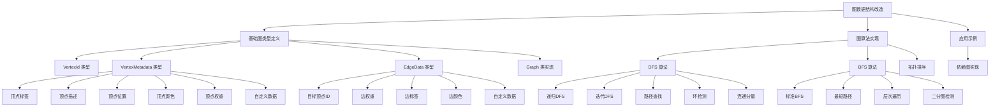
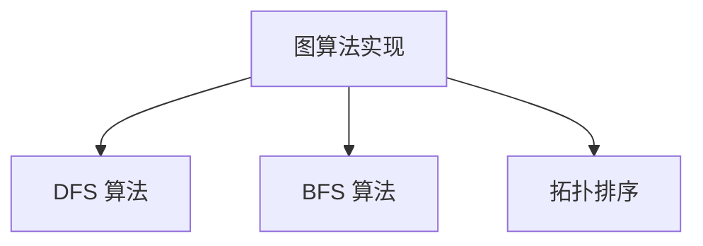

# 图数据结构改造

## 图数据结构改造

```mermaid
graph TD;
    A["图数据结构改造"] --> B["基础图类型定义"]
    A --> C["图算法实现"]
    A --> D["应用示例"]

    B --> B1["VertexId 类型"]
    B --> B2["VertexMetadata 类型"]
    B --> B3["EdgeData 类型"]
    B --> B4["Graph 类实现"]

    C --> C1["DFS 算法"]
    C --> C2["BFS 算法"]
    C --> C3["拓扑排序"]

    D --> D1["依赖图实现"]

    B2 --> B2A["顶点标签"]
    B2 --> B2B["顶点描述"]
    B2 --> B2C["顶点位置"]
    B2 --> B2D["顶点颜色"]
    B2 --> B2E["顶点权重"]
    B2 --> B2F["自定义数据"]

    B3 --> B3A["目标顶点ID"]
    B3 --> B3B["边权重"]
    B3 --> B3C["边标签"]
    B3 --> B3D["边颜色"]
    B3 --> B3E["自定义数据"]

    C1 --> C1A["递归DFS"]
    C1 --> C1B["迭代DFS"]
    C1 --> C1C["路径查找"]
    C1 --> C1D["环检测"]
    C1 --> C1E["连通分量"]

    C2 --> C2A["标准BFS"]
    C2 --> C2B["最短路径"]
    C2 --> C2C["层次遍历"]
    C2 --> C2D["二分图检测"]
```

## 图算法实现

```mermaid
graph TD;
    A["图算法实现"] --> B["DFS 算法"]
    A --> C["BFS 算法"]
    A --> D["拓扑排序"]
```