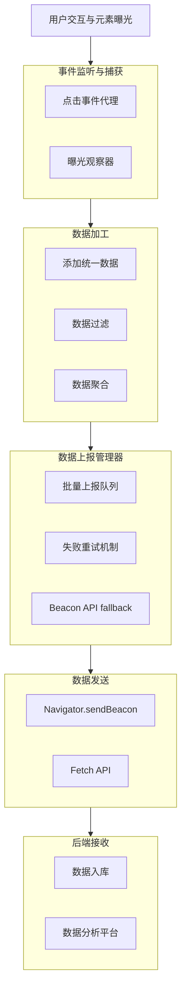

# 前端全埋点方案

基于 Proxy 代理和 Intersection Observer 的前端全埋点解决方案，支持指定元素曝光埋点和全点击事件自动上报，使用 TypeScript 实现，适用于 React + Antd 环境。

## 📋 目录

- [前端全埋点方案](#前端全埋点方案)
  - [📋 目录](#-目录)
  - [设计目标与原则](#设计目标与原则)
  - [技术架构](#技术架构)
  - [核心功能](#核心功能)
  - [使用指南](#使用指南)
    - [基础用法](#基础用法)
    - [React 集成](#react-集成)
    - [Antd 组件集成](#antd-组件集成)
  - [API 参考](#api-参考)
    - [核心 API](#核心-api)
    - [React Hooks](#react-hooks)
    - [React 组件](#react-组件)
    - [Antd 集成](#antd-集成)
  - [最佳实践](#最佳实践)

## 设计目标与原则

1. **无侵入性**：业务逻辑零感知，通过代理和原型拦截自动捕获事件
2. **自动采集**：自动捕获点击、曝光等用户行为，减少手动埋点工作量
3. **类型安全**：使用 TypeScript，确保数据类型和接口定义明确
4. **性能友好**：使用批量上报、请求队列、懒加载等策略优化性能
5. **可扩展性**：支持动态更新采集策略，方便后续添加新事件类型
6. **UI 分离**：埋点逻辑与 UI 组件完全隔离，通过配置和代理模式集成

## 技术架构

整个埋点系统的数据流和架构概览：



## 核心功能

- **曝光埋点**：基于 Intersection Observer API 实现元素曝光检测
- **点击事件代理**：全局事件监听，捕获点击、长按等交互事件
- **批量上报**：队列管理，批量发送，减少网络请求
- **失败重试**：网络错误自动重试，保证数据可靠性
- **React 集成**：提供 Hooks 和组件，方便在 React 项目中使用
- **Antd 组件增强**：针对 Antd 组件库特殊处理，实现更精准的埋点

## 使用指南

### 基础用法

1. 初始化埋点 SDK：

```typescript
import { initTracker } from '@libs/dom-proxy/src/Tracking';

// 初始化埋点 SDK
initTracker({
  serverUrl: 'https://analytics-api.example.com/collect',
  appId: 'your-app-id',
  version: '1.0.0',
  debug: process.env.NODE_ENV !== 'production',
  batchSize: 10,
  batchDelay: 5000,
  autoTrackClicks: true
});
```

2. 手动跟踪事件：

```typescript
import { getTracker } from '@libs/dom-proxy/src/Tracking';

// 手动跟踪事件
getTracker().track({
  eventType: 'custom',
  eventCategory: 'product',
  eventAction: 'view',
  eventLabel: 'Product XYZ',
  productId: '123',
  productPrice: 99.99
});
```

3. 跟踪元素曝光：

```typescript
import { getTracker } from '@libs/dom-proxy/src/Tracking';

// 跟踪单个元素曝光
getTracker().trackExposure({
  element: document.querySelector('.banner'),
  eventData: {
    eventCategory: 'banner',
    eventAction: 'exposure',
    eventLabel: 'Summer Sale',
    bannerId: 'summer-2023'
  }
});

// 批量跟踪元素曝光
getTracker().trackExposures('.product-card', {
  eventCategory: 'product',
  eventAction: 'exposure',
  eventLabel: 'Product Card'
});
```

### React 集成

1. 在应用根组件中初始化：

```tsx
import { TrackingRoot } from '@libs/dom-proxy/src/Tracking';

function App() {
  return (
    <TrackingRoot
      config={{
        serverUrl: 'https://analytics-api.example.com/collect',
        appId: 'your-app-id',
        version: '1.0.0'
      }}
    >
      <YourApp />
    </TrackingRoot>
  );
}
```

2. 使用 Hooks 跟踪曝光和点击：

```tsx
import { useExposureTracking, useClickTracking } from '@libs/dom-proxy/src/Tracking';

function ProductCard({ product }) {
  // 跟踪元素曝光
  const ref = useExposureTracking({
    eventCategory: 'product',
    eventAction: 'exposure',
    eventLabel: product.name,
    productId: product.id
  });

  // 跟踪点击事件
  const handleClick = useClickTracking({
    eventCategory: 'product',
    eventAction: 'click',
    eventLabel: product.name,
    productId: product.id
  });

  return (
    <div ref={ref} onClick={handleClick} className="product-card">
      
      <h3>{product.name}</h3>
      <p>${product.price}</p>
    </div>
  );
}
```

3. 使用组件跟踪曝光和点击：

```tsx
import { TrackExposure, TrackClick } from '@libs/dom-proxy/src/Tracking';

function BannerSection() {
  return (
    <TrackExposure
      eventData={{
        eventCategory: 'banner',
        eventAction: 'exposure',
        eventLabel: 'Hero Banner'
      }}
    >
      <div className="banner">
        <h1>Summer Sale</h1>
        <TrackClick
          eventData={{
            eventCategory: 'banner',
            eventAction: 'click',
            eventLabel: 'Shop Now Button'
          }}
          as="button"
        >
          Shop Now
        </TrackClick>
      </div>
    </TrackExposure>
  );
}
```

4. 使用高阶组件：

```tsx
import { withExposureTracking, withClickTracking } from '@libs/dom-proxy/src/Tracking';

// 原始组件
function ProductCard({ product, onClick }) {
  return (
    <div onClick={onClick} className="product-card">
      
      <h3>{product.name}</h3>
      <p>${product.price}</p>
    </div>
  );
}

// 增强后的组件
const TrackedProductCard = withExposureTracking(
  withClickTracking(
    ProductCard,
    { eventCategory: 'product', eventAction: 'click' }
  ),
  { eventCategory: 'product', eventAction: 'exposure' }
);

// 使用增强后的组件
function ProductList({ products }) {
  return (
    <div className="product-list">
      {products.map(product => (
        <TrackedProductCard key={product.id} product={product} />
      ))}
    </div>
  );
}
```

### Antd 组件集成

1. 包装整个 Antd 组件库：

```tsx
import * as antd from 'antd';
import { wrapAntdComponents } from '@libs/dom-proxy/src/Tracking';

// 创建埋点增强版 Antd
const TrackedAntd = wrapAntdComponents(antd);

// 使用增强后的组件
function LoginForm() {
  return (
    <TrackedAntd.Form name="login">
      <TrackedAntd.Form.Item label="Username" name="username">
        <TrackedAntd.Input />
      </TrackedAntd.Form.Item>
      <TrackedAntd.Form.Item label="Password" name="password">
        <TrackedAntd.Input.Password />
      </TrackedAntd.Form.Item>
      <TrackedAntd.Form.Item>
        <TrackedAntd.Button type="primary" htmlType="submit">
          Login
        </TrackedAntd.Button>
      </TrackedAntd.Form.Item>
    </TrackedAntd.Form>
  );
}
```

2. 单独包装特定组件：

```tsx
import { Button, Modal } from 'antd';
import { createTrackedAntdComponent } from '@libs/dom-proxy/src/Tracking';

// 创建埋点增强版按钮和弹窗
const TrackedButton = createTrackedAntdComponent(Button, 'button');
const TrackedModal = createTrackedAntdComponent(Modal, 'modal');

function ConfirmDialog() {
  const [visible, setVisible] = useState(false);

  return (
    <>
      <TrackedButton onClick={() => setVisible(true)}>
        Open Modal
      </TrackedButton>
      <TrackedModal
        title="Confirmation"
        visible={visible}
        onOk={() => setVisible(false)}
        onCancel={() => setVisible(false)}
      >
        <p>Are you sure you want to proceed?</p>
      </TrackedModal>
    </>
  );
}
```

## API 参考

### 核心 API

- `initTracker(config)`: 初始化埋点 SDK
- `getTracker()`: 获取埋点实例
- `Tracker.track(event)`: 手动跟踪事件
- `Tracker.trackExposure(options)`: 跟踪元素曝光
- `Tracker.trackExposures(selector, eventData, options)`: 批量跟踪元素曝光
- `Tracker.createProxy(target, options)`: 创建代理对象
- `Tracker.setUserId(userId)`: 设置用户 ID
- `Tracker.flush()`: 立即发送队列中的所有事件
- `Tracker.destroy()`: 销毁埋点实例

### React Hooks

- `useExposureTracking(eventData, options)`: 跟踪元素曝光
- `useClickTracking(eventData, onClick)`: 跟踪点击事件
- `useEventTracking(eventType)`: 跟踪自定义事件
- `usePageViewTracking(pageInfo)`: 跟踪页面浏览
- `useFormSubmitTracking(formId, formName)`: 跟踪表单提交

### React 组件

- `<TrackingRoot config={...}>`: 埋点根组件
- `<TrackExposure eventData={...}>`: 曝光跟踪组件
- `<TrackClick eventData={...}>`: 点击跟踪组件
- `withExposureTracking(Component, eventData, options)`: 曝光跟踪高阶组件
- `withClickTracking(Component, eventData)`: 点击跟踪高阶组件

### Antd 集成

- `wrapAntdComponents(antd)`: 包装整个 Antd 组件库
- `createTrackedAntdComponent(Component, componentType)`: 包装特定 Antd 组件

## 最佳实践

1. **隐私合规**：确保遵守 GDPR、CCPA 等隐私法规，提供退出跟踪的选项
2. **性能监控**：监控埋点系统对页面性能的影响，特别是大量曝光跟踪时
3. **数据清洗**：后端应验证和清洗埋点数据，防止恶意攻击或错误数据
4. **错误处理**：实现完善的错误处理机制，避免埋点系统崩溃影响主业务
5. **版本管理**：埋点事件结构应版本化，确保前后端兼容性
6. **测试验证**：提供测试工具验证埋点数据准确性，避免数据遗漏或错误
7. **文档维护**：维护埋点字典，记录每个事件的定义和使用场景
