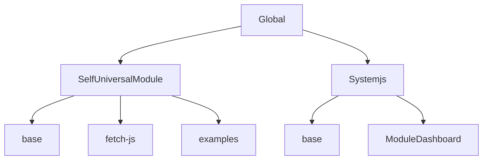

# UniversalModule 远程 JS 资源加载 SDK 架构分析

## 1. 架构设计

UniversalModule 是一个多格式 JS 模块加载器，旨在安全、高效地加载和执行各种格式的 JavaScript 模块（AMD、CommonJS、ES Module、UMD 和 IIFE）。该 SDK 采用分层架构设计，主要包含以下核心组件：

### 1.1 核心架构层次



```md
UniversalModule/
├── Global/            # 全局基础设施
│   └── base.ts        # 沙箱环境、模块类型检测
├── SelfUniversalModule/ # 自实现模块加载器
│   ├── base.ts        # 核心加载逻辑
│   ├── fetch-js.ts    # 网络请求获取模块
│   └── examples.ts    # 示例模块代码
├── Systemjs/          # SystemJS 集成
│   ├── base.ts        # SystemJS 加载器封装
│   └── ModuleDashboard.tsx # 可视化监控面板
├── Tools/             # 工具函数
│   ├── code.ts        # 代码安全检测
│   └── console.ts     # 日志输出工具
└── index.ts           # 统一导出接口
```

### 1.2 设计模式

- **策略模式**：根据模块类型选择不同的执行器
- **单例模式**：SystemJS 加载器实例全局唯一
- **代理模式**：通过 Proxy 实现安全沙箱
- **工厂模式**：创建不同类型的模块执行环境
- **观察者模式**：模块加载性能监控

## 2. 模块分工

### 2.1 Global/base.ts

- 定义沙箱环境接口和创建函数
- 实现模块类型检测逻辑
- 提供自定义 require 函数

### 2.2 SelfUniversalModule/

#### base.ts
- 实现各类模块格式的执行器
- 管理模块缓存和循环依赖检测
- 提供安全的模块导出机制

#### fetch-js.ts
- 负责从远程 URL 获取模块代码
- 实现模块代码缓存策略

### 2.3 Systemjs/

#### base.ts
- 封装 SystemJS 加载能力
- 提供统一的模块加载接口
- 实现安全检查和格式自动转换

#### ModuleDashboard.tsx
- 可视化模块依赖关系
- 监控模块加载性能指标

### 2.4 Tools/

#### code.ts
- 恶意代码检测工具
- 安全规则定义

#### console.ts
- 彩色日志输出
- 分组日志工具

## 3. 整体流程

### 3.1 模块加载流程

1. **模块代码获取**：通过 fetch 或直接传入获取模块代码
2. **安全检查**：检测代码是否包含恶意内容
3. **模块类型检测**：通过正则表达式识别模块格式
4. **沙箱环境创建**：构建隔离的执行环境
5. **模块执行**：根据类型选择对应执行器执行代码
6. **结果安全处理**：通过 Proxy 包装导出结果
7. **缓存管理**：存储模块结果以供复用

### 3.2 执行流程示意

```
输入代码 → 安全检查 → 类型检测 → 选择执行器 → 沙箱执行 → 安全导出 → 缓存结果
```

## 4. 设计重点与难点

### 4.1 多格式模块支持

**难点**：不同模块格式（AMD/CJS/ESM/UMD/IIFE）有不同的加载和执行机制

**解决方案**：
- 使用正则表达式精确识别模块类型
- 为每种格式实现专用执行器
- 统一导出接口，屏蔽内部差异

```typescript
// 模块类型检测示例
export const detectModuleType = (code: string): ModuleType => {
  if (/\bexport\s+.*|import\s+/.test(code)) return ModuleType.ESM;
  if (/define\(.*?function\s*\(/.test(code)) return ModuleType.AMD;
  if (/\(function\s*\([^)]*\broot\b[^)]*,\s*\bfactory\b[^)]*\)/.test(code)) return ModuleType.UMD;
  if (/exports.*?\=|\bmodule\.exports\b/.test(code)) return ModuleType.CJS;
  return ModuleType.IIFE;
};
```

### 4.2 ESM 动态加载

**难点**：ES 模块在浏览器中需要有效的 URL，无法直接从字符串加载

**解决方案**：
- 使用 Blob URL 技术创建临时模块 URL
- 通过 `import()` 动态导入模块
- 加载完成后释放 Blob URL 资源

```typescript
export const executeESM = async (code: string): Promise<ESMModuleExports> => {
  const blob = new Blob([code], { type: 'application/javascript' });
  const url = URL.createObjectURL(blob);
  try {
    const module = await import(/* @vite-ignore */ url);
    return module;
  } finally {
    URL.revokeObjectURL(url);
  }
};
```

### 4.3 安全沙箱隔离

**难点**：防止模块代码访问和污染全局环境，防止恶意代码执行

**解决方案**：
- 使用 Proxy 拦截对象访问
- 白名单控制可访问属性
- 禁止访问敏感 API（如 document、localStorage）
- 深拷贝返回值防止引用污染

```typescript
return new Proxy(context, {
  get(target, key: string | symbol) {
    if (key in target) {
      return target[key as keyof typeof target];
    }
    if (key === 'document' || key === 'localStorage') {
      console.warn(`[Sandbox] 阻止访问全局对象: ${String(key)}`);
      return {};
    }
    return undefined;
  },
  set(target, key, value) {
    // 限制属性设置...
  }
});
```

### 4.4 循环依赖处理

**难点**：模块间循环依赖可能导致死循环或不完整加载

**解决方案**：
- 使用 Set 跟踪加载中的模块
- 设置最大依赖深度（默认 20 层）
- 检测到循环时抛出明确错误

```typescript
// 检测循环依赖
if (moduleId) {
  if (loadingModules.has(moduleId)) {
    throw new Error(`检测到循环依赖: ${moduleId}`);
  }
  if (loadingModules.size >= MAX_DEPTH) {
    throw new Error(`超过最大依赖深度 (${MAX_DEPTH})`);
  }
  loadingModules.add(moduleId);
}
```

### 4.5 恶意代码防护

**难点**：防止执行恶意代码，保护宿主环境

**解决方案**：
- 正则匹配检测高风险 API 调用
- 拦截敏感操作（如 eval、new Function）
- 加载前进行代码安全扫描

```typescript
export const containsMaliciousCode = (code: string): boolean => {
  const maliciousPatterns = [
    /\beval\s*\(/,                    // eval()
    /new\s+Function\s*\(/,            // new Function()
    /\bdocument\.cookie\b/,           // document.cookie
    /\blocation\s*=/,                 // location=
    /\bwindow\s*\.\s*open\s*\(/,      // window.open()
    /\bnavigator\s*\.\s*userAgent\b/, // navigator.userAgent
  ];
  return maliciousPatterns.some(pattern => pattern.test(code));
};
```

### 4.6 性能优化

**难点**：模块加载和执行性能开销大，影响用户体验

**解决方案**：
- 模块结果缓存复用
- 按需加载模块
- 并发加载优化
- 可视化性能监控

```typescript
// 模块加载缓存
const moduleCache = new Map<string, any>();

// 缓存检查
if (moduleId && moduleCache.has(moduleId)) {
  return moduleCache.get(moduleId);
}
```

## 5. 双引擎设计

SDK 提供了两种模块加载引擎，可根据需求选择：

### 5.1 自实现引擎 (SelfUniversalModule)

- 完全自主实现，不依赖第三方库
- 更精细的控制和定制能力
- 更小的体积，适合轻量级应用

### 5.2 SystemJS 引擎

- 基于成熟的 SystemJS 库
- 更强的兼容性和稳定性
- 支持更复杂的模块解析和加载场景
- 内置更多高级特性

## 6. 总结

UniversalModule SDK 通过精心设计的分层架构、多种模块格式支持、安全沙箱隔离和性能优化，提供了一个安全、高效、灵活的远程 JS 资源加载解决方案。它能够满足现代 Web 应用中动态加载和执行第三方 JavaScript 代码的需求，同时保障宿主环境的安全性。

该 SDK 的核心价值在于：

1. **多格式统一**：无缝支持各种模块格式，简化集成流程
2. **安全可控**：严格的沙箱隔离和恶意代码检测
3. **性能优先**：缓存机制和按需加载策略
4. **可视化监控**：直观展示模块依赖和性能指标
5. **双引擎选择**：根据需求场景灵活选择加载引擎
