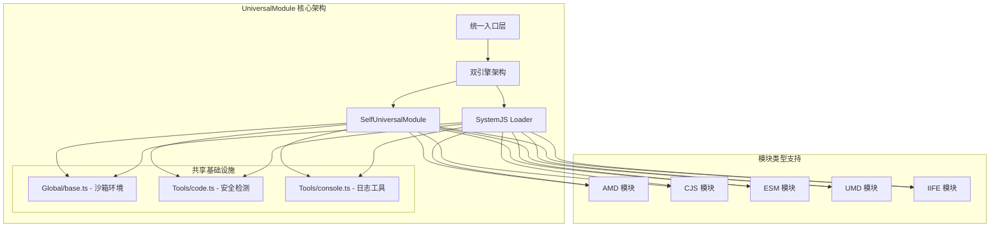

# UniversalModule 架构设计深度分析

## 概述

UniversalModule 是一个功能完备的通用JavaScript模块加载器，支持AMD、CJS、ESM、UMD、IIFE等多种模块格式的动态加载与执行。该模块采用双引擎架构设计，提供了自研的SelfUniversalModule和基于SystemJS的两套实现方案，在保证功能完整性的同时兼顾了灵活性和扩展性。

## 架构设计

### 整体架构



### 设计原则

1. **双引擎架构**：提供自研和第三方两套实现，满足不同场景需求
2. **沙箱隔离**：确保模块执行的安全性和环境隔离
3. **格式无关**：自动识别并适配多种模块格式
4. **安全优先**：内置恶意代码检测和权限控制机制
5. **性能优化**：模块缓存、循环依赖检测、资源管理

## 模块拆分策略

### 核心模块划分

#### 1. Global/base.ts - 基础设施层
**职责**：
- 沙箱环境创建与管理
- 模块类型检测算法
- 安全上下文构建

**关键实现**：
```typescript
// 沙箱环境创建
export const createSandbox = () => {
  const context: SandboxContext = {
    require: customRequire,
    exports: {},
    module: { exports: {} },
    // ... 其他安全属性
  };

  return new Proxy(context, {
    get(target, key) { /* 安全访问控制 */ },
    set(target, key, value) { /* 防止全局污染 */ }
  });
};

// 模块类型智能检测
export const detectModuleType = (code: string): ModuleType => {
  if (/\bexport\s+(default\b|\{|\*|const\s+|let\s+|var\s+|function\s+|class\s+)|import\s+/.test(code))
    return ModuleType.ESM;
  if (/define\(.*?function\s*\(/.test(code))
    return ModuleType.AMD;
  if (/\(function\s*\([^)]*\broot\b[^)]*,\s*\bfactory\b[^)]*\)/.test(code))
    return ModuleType.UMD;
  if (/exports.*?\=|\bmodule\.exports\b/.test(code))
    return ModuleType.CJS;
  return ModuleType.IIFE;
};
```

#### 2. SelfUniversalModule - 自研引擎
**职责**：
- 多格式模块执行器实现
- 模块缓存与生命周期管理
- 循环依赖检测与处理

**架构特点**：
- **执行器模式**：为每种模块格式提供专门的执行器
- **统一接口**：通过loadModule函数提供统一的加载入口
- **安全代理**：使用Proxy包装模块导出，确保安全访问

#### 3. SystemJS - 第三方引擎
**职责**：
- 基于SystemJS的模块加载实现
- 性能监控与可视化仪表板
- 高级特性支持（如import maps）

**架构特点**：
- **成熟生态**：利用SystemJS的成熟模块加载能力
- **监控增强**：提供ModuleDashboard进行性能监控
- **配置灵活**：支持复杂的模块解析配置

#### 4. Tools - 工具层
**职责**：
- 安全检测工具（code.ts）
- 日志管理工具（console.ts）
- 通用工具函数

## 重点难点分析

### 难点1：多格式模块统一加载

**技术挑战**：
- 不同模块格式的语法差异巨大
- 执行环境要求不同（如ESM需要原生支持）
- 依赖解析机制各异

**解决方案**：

1. **智能类型检测**：
```typescript
// 基于正则表达式的特征匹配
const detectModuleType = (code: string): ModuleType => {
  // ESM: 检测 export/import 关键字
  if (/\bexport\s+|import\s+/.test(code)) return ModuleType.ESM;
  // AMD: 检测 define 函数调用
  if (/define\(.*?function\s*\(/.test(code)) return ModuleType.AMD;
  // UMD: 检测特定的IIFE模式
  if (/\(function\s*\([^)]*\broot\b[^)]*,\s*\bfactory\b[^)]*\)/.test(code))
    return ModuleType.UMD;
  // CJS: 检测 exports 或 module.exports
  if (/exports.*?\=|\bmodule\.exports\b/.test(code)) return ModuleType.CJS;
  // 默认为IIFE
  return ModuleType.IIFE;
};
```

2. **专用执行器**：
```typescript
// ESM执行器 - 使用Blob URL + 动态import
export const executeESM = async (code: string): Promise<ESMModuleExports> => {
  const blob = new Blob([code], { type: 'application/javascript' });
  const url = URL.createObjectURL(blob);
  try {
    const module = await import(/* @vite-ignore */ url);
    return module;
  } finally {
    URL.revokeObjectURL(url); // 防止内存泄漏
  }
};

// CJS执行器 - 使用Function构造函数
export const executeCJS = (code: string, sandbox: SandboxContext) => {
  new Function('module', 'exports', 'require', code)(
    sandbox.module,
    sandbox.exports,
    sandbox.require
  );
  return sandbox.module.exports;
};
```

### 难点2：沙箱隔离与安全防护

**技术挑战**：
- 防止恶意代码访问全局对象
- 阻止原型链污染
- 控制API访问权限

**解决方案**：

1. **Proxy-based沙箱**：
```typescript
export const createSandbox = () => {
  const context: SandboxContext = { /* 安全上下文 */ };

  return new Proxy(context, {
    get(target, key: string | symbol) {
      // 白名单机制
      if (key in target) {
        return target[key as keyof typeof target];
      }

      // 阻止访问危险API
      if (key === 'document' || key === 'localStorage' || key === 'location') {
        console.warn(`[Sandbox] 阻止访问全局对象: ${String(key)}`);
        return {};
      }

      return undefined;
    },
    set(target, key, value) {
      // 控制属性设置权限
      if (key === 'module' || key === 'exports') {
        // 允许模块相关属性
        target[key as keyof typeof target] = value;
        return true;
      }

      console.warn(`[Sandbox] 设置属性: ${String(key)}`);
      return false;
    }
  });
};
```

2. **恶意代码检测**：
```typescript
export const containsMaliciousCode = (code: string): boolean => {
  const maliciousPatterns = [
    /\beval\s*\(/,                    // eval()
    /new\s+Function\s*\(/,            // new Function()
    /\bdocument\.cookie\b/,           // document.cookie
    /\blocation\s*=/,                 // location=
    /\bwindow\s*\.\s*open\s*\(/,      // window.open()
  ];

  return maliciousPatterns.some(pattern => pattern.test(code));
};
```

### 难点3：循环依赖检测与处理

**技术挑战**：
- 检测模块间的循环依赖关系
- 防止无限递归加载
- 限制依赖深度避免内存溢出

**解决方案**：
```typescript
const loadingModules = new Set<string>();
const MAX_DEPTH = 20;

export async function loadModule(code: string, moduleId?: string): Promise<any> {
  if (moduleId) {
    // 循环依赖检测
    if (loadingModules.has(moduleId)) {
      throw new Error(`检测到循环依赖: ${moduleId}`);
    }

    // 深度限制
    if (loadingModules.size >= MAX_DEPTH) {
      throw new Error(`超过最大依赖深度 (${MAX_DEPTH})`);
    }

    loadingModules.add(moduleId);
  }

  try {
    // 模块加载逻辑
    return await executeModule(code);
  } finally {
    if (moduleId) {
      loadingModules.delete(moduleId);
    }
  }
}
```

### 难点4：ESM动态加载实现

**技术挑战**：
- 浏览器环境下ESM的动态执行
- Blob URL的生命周期管理
- 模块命名空间的正确处理

**解决方案**：
```typescript
export const executeESM = async (code: string): Promise<ESMModuleExports> => {
  // 创建Blob URL实现动态ESM加载
  const blob = new Blob([code], { type: 'application/javascript' });
  const url = URL.createObjectURL(blob);

  try {
    // 使用动态import加载模块
    const module = await import(/* @vite-ignore */ url) as ESMModuleExports;
    return module;
  } catch (error) {
    console.error('[Sandbox] ESM 执行错误:', error);
    throw error;
  } finally {
    // 及时清理Blob URL，防止内存泄漏
    URL.revokeObjectURL(url);
  }
};
```

## 性能优化策略

### 1. 模块缓存机制
```typescript
const moduleCache = new Map<string, any>();

// 缓存命中检查
if (moduleId && moduleCache.has(moduleId)) {
  return moduleCache.get(moduleId);
}

// 缓存结果
if (moduleId) {
  moduleCache.set(moduleId, safeExports);
}
```

### 2. 资源管理
- Blob URL及时清理
- 事件监听器自动解绑
- 内存泄漏防护

### 3. 性能监控
通过ModuleDashboard提供：
- 加载时间统计
- 资源大小监控
- 依赖关系可视化

## 安全机制

### 1. 多层安全防护
- **代码静态检测**：恶意模式匹配
- **运行时隔离**：Proxy沙箱
- **API访问控制**：白名单机制
- **资源限制**：深度和时间限制

### 2. 安全导出代理
```typescript
export const createSafeExports = (exports: any, sandbox: SandboxContext) => {
  return new Proxy(exports, {
    get(target, key) {
      const value = target[key];

      // 函数绑定沙箱上下文
      if (typeof value === 'function') {
        return value.bind(sandbox);
      }

      // 深拷贝对象，避免污染
      if (typeof value === 'object' && value !== null) {
        return structuredClone(value);
      }

      return value;
    }
  });
};
```

## 最佳实践与使用建议

### 1. 选择合适的引擎
- **SelfUniversalModule**：适用于简单场景，更轻量
- **SystemJS**：适用于复杂场景，功能更完整

### 2. 安全使用
- 始终启用恶意代码检测
- 合理设置依赖深度限制
- 及时清理不需要的模块缓存

### 3. 性能优化
- 合理使用模块缓存
- 监控加载性能指标
- 避免过深的依赖链

## 扩展性考虑

### 1. 新格式支持
架构支持轻松添加新的模块格式：
- 添加类型检测规则
- 实现对应的执行器
- 更新统一加载逻辑

### 2. 功能扩展
- 支持更多安全检测规则
- 增强性能监控能力
- 扩展可视化功能

### 3. 平台适配
- Node.js环境适配
- Web Worker支持
- 微前端集成

## 总结

UniversalModule通过精心设计的双引擎架构，成功解决了多格式JavaScript模块统一加载的复杂技术挑战。其在安全性、性能和扩展性方面的深度考虑，使其成为一个生产级的模块加载解决方案。该架构的设计思路和实现方案对于类似的通用模块系统具有重要的参考价值。
