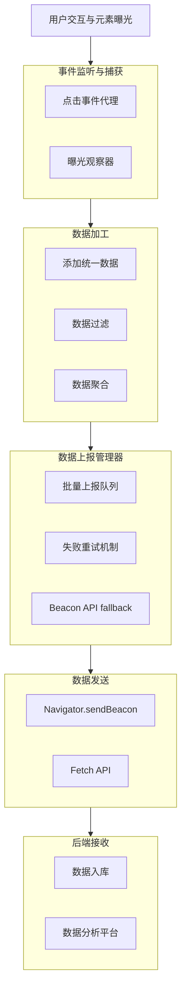

基于你的需求，我将为你设计一个基于 **Proxy 代理** 和 **Intersection Observer** 的前端全埋点方案。这个方案会实现**指定元素曝光埋点**和**全点击事件自动上报**，并使用 TypeScript 在 React + Antd 环境中实现，确保逻辑与 UI 隔离。

# 🚀 前端全埋点技术方案

## 📋 目录
1.  #设计目标与原则
2.  #技术架构图
3.  #核心实现
    *   #类型定义
    *   #曝光追踪
    *   #点击事件代理
    *   #数据上报与管理
    *   #核心-sdk
4.  #react-集成
5.  #antd-组件特殊处理
6.  #最佳实践与注意事项

---

## 🎯 设计目标与原则

1.  **无侵入性**：业务逻辑零感知，通过代理和原型拦截自动捕获事件。
2.  **自动采集**：自动捕获点击、曝光等用户行为，减少手动埋点工作量。
3.  **类型安全**：使用 TypeScript，确保数据类型和接口定义明确。
4.  **性能友好**：使用批量上报、请求队列、懒加载等策略优化性能。
5.  **可扩展性**：支持动态更新采集策略，方便后续添加新事件类型。
6.  **UI 分离**：埋点逻辑与 UI 组件完全隔离，通过配置和代理模式集成。

---

## 📊 技术架构图

以下是整个埋点系统的数据流和架构概览，它展示了从数据捕获到上报的完整流程：



---

## 🔧 核心实现

### 📐 类型定义

首先，我们定义整个系统需要的 TypeScript 类型和接口，这是确保类型安全的基础。

```typescript
// types/tracking.ts

// 埋点事件基础接口
export interface ITrackingEvent {
  eventId?: string; // 唯一标识，可用于幂等
  eventType: string; // 事件类型，如 'click', 'exposure'
  eventCategory: string; // 事件分类，如 'button', 'banner'
  eventAction: string; // 事件动作，如 'click', 'show'
  eventLabel?: string; // 事件标签，附加信息
  eventValue?: number; // 事件值，如订单金额
  timestamp: number; // 事件发生的时间戳
  pageUrl: string; // 页面URL
  pageTitle: string; // 页面标题
  referrer?: string; // 来源页
  elementPath?: string; // 元素路径（CSS选择器或XPath）
  elementType?: string; // 元素类型，如 'button', 'img'
  elementContent?: string; // 元素内容（文本或值）
  // 其他自定义维度
  [key: string]: unknown;
}

// 曝光事件特定属性
export interface IExposureEvent extends ITrackingEvent {
  exposureDuration?: number; // 曝光时长（ms）
  visibleRatio?: number; // 可见比例（0-1）
}

// 点击事件特定属性
export interface IClickEvent extends ITrackingEvent {
  clickX?: number; // 点击位置X坐标
  clickY?: number; // 点击位置Y坐标
}

// SDK配置项
export interface ITrackerConfig {
  serverUrl: string; // 上报服务器地址
  appId: string; // 应用ID
  version?: string; // 应用版本
  batchSize?: number; // 批量上报大小，默认10
  batchDelay?: number; // 批量上报延迟(ms)，默认5000
  useBeacon?: boolean; // 是否使用navigator.sendBeacon，默认true
  blackList?: string[]; // 元素黑名单选择器
  whiteList?: string[]; // 元素白名单选择器
  samplingRate?: number; // 采样率(0-1)，默认1
  enableErrorTracking?: boolean; // 是否启用错误追踪，默认false
}

// 上报队列项
export interface IQueueItem {
  event: ITrackingEvent;
  attempts?: number; // 尝试次数，用于重试
  timestamp: number;
}
```

### 👀 曝光追踪

曝光追踪使用 **Intersection Observer API** 监听元素是否进入视口。

```typescript
// tracker/exposureTracker.ts
import { ITrackerConfig, IExposureEvent } from '../types/tracking';

export class ExposureTracker {
  private observer: IntersectionObserver | null = null;
  private observedElements: Map<Element, IExposureEvent> = new Map();
  private config: ITrackerConfig;

  constructor(config: ITrackerConfig) {
    this.config = config;
    this.init();
  }

  private init(): void {
    // 初始化Intersection Observer
    this.observer = new IntersectionObserver(
      (entries) => {
        entries.forEach((entry) => {
          if (entry.isIntersecting) {
            this.handleExposure(entry.target as HTMLElement, entry);
          }
        });
      },
      {
        threshold: 0.5, // 元素50%可见时触发
        rootMargin: '0px',
      }
    );
  }

  // 添加需要跟踪曝光的元素
  public addElement(element: HTMLElement, eventData: Omit<IExposureEvent, 'timestamp' | 'pageUrl' | 'pageTitle'>): void {
    if (!this.observer) return;

    // 检查元素是否在黑名单中
    if (this.isInBlacklist(element)) return;

    this.observer.observe(element);
    this.observedElements.set(element, {
      ...eventData,
      timestamp: Date.now(),
      pageUrl: window.location.href,
      pageTitle: document.title,
    } as IExposureEvent);
  }

  // 处理曝光事件
  private handleExposure(element: HTMLElement, entry: IntersectionObserverEntry): void {
    const eventData = this.observedElements.get(element);
    if (!eventData) return;

    // 计算曝光时长和可见比例
    const exposureEvent: IExposureEvent = {
      ...eventData,
      exposureDuration: 0, // 实际项目中需要计算时间
      visibleRatio: this.calculateVisibleRatio(entry),
    };

    // 发送曝光事件（实际应接入上报队列）
    console.log('Exposure event:', exposureEvent);
    // tracker.send(exposureEvent);

    // 曝光后停止观察（如需多次曝光则移除此行）
    this.removeElement(element);
  }

  // 移除元素跟踪
  public removeElement(element: HTMLElement): void {
    if (!this.observer) return;
    this.observer.unobserve(element);
    this.observedElements.delete(element);
  }

  // 检查元素是否在黑名单中
  private isInBlacklist(element: HTMLElement): boolean {
    if (!this.config.blackList) return false;
    return this.config.blackList.some(selector => element.matches(selector));
  }

  // 计算可见比例
  private calculateVisibleRatio(entry: IntersectionObserverEntry): number {
    const ratio = entry.intersectionRatio;
    return Math.round(ratio * 100) / 100;
  }

  // 销毁清理
  public destroy(): void {
    if (this.observer) {
      this.observer.disconnect();
      this.observer = null;
    }
    this.observedElements.clear();
  }
}
```

### 🖱️ 点击事件代理

使用 **事件代理** 全局监听点击事件，并通过 **Proxy** 拦截特殊处理。

```typescript
// tracker/clickTracker.ts
import { ITrackerConfig, IClickEvent } from '../types/tracking';

export class ClickTracker {
  private config: ITrackerConfig;
  private pressedElements: Map<HTMLElement, number> = new Map();

  constructor(config: ITrackerConfig) {
    this.config = config;
    this.init();
  }

  private init(): void {
    // 全局事件监听
    document.addEventListener('click', this.handleClick.bind(this), true);
    document.addEventListener('mousedown', this.handlePressIn.bind(this), true);
    document.addEventListener('mouseup', this.handlePressOut.bind(this), true);
    document.addEventListener('touchstart', this.handlePressIn.bind(this), true);
    document.addEventListener('touchend', this.handlePressOut.bind(this), true);
  }

  // 处理点击事件
  private handleClick(event: MouseEvent): void {
    const target = event.target as HTMLElement;

    // 检查元素是否在黑名单中
    if (this.isInBlacklist(target)) return;

    // 采样控制
    if (Math.random() > (this.config.samplingRate || 1)) return;

    const clickEvent: IClickEvent = {
      eventType: 'click',
      eventCategory: this.getElementCategory(target),
      eventAction: 'click',
      eventLabel: this.getElementLabel(target),
      timestamp: Date.now(),
      pageUrl: window.location.href,
      pageTitle: document.title,
      elementPath: this.getElementPath(target),
      elementType: target.tagName.toLowerCase(),
      elementContent: this.getElementContent(target),
      clickX: event.clientX,
      clickY: event.clientY,
    };

    // 发送点击事件（实际应接入上报队列）
    console.log('Click event:', clickEvent);
    // tracker.send(clickEvent);
  }

  // 处理按下事件（onPressIn）
  private handlePressIn(event: MouseEvent | TouchEvent): void {
    const target = event.target as HTMLElement;
    this.pressedElements.set(target, Date.now());
  }

  // 处理释放事件（onPressOut）
  private handlePressOut(event: MouseEvent | TouchEvent): void {
    const target = event.target as HTMLElement;
    const pressStartTime = this.pressedElements.get(target);

    if (pressStartTime) {
      const pressDuration = Date.now() - pressStartTime;

      // 可在此处理长按逻辑
      if (pressDuration > 500) {
        console.log('Long press detected:', pressDuration);
      }

      this.pressedElements.delete(target);
    }
  }

  // 获取元素分类
  private getElementCategory(element: HTMLElement): string {
    // 可根据类名、ID等判断元素类别
    if (element.id.includes('btn')) return 'button';
    if (element.classList.contains('ant-')) return 'antd-component';
    return element.tagName.toLowerCase();
  }

  // 获取元素标签
  private getElementLabel(element: HTMLElement): string {
    return element.getAttribute('data-tracking-label') ||
           element.textContent?.trim().substring(0, 50) ||
           '';
  }

  // 获取元素路径（简化版）
  private getElementPath(element: HTMLElement): string {
    const path: string[] = [];
    let current: Element | null = element;

    while (current && current !== document.body) {
      let selector = current.tagName.toLowerCase();

      if (current.id) {
        selector += `#${current.id}`;
      } else if (current.className && typeof current.className === 'string') {
        selector += `.${current.className.split(/\s+/).join('.')}`;
      }

      path.unshift(selector);
      current = current.parentElement;
    }

    return path.join(' > ');
  }

  // 获取元素内容
  private getElementContent(element: HTMLElement): string {
    return element.textContent?.trim().substring(0, 100) ||
           element.getAttribute('value') ||
           '';
  }

  // 检查元素是否在黑名单中
  private isInBlacklist(element: HTMLElement): boolean {
    if (!this.config.blackList) return false;
    return this.config.blackList.some(selector => element.matches(selector));
  }

  // 销毁清理
  public destroy(): void {
    document.removeEventListener('click', this.handleClick.bind(this), true);
    document.removeEventListener('mousedown', this.handlePressIn.bind(this), true);
    document.removeEventListener('mouseup', this.handlePressOut.bind(this), true);
    document.removeEventListener('touchstart', this.handlePressIn.bind(this), true);
    document.removeEventListener('touchend', this.handlePressOut.bind(this), true);
    this.pressedElements.clear();
  }
}
```

### 📤 数据上报与管理

实现一个健壮的上报管理器，支持批量上报、失败重试和多种上报方式。

```typescript
// tracker/reporter.ts
import { ITrackingEvent, ITrackerConfig, IQueueItem } from '../types/tracking';

export class Reporter {
  private queue: IQueueItem[] = [];
  private isSending: boolean = false;
  private config: ITrackerConfig;
  private timer: number | null = null;

  constructor(config: ITrackerConfig) {
    this.config = config;
    this.initBatchProcessing();
  }

  // 初始化批量处理
  private initBatchProcessing(): void {
    // 定时处理队列
    this.timer = window.setInterval(() => {
      if (this.queue.length > 0) {
        this.processQueue();
      }
    }, this.config.batchDelay || 5000);
  }

  // 添加到上报队列
  public addToQueue(event: ITrackingEvent): void {
    this.queue.push({
      event,
      attempts: 0,
      timestamp: Date.now()
    });

    // 达到批量大小时立即处理
    if (this.queue.length >= (this.config.batchSize || 10)) {
      this.processQueue();
    }
  }

  // 处理队列
  private async processQueue(): Promise<void> {
    if (this.isSending || this.queue.length === 0) return;

    this.isSending = true;
    const itemsToSend = this.queue.splice(0, this.config.batchSize || 10);

    try {
      await this.sendBatch(itemsToSend.map(item => item.event));
      // 发送成功，从队列中移除
    } catch (error) {
      console.error('Failed to send batch:', error);
      // 发送失败，重新放回队列并增加尝试次数
      itemsToSend.forEach(item => {
        item.attempts = (item.attempts || 0) + 1;
        // 如果尝试次数过多，则丢弃（可根据需要调整策略）
        if (item.attempts < 3) {
          this.queue.unshift(item);
        }
      });
    } finally {
      this.isSending = false;
    }
  }

  // 发送批量数据
  private async sendBatch(events: ITrackingEvent[]): Promise<void> {
    const batchData = {
      appId: this.config.appId,
      version: this.config.version,
      events: events,
      timestamp: Date.now()
    };

    // 使用sendBeacon或fetch
    if (this.config.useBeacon !== false && navigator.sendBeacon) {
      const blob = new Blob([JSON.stringify(batchData)], { type: 'application/json' });
      const success = navigator.sendBeacon(this.config.serverUrl, blob);
      if (!success) {
        throw new Error('sendBeacon failed');
      }
    } else {
      const response = await fetch(this.config.serverUrl, {
        method: 'POST',
        headers: { 'Content-Type': 'application/json' },
        body: JSON.stringify(batchData)
      });

      if (!response.ok) {
        throw new Error(`HTTP ${response.status}`);
      }
    }
  }

  // 销毁清理
  public destroy(): void {
    if (this.timer) {
      clearInterval(this.timer);
      this.timer = null;
    }

    // 页面卸载前发送剩余数据
    if (this.queue.length > 0) {
      this.processQueue().catch(console.error);
    }
  }
}
```

### 📦 核心 SDK

整合所有功能，提供统一的埋点 SDK。

```typescript
// tracker/index.ts
import { ITrackerConfig, ITrackingEvent, IExposureEvent, IClickEvent } from './types/tracking';
import { ExposureTracker } from './exposureTracker';
import { ClickTracker } from './clickTracker';
import { Reporter } from './reporter';

export class Tracker {
  private config: ITrackerConfig;
  private exposureTracker: ExposureTracker;
  private clickTracker: ClickTracker;
  private reporter: Reporter;
  private isInitialized: boolean = false;

  constructor(config: ITrackerConfig) {
    this.config = config;
    this.exposureTracker = new ExposureTracker(config);
    this.clickTracker = new ClickTracker(config);
    this.reporter = new Reporter(config);
    this.isInitialized = true;
  }

  // 手动跟踪事件
  public track(event: Omit<ITrackingEvent, 'timestamp' | 'pageUrl' | 'pageTitle'>): void {
    if (!this.isInitialized) return;

    const fullEvent: ITrackingEvent = {
      ...event,
      timestamp: Date.now(),
      pageUrl: window.location.href,
      pageTitle: document.title,
    };

    this.reporter.addToQueue(fullEvent);
  }

  // 跟踪曝光事件
  public trackExposure(element: HTMLElement, eventData: Omit<IExposureEvent, 'timestamp' | 'pageUrl' | 'pageTitle'>): void {
    if (!this.isInitialized) return;
    this.exposureTracker.addElement(element, eventData);
  }

  // 获取曝光追踪器实例
  public getExposureTracker(): ExposureTracker {
    return this.exposureTracker;
  }

  // 获取点击追踪器实例
  public getClickTracker(): ClickTracker {
    return this.clickTracker;
  }

  // 设置用户ID
  public setUserId(userId: string): void {
    // 可将userId存储在全局或Cookie中，在上报时附加
  }

  // 销毁清理
  public destroy(): void {
    this.exposureTracker.destroy();
    this.clickTracker.destroy();
    this.reporter.destroy();
    this.isInitialized = false;
  }
}

// 全局单例
let globalTracker: Tracker | null = null;

export const initTracker = (config: ITrackerConfig): Tracker => {
  if (!globalTracker) {
    globalTracker = new Tracker(config);
  }
  return globalTracker;
};

export const getTracker = (): Tracker => {
  if (!globalTracker) {
    throw new Error('Tracker not initialized. Call initTracker first.');
  }
  return globalTracker;
};
```

---

## ⚛️ React 集成

创建 React Hooks 和 HOC 以便在组件中使用，同时保持 UI 分离。

```typescript
// hooks/useTracking.ts
import { useEffect, useRef } from 'react';
import { getTracker } from '../tracker';

// 曝光跟踪Hook
export const useExposureTracking = (
  eventData: Omit<IExposureEvent, 'timestamp' | 'pageUrl' | 'pageTitle'>
) => {
  const elementRef = useRef<HTMLElement>(null);

  useEffect(() => {
    const element = elementRef.current;
    if (!element) return;

    const tracker = getTracker();
    tracker.trackExposure(element, eventData);

    return () => {
      tracker.getExposureTracker().removeElement(element);
    };
  }, [eventData]);

  return elementRef;
};

// 点击事件跟踪Hook
export const useClickTracking = (
  eventData: Omit<IClickEvent, 'timestamp' | 'pageUrl' | 'pageTitle'>,
  onClick?: () => void
) => {
  const handleClick = () => {
    const tracker = getTracker();
    tracker.track({
      ...eventData,
      eventType: 'click',
      eventAction: 'click',
    });

    if (onClick) {
      onClick();
    }
  };

  return handleClick;
};
```

```typescript
// components/TrackingRoot.tsx
import { useEffect } from 'react';
import { initTracker, ITrackerConfig } from '../tracker';

interface TrackingRootProps {
  config: ITrackerConfig;
  children: React.ReactNode;
}

export const TrackingRoot = ({ config, children }: TrackingRootProps) => {
  useEffect(() => {
    // 初始化埋点SDK
    initTracker(config);

    // 页面卸载前销毁
    return () => {
      const tracker = getTracker();
      tracker.destroy();
    };
  }, [config]);

  return <>{children}</>;
};
```

---

## 🎨 Antd 组件特殊处理

Antd 组件需要特殊处理，因为它们的 DOM 结构可能与实际交互元素不一致。

```typescript
// tracker/antdTracker.ts
import { Tracker } from './tracker';

// Antd组件特殊处理
export class AntdTracker {
  private tracker: Tracker;

  constructor(tracker: Tracker) {
    this.tracker = tracker;
    this.patchAntdComponents();
  }

  // 代理Antd组件方法
  private patchAntdComponents(): void {
    this.patchButton();
    this.patchModal();
    this.patchMenu();
    // 其他组件...
  }

  // 代理Button组件
  private patchButton(): void {
    if (!window.antd || !window.antd.Button) return;

    const originalRender = window.antd.Button.prototype.render;
    const self = this;

    window.antd.Button.prototype.render = function () {
      const button = originalRender.apply(this, arguments);

      // 添加跟踪属性
      return React.cloneElement(button, {
        onClick: (e: React.MouseEvent) => {
          self.tracker.track({
            eventType: 'click',
            eventCategory: 'antd-button',
            eventAction: 'click',
            eventLabel: this.props['data-tracking-label'] || this.props.children,
          });

          if (this.props.onClick) {
            this.props.onClick(e);
          }
        }
      });
    };
  }

  // 代理Modal组件
  private patchModal(): void {
    if (!window.antd || !window.antd.Modal) return;

    const originalUpdate = window.antd.Modal.prototype.componentDidUpdate;
    const self = this;

    window.antd.Modal.prototype.componentDidUpdate = function (prevProps: any) {
      if (originalUpdate) {
        originalUpdate.apply(this, [prevProps]);
      }

      // 跟踪Modal显示/隐藏
      if (this.props.visible !== prevProps.visible) {
        self.tracker.track({
          eventType: 'modal',
          eventCategory: 'antd-modal',
          eventAction: this.props.visible ? 'show' : 'hide',
          eventLabel: this.props.title,
        });
      }
    };
  }

  // 代理Menu组件
  private patchMenu(): void {
    if (!window.antd || !window.antd.Menu) return;

    const originalHandleClick = window.antd.Menu.prototype.handleClick;
    const self = this;

    window.antd.Menu.prototype.handleClick = function (e: any) {
      self.tracker.track({
        eventType: 'click',
        eventCategory: 'antd-menu',
        eventAction: 'select',
        eventLabel: e.key,
      });

      if (originalHandleClick) {
        originalHandleClick.apply(this, [e]);
      }
    };
  }
}
```

---

## ✅ 最佳实践与注意事项

1.  **隐私合规**：确保遵守 GDPR、CCPA 等隐私法规，提供退出跟踪的选项。
2.  **性能监控**：监控埋点系统对页面性能的影响，特别是大量曝光跟踪时。
3.  **数据清洗**：后端应验证和清洗埋点数据，防止恶意攻击或错误数据。
4.  **错误处理**：实现完善的错误处理机制，避免埋点系统崩溃影响主业务。
5.  **版本管理**：埋点事件结构应版本化，确保前后端兼容性。
6.  **测试验证**：提供测试工具验证埋点数据准确性，避免数据遗漏或错误。
7.  **文档维护**：维护埋点字典，记录每个事件的定义和使用场景。

---

此方案提供了一个完整的前端全埋点实现，涵盖了曝光追踪、点击事件捕获、数据上报和 React 集成。通过 Proxy 和事件代理技术，实现了与业务逻辑的完全解耦，只需简单初始化即可自动收集用户行为数据。