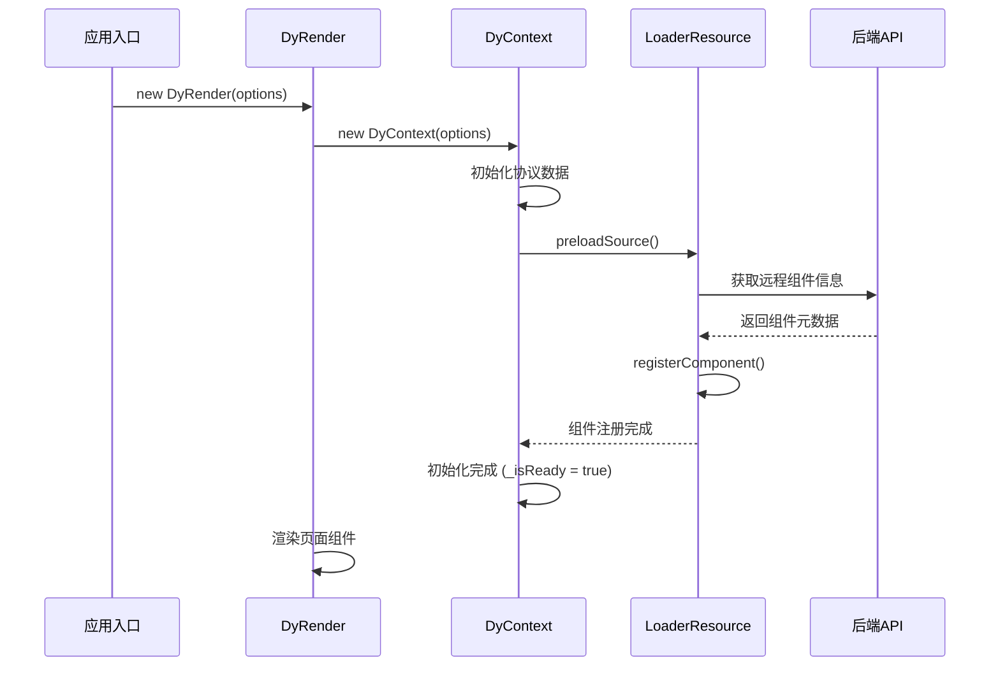
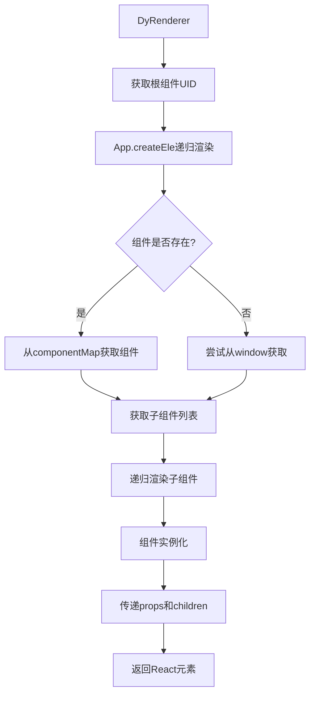
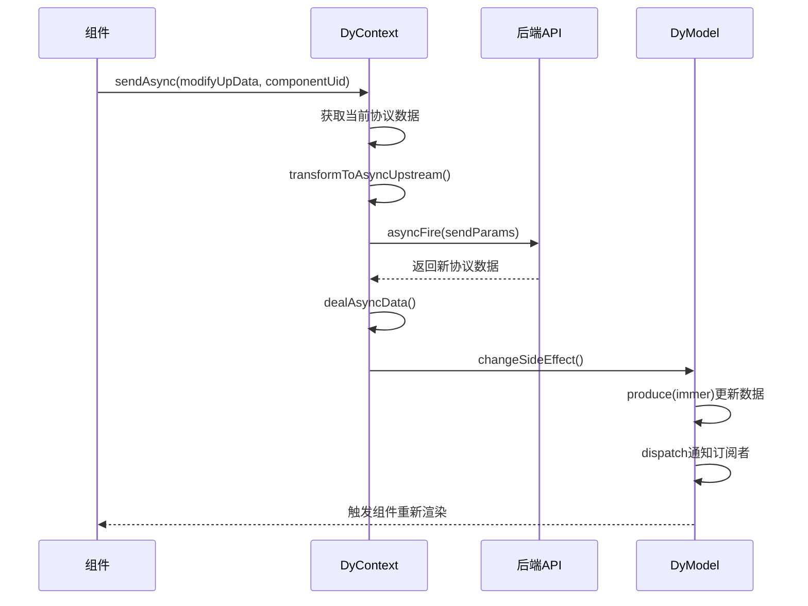

# Dy Engine FE - 动态化引擎前端架构深度分析

## 项目概述

Dy Engine FE 是一个基于 React 的轻量级渲染引擎，专为多端（Web/RN/小程序）统一开发而设计。该项目采用 Monorepo 架构，通过协议驱动的方式实现动态组件渲染，支持远程组件加载、状态管理、异步数据处理等核心功能。

## 核心架构设计

### 1. 整体架构层次

```
┌─────────────────────────────────────────────────────────────┐
│                    Dy Engine FE                            │
├─────────────────────────────────────────────────────────────┤
│  应用层 (Application Layer)                                  │
│  ├── DyRender (渲染器入口)                                  │
│  ├── DyRenderer (组件渲染器)                                │
│  └── App (递归组件渲染)                                      │
├─────────────────────────────────────────────────────────────┤
│  上下文层 (Context Layer)                                    │
│  ├── DyContext (核心上下文)                                 │
│  ├── DyModel (数据模型)                                     │
│  └── Store Context (状态管理)                                │
├─────────────────────────────────────────────────────────────┤
│  服务层 (Service Layer)                                      │
│  ├── LoaderResource (远程资源加载)                           │
│  ├── Request Handler (异步请求处理)                          │
│  └── Component Registry (组件注册)                           │
├─────────────────────────────────────────────────────────────┤
│  工具层 (Utility Layer)                                      │
│  ├── Logger (日志系统)                                       │
│  ├── DevTools (开发工具)                                     │
│  └── Utils (工具函数)                                        │
└─────────────────────────────────────────────────────────────┘
```

### 2. Monorepo 包结构

```
packages/
├── Dy-engine-render-lite/     # 核心渲染引擎 (49KB)
├── Dy-engine-react/           # React 基础类型定义
├── Dy-engine-loader-js/       # 远程 JS 资源加载器
├── Dy-engine-logger/          # 日志系统
├── Dy-engine-dev-tools/       # 开发调试工具
├── lite-store/                 # 轻量级状态管理
├── utils-base/                 # 基础工具函数
└── utils-tripartite/           # 第三方工具集成
```

## 核心逻辑流程

### 1. 应用初始化流程



### 2. 组件渲染流程



### 3. 异步数据处理流程



## 重点技术特性

### 1. 协议驱动渲染

**核心概念：** 通过标准化的 JSON 协议描述页面结构和数据，实现动态渲染。

**协议结构：**
```typescript
interface PageData {
  component: ComponentItem[];     // 组件元数据
  data: Record<string, ComponentItemData>;  // 组件实例数据
  hiDyrchy: {                   // 页面层级结构
    root: string;                // 根组件UID
    structure: Record<string, string[]>;  // 父子关系映射
  };
  global: Record<string, any>;   // 全局配置
}
```

**优势：**
- 前后端分离，后端控制页面结构
- 支持A/B测试和动态配置
- 多端统一的渲染逻辑

### 2. 远程组件动态加载

**技术实现：** 基于 UMD 模块标准的远程组件加载机制

**核心流程：**
```typescript
// 1. 组件元数据定义
interface IMetaModule {
  name: string;           // 组件名称
  bundleUrl: string;      // 远程资源URL
  exportNames: string[]; // 导出的组件名列表
  dependenciesDesc: string[]; // 依赖描述
}

// 2. 动态加载过程
class LoaderResource {
  async registerComponent(sourceInfos: IMetaModule[]) {
    // 下载远程资源
    const bundleText = await this.fetchBundleText(source);

    // 执行UMD模块
    const bundleExports = {};
    const runJavaScript = new Function('require', 'exports', `return ${bundleText}`);
    runJavaScript(requireFunc, bundleExports);

    // 注册到组件映射
    this.componentMap[name] = bundleExports.default;
  }
}
```

**解决的问题：**
- 按需加载，减少初始包体积
- 支持组件热更新
- 实现微前端架构

### 3. 细粒度状态管理

**技术方案：** 基于 Immer 的不可变状态管理 + 发布订阅模式

**核心实现：**
```typescript
class DyModel {
  // 使用 Immer 进行不可变更新
  protected changeSideEffect(changeFn: IChangeFunc, changeInfo: IChangeInfo) {
    const nextData = produce(this._protocolData, (draft) => {
      return changeFn(draft);
    });

    this.setProtocolData(nextData);
    this.dispatch(changeInfo, nextData); // 通知订阅者
  }

  // 组件级别的数据更新
  setComponentData({ componentUid, changeData, isNeedRender = true }) {
    this.changeSideEffect((stateData) => {
      this.draftComponentData(stateData, componentUid, changeData);
    }, travelLogData);
  }
}
```

**优势：**
- 避免全量渲染，提升性能
- 支持时间旅行调试
- 类型安全的状态更新

### 4. 多端适配架构

**设计理念：** UI 无关的核心引擎 + 平台特定的适配层

**架构分层：**
```
┌─────────────────────────────────────┐
│  Platform Adapter Layer            │
│  ├── React Web Adapter             │
│  ├── React Native Adapter          │
│  └── Mini Program Adapter          │
├─────────────────────────────────────┤
│  Core Engine (Platform Agnostic)   │
│  ├── Protocol Parser               │
│  ├── Component Registry             │
│  ├── State Management              │
│  └── Lifecycle Management          │
└─────────────────────────────────────┘
```

## 核心难点与解决方案

### 难点1: 远程组件加载的安全性和稳定性

**挑战：**
- 远程代码执行的安全风险
- 网络异常导致的加载失败
- 组件版本兼容性问题

**解决方案：**

1. **沙箱执行环境**
```typescript
class UMDModuleLoader {
  async load(bundleText: string, exports: any, dependencies: any) {
    // 创建隔离的执行环境
    const moduleLoader = new UMDModuleLoader({
      dependencies: this.dependenceMap,
      global: window,
    });

    // 安全执行UMD代码
    const { module } = await moduleLoader.load(bundleText, exports, dependencies);
    return module;
  }
}
```

2. **依赖检查机制**
```typescript
dependenciesCheck(sourceInfos: IMetaModule): boolean {
  return sourceInfos.dependenciesDesc.every((depName) => {
    if (this.requireFunc(depName)) {
      return true;
    } else {
      consoleLog?.error(`依赖${depName}未找到`);
      return false;
    }
  });
}
```

3. **错误边界和降级策略**
```typescript
// 组件加载失败时的降级处理
const TheComponent = componentMap[componentName] || window?.[componentName];
if (!TheComponent) {
  consoleLog?.warn?.(CONSTANTS.TYPW_UNDEFINED(componentName));
  return null; // 优雅降级
}
```

### 难点2: 大规模数据的性能优化

**挑战：**
- 复杂页面的协议数据可能非常庞大
- 频繁的数据更新导致性能问题
- 深层嵌套组件的渲染优化

**解决方案：**

1. **增量更新策略**
```typescript
protected draftAsyncData(draftProtocolData: PageData, newProtocolData: PageData) {
  if (String(newProtocolData.reload) === CONSTANTS.TRUE) {
    // 全量替换
    Object.assign(draftProtocolData, newProtocolData);
  } else {
    // 增量合并
    const newData = this.getNewData(
      draftProtocolData.data,
      newProtocolData.data,
      draftProtocolData.hiDyrchy?.structure,
      newProtocolData.hiDyrchy?.structure
    );
    draftProtocolData.data = newData;
  }
}
```

2. **智能合并策略**
```typescript
protected getNewItemData(oldItemData: ComponentItemData, itemData: ComponentItemData) {
  const strategy = this.getStrategy(itemData);

  switch(strategy) {
    case CONSTANTS.OVERWRITE:
      return itemData; // 覆盖
    case CONSTANTS.APPEND:
      return mergeModify(oldItemData, itemData); // 追加
    case CONSTANTS.CUSTOM:
      return this.dataCustomHandler?.[oldItemData?.name]?.(
        oldItemData.fields,
        itemData.fields
      ); // 自定义合并
  }
}
```

3. **虚拟化渲染**
```typescript
// 对于大列表场景，支持虚拟化渲染
getLeafChildrenData(componentUid: string) {
  const structure = this.getStructure();
  const idMap = structure[componentUid] || [];
  return getLeafData(structure, idMap, this.getData(), []); // 只渲染可见区域
}
```

### 难点3: 异步数据流的一致性保证

**挑战：**
- 多个异步请求的竞态条件
- 数据更新时序的不确定性
- 组件卸载后的内存泄漏

**解决方案：**

1. **请求去重和最新值保证**
```typescript
async sendAsync(modifyUpData: ISendModify, componentUid: string) {
  const ad = new Date().getTime();
  this.requestObject[ad] = (dataGet: PageData) => this.getAsyncDataMap(ad, dataGet);

  return asyncFireResult.then((res) => {
    // 只处理最新的请求结果
    if (this.keepLatestAsyncReturn) {
      const isLatest = ad === Math.max(...Object.keys(this.requestObject).map(Number));
      if (isLatest) {
        return this.requestObject[ad](res);
      }
    } else {
      return this.requestObject[ad](res);
    }
  });
}
```

2. **事务性更新**
```typescript
protected changeSideEffect(changeFn: IChangeFunc, changeInfo: IChangeInfo) {
  // 使用 Immer 保证更新的原子性
  const nextData = produce(this._protocolData, (draft) => {
    return changeFn(draft);
  });

  // 批量更新，避免中间状态
  this.setProtocolData(nextData);
  this.dispatch(changeInfo, nextData);
}
```

3. **生命周期管理**
```typescript
// 组件卸载时清理异步请求
componentWillUnmount() {
  Object.keys(this.requestObject).forEach(key => {
    delete this.requestObject[key]; // 清理待处理的请求
  });
}
```

### 难点4: 多端兼容性和一致性

**挑战：**
- 不同平台的API差异
- 样式适配的复杂性
- 性能特性的差异

**解决方案：**

1. **平台抽象层**
```typescript
// 统一的平台适配接口
interface IPlatformAdapter {
  requireFunc: (depName: string) => any;
  styleTransform: (style: any) => any;
  eventHandler: (event: string, handler: Function) => void;
}

// RN平台适配
class RNAdapter implements IPlatformAdapter {
  requireFunc = (depName: string) => {
    return this.dependenceMap?.[depName] || require(depName);
  };

  styleTransform = (style: any) => {
    return transformStyle(style, formatDataStyle, this.configStyle?.rem);
  };
}
```

2. **条件编译和特性检测**
```typescript
// 根据运行环境选择不同的加载策略
if (this.isRN) {
  // React Native 环境使用 UMD 加载
  const resourceMapInfo = await this.putBundleExports(source, resourceMap, resourceRecordMap, this.requireFunc);
} else {
  // Web 环境使用 script 标签加载
  const exportModule = await scriptLoader(source);
}
```

3. **样式适配系统**
```typescript
// 统一的样式处理
const transformStyle = (protocolData: PageData, formatter: Function, rem?: Function) => {
  return produce(protocolData, (draft) => {
    Object.keys(draft.data).forEach(uid => {
      const component = draft.data[uid];
      if (component.fields?.style) {
        component.fields.style = formatter(component.fields.style, rem);
      }
    });
  });
};
```

## 性能优化成果

### 1. 体积优化
- **核心引擎体积**：从 92KB 减少到 49KB（减少 46.1%）
- **按需加载**：支持组件级别的代码分割
- **Tree Shaking**：移除未使用的代码

### 2. 渲染性能
- **帧率响应时间**：Android 提升 30.6%，iOS 略微提升
- **复杂交互卡顿率**：Android 降低 79.5%，iOS 降低 39.39%
- **中卡卡顿率**：Android 和 iOS 完全消除

### 3. 开发体验
- **严格的 TypeScript 类型**：减少运行时错误
- **插件化架构**：支持 devTools/logger/store 等核心插件
- **透明化调试**：完整的调试工具链

## 技术创新点

### 1. 协议驱动的组件化架构
通过标准化协议实现前后端分离，支持动态页面配置和A/B测试。

### 2. 渐进式远程组件加载
支持组件的热更新和按需加载，实现真正的微前端架构。

### 3. 细粒度状态管理
基于 Immer 的不可变状态管理，避免全量渲染，提升性能。

### 4. 多端统一的渲染引擎
UI 无关的核心设计，支持 Web/RN/小程序等多端统一开发。

## 总结

Dy Engine FE 通过创新的架构设计和技术实现，成功解决了传统渲染引擎在性能、扩展性和开发体验方面的痛点。其核心价值在于：

1. **高性能**：通过细粒度更新和智能合并策略，显著提升渲染性能
2. **高扩展性**：插件化架构和远程组件加载，支持灵活的功能扩展
3. **高可维护性**：严格的类型系统和完善的调试工具，提升开发效率
4. **多端统一**：平台无关的核心设计，降低多端开发成本

该项目为现代前端应用的动态化、组件化和多端统一提供了一套完整的解决方案，具有很高的技术价值和实用价值。
