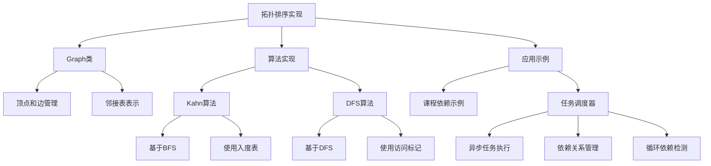

# 拓扑排序 (Topological Sort)

拓扑排序是一种针对有向无环图(DAG, Directed Acyclic Graph)的排序算法，它将图中的所有顶点排成一个线性序列，使得对于图中的任意一条有向边(u, v)，顶点u在序列中都出现在顶点v之前。

## 基本概念

- **有向无环图(DAG)**：一个没有环路的有向图
- **拓扑序**：满足上述条件的顶点序列
- **环检测**：如果图中存在环，则无法得到拓扑序

## 算法实现

本模块提供了两种经典的拓扑排序算法实现：

### 1. Kahn算法 (基于BFS)

Kahn算法是一种基于广度优先搜索(BFS)的拓扑排序算法，其核心思想是不断移除图中入度为0的顶点。

**算法步骤**：
1. 计算图中每个顶点的入度
2. 将所有入度为0的顶点加入队列
3. 当队列非空时：
   - 出队一个顶点，将其加入结果序列
   - 将该顶点的所有邻接点的入度减1
   - 如果邻接点的入度变为0，则将其加入队列
4. 重复步骤3直到队列为空
5. 如果结果序列的长度等于图中顶点数，则返回该序列；否则图中存在环，无法进行拓扑排序

**时间复杂度**：O(V + E)，其中V是顶点数，E是边数

### 2. DFS算法 (基于深度优先搜索)

DFS算法是一种基于深度优先搜索的拓扑排序算法，其核心思想是在DFS的过程中记录顶点的访问状态，并在回溯时将顶点加入结果序列。

**算法步骤**：
1. 对图中每个未访问的顶点进行DFS
2. 在DFS过程中，将顶点标记为三种状态之一：未访问、访问中、已访问
3. 如果在DFS过程中遇到"访问中"的顶点，则表示图中存在环
4. DFS完成后，将顶点按照访问完成的逆序排列，即为拓扑排序结果

**时间复杂度**：O(V + E)，其中V是顶点数，E是边数

## 应用场景

拓扑排序在实际应用中有许多用途，例如：

1. **任务调度**：当任务之间存在依赖关系时，可以使用拓扑排序确定任务的执行顺序
2. **编译顺序确定**：在编译过程中，确定模块的编译顺序
3. **课程安排**：根据课程的先修关系，确定课程的学习顺序
4. **包依赖管理**：在软件包管理系统中，解决包之间的依赖关系
5. **数据处理流水线**：在数据处理中，确定处理步骤的执行顺序

## 示例

本模块提供了两个具体的示例：

1. **课程依赖关系**：展示了如何使用拓扑排序确定课程的学习顺序
2. **任务调度器**：一个基于拓扑排序的任务调度系统，可以处理具有依赖关系的任务

## 使用方法

```typescript
import { Graph, topologicalSortKahn, topologicalSortDFS } from './index';

// 创建一个有向图
const graph = new Graph<string>();

// 添加顶点和边
graph.addEdge("A", "B"); // A -> B
graph.addEdge("A", "C"); // A -> C
graph.addEdge("B", "D"); // B -> D
graph.addEdge("C", "D"); // C -> D

// 使用Kahn算法进行拓扑排序
const kahnResult = topologicalSortKahn(graph);
console.log("Kahn算法结果:", kahnResult.join(" -> ")); // 输出: A -> B -> C -> D 或 A -> C -> B -> D

// 使用DFS算法进行拓扑排序
const dfsResult = topologicalSortDFS(graph);
console.log("DFS算法结果:", dfsResult.join(" -> ")); // 输出可能不同于Kahn算法
```

## 任务调度器示例

```typescript
import { TaskScheduler } from './TaskScheduler';

const scheduler = new TaskScheduler();

// 添加任务
scheduler.addTask({
  id: 'task1',
  name: '任务1',
  duration: 1000,
  dependencies: []
});

scheduler.addTask({
  id: 'task2',
  name: '任务2',
  duration: 2000,
  dependencies: ['task1'] // 任务2依赖于任务1
});

// 执行所有任务
scheduler.executeAll();
```

## 注意事项

1. 拓扑排序只适用于有向无环图(DAG)
2. 对于同一个图，可能存在多个有效的拓扑序
3. 如果图中存在环，则无法进行拓扑排序