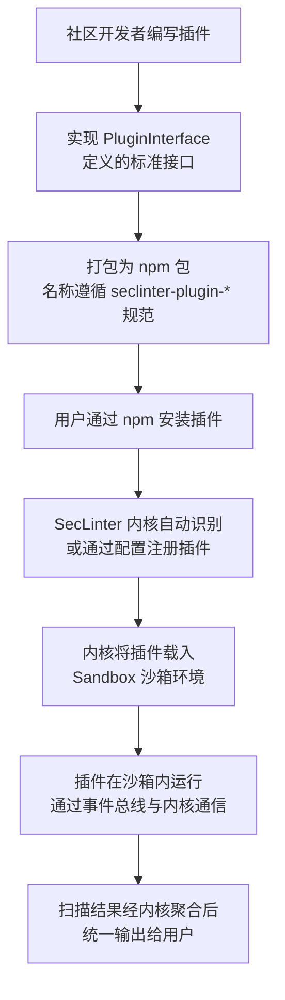

为你的 SecLinter 安全工具包设计一个插件系统，是让其保持活力和强大的关键。下面我将为你提供一个结合了现代插件架构最佳实践的设计方案，它强调**安全性**、**扩展性**和**开发者友好性**。

### 🧩 一、核心设计原则

1.  **解耦与扩展性**：核心系统只负责插件管理、生命周期调度和提供基础服务。所有具体的安全检测规则都应作为独立插件存在，允许社区开发者在不修改核心代码的情况下扩展功能。
2.  **安全第一**：插件系统必须**隔离**和**容错**。一个插件的崩溃或安全漏洞不应影响核心工具或其他插件的运行。这对于安全工具来说至关重要。
3.  **约定优于配置**：提供清晰的接口规范、简单的开发模板和自动化工具，降低社区贡献者的开发门槛。
4.  **性能与可控性**：支持插件的按需加载和卸载，避免不必要的性能开销。同时，核心系统应能监控插件的资源使用情况（如内存、CPU）。

### 🏗️ 二、插件系统架构设计

整个系统可以采用 **“内核 (Core) + 插件 (Plugin)”** 的架构，并引入 **沙箱 (Sandbox)** 机制来隔离插件运行环境。

| **系统层** | **职责** | **关键技术/实现** |
| :--- | :--- | :--- |
| **内核 (Core)** | 插件注册、生命周期管理、提供公共服务（如日志、配置、事件总线）、安全沙箱管理 | TypeScript 接口、依赖注入 |
| **插件 (Plugin)** | 实现具体的安全检测规则（如检测新的 XSS 向量、特定的敏感信息模式） | 实现标准接口、独立打包 |
| **沙箱 (Sandbox)** | 为插件提供隔离的执行环境，限制其访问权限，确保核心系统安全 | Node.js `vm` 模块、Proxy 代理 |

下面是该插件系统的运行流程：


### 📐 三、核心接口与类型定义

首先，在 `seclinter` 核心包中定义一套所有插件必须遵循的 TypeScript 接口。

```typescript
// src/core/pluginInterface.ts

/**
 * 插件元数据
 */
export interface PluginMeta {
  name: string;
  version: string;
  author?: string;
  description: string;
  // 该插件针对的扫描类型，如 'dependency', 'secret', 'header' 等
  target: string;
}

/**
 * 插件必须实现的核心方法
 */
export interface PluginInterface {
  /**
   * 初始化插件，内核会注入安全沙箱和工具函数
   */
  init(sandbox: Sandbox, helpers?: PluginHelpers): Promise<void>;

  /**
   * 执行扫描的主要逻辑，返回扫描结果
   */
  scan(projectPath: string): Promise<ScanResult[]>;

  /**
   * （可选）清理资源
   */
  cleanup?(): Promise<void>;
}

/**
 * 内核提供给插件的工具函数
 */
export interface PluginHelpers {
  logger: {
    info: (msg: string) => void;
    warn: (msg: string) => void;
    error: (msg: string) => void;
  };
// 可用于网络请求的安全客户端（自带速率限制、错误处理）
httpClient: SecureHttpClient;
// 其他工具...
}

/**
 * 统一的扫描结果格式
 */
export interface ScanResult {
  ruleId: string; // 规则唯一标识，如 'no-hardcoded-keys'
  plugin: string; // 插件名
  level: 'info' | 'low' | 'medium' | 'high' | 'critical';
  file?: string; // 问题所在文件
  line?: number; // 问题行号
  message: string; // 描述信息
  suggestion?: string; // 修复建议
}
```

### 📦 四、插件开发范式与沙箱隔离

社区开发者可以按照以下范式创建一个新的安全插件：

1.  **创建新项目**：
```bash
mkdir seclinter-plugin-super-xss
cd seclinter-plugin-super-xss
npm init -y
```
2.  **实现接口**：
```typescript
// src/index.ts
import { PluginInterface, ScanResult, PluginMeta } from 'seclinter';

const meta: PluginMeta = {
  name: 'seclinter-plugin-super-xss',
  version: '1.0.0',
  description: 'A plugin to detect advanced XSS vectors',
  target: 'xss',
};

class SuperXSSPlugin implements PluginInterface {
  async init(sandbox: Sandbox, helpers: PluginHelpers) {
    // 在沙箱中初始化，可以安全地访问受限的全局对象
    this.helpers = helpers;
    this.helpers.logger.info('SuperXSSPlugin initialized');
  }

  async scan(projectPath: string): Promise<ScanResult[]> {
    // 实现扫描逻辑...
    const results: ScanResult[] = [];
    // ... 检查代码 ...
    if (foundVulnerability) {
      results.push({
        ruleId: 'super-xss-rule-1',
        plugin: meta.name,
        level: 'high',
        file: 'src/app.js',
        line: 123,
        message: 'Found potential advanced XSS vector',
        suggestion: 'Use output encoding library X',
      });
    }
    return results;
  }
}

export default SuperXSSPlugin;
export { meta };
```
3.  **内核使用沙箱加载插件**：
内核不应直接 `require` 插件，而应通过沙箱来执行插件代码。
```typescript
// src/core/sandbox.ts
import { NodeVM, VMScript } from 'vm2'; // 一个流行的用于创建沙箱的库

export class Sandbox {
  private vm: NodeVM;

  constructor() {
    this.vm = new NodeVM({
      // 严格限制可访问的模块
      require: {
        external: true, // 允许引入外部包
        builtin: ['path', 'fs'], // 只允许白名单内的内置模块
        root: './', // 限制范围
      },
      sandbox: {}, // 可注入一些安全的全局变量
      wrapper: 'commonjs',
    });
  }

  async runPlugin(pluginPath: string): Promise<PluginInterface> {
    try {
      // 在沙箱中运行插件代码
      const pluginCode = await fs.promises.readFile(pluginPath, 'utf-8');
      const pluginInstance = this.vm.run(pluginCode)();
      return pluginInstance;
    } catch (error) {
      throw new Error(`Failed to run plugin in sandbox: ${error.message}`);
    }
  }
}
```

### 🔧 五、插件注册与发现机制

为了让内核能发现并加载社区插件，可以采用以下方式：

1.  **约定命名**：社区插件应遵循命名约定 `seclinter-plugin-*`。
2.  **自动发现**：内核可以通过扫描 `node_modules` 中符合命名规则的包来发现插件。
```typescript
// src/core/pluginManager.ts
import { readdirSync } from 'fs';

export class PluginManager {
  async autoDiscoverPlugins(): Promise<void> {
    // 简化示例：遍历 node_modules 寻找符合前缀的包
    const modulesDir = 'node_modules';
    const dirs = readdirSync(modulesDir);
    const pluginPackages = dirs.filter(dir => dir.startsWith('seclinter-plugin-'));

    for (const pkgName of pluginPackages) {
      try {
        const pluginPath = require.resolve(pkgName);
        this.registerPlugin(pluginPath);
      } catch (error) {
        this.logger.warn(`Failed to load plugin ${pkgName}: ${error.message}`);
      }
    }
  }

  async registerPlugin(pluginPath: string): Promise<void> {
    // 1. 通过沙箱加载插件
    const pluginInstance = await this.sandbox.runPlugin(pluginPath);
    // 2. 调用插件的 init 方法
    await pluginInstance.init(this.sandbox, this.helpers);
    // 3. 存储插件实例，并按 target 分类
    this.plugins.set(pluginInstance.meta.name, pluginInstance);
  }
}
```
3.  **配置显式启用**：在 `seclinter.config.ts` 中，允许用户显式启用或禁用特定插件，提供灵活性。
```typescript
// seclinter.config.ts 或 .seclinterrc
export default {
  plugins: {
    // 启用自动发现的插件
    'seclinter-plugin-super-xss': true,
    // 明确指定本地插件路径
    './local-plugins/my-custom-rule.js': true,
    // 禁用某个插件
    'seclinter-plugin-some-rule': false,
  },
};
```

### 🛡️ 六、错误处理与熔断机制

借鉴 ByteTop 的设计，必须确保插件的错误不会影响核心系统。

1.  **Try-Catch 包装**：所有插件的 `init`、`scan` 方法调用都应用 `try-catch` 包装。
2.  **熔断机制**：如果一个插件连续多次失败，应将其自动禁用并标记为不健康，防止持续报错影响扫描体验。
```typescript
async runScan(projectPath: string) {
  for (const [name, plugin] of this.plugins) {
    try {
      const results = await plugin.scan(projectPath);
      this.handleResults(results);
      // 成功则重置错误计数
      this.pluginStatus.get(name).errorCount = 0;
    } catch (error) {
      this.logger.error(`Plugin ${name} failed: ${error.message}`);
      const status = this.pluginStatus.get(name);
      status.errorCount++;

      // 如果错误超过阈值，熔断，禁用该插件
      if (status.errorCount > 3) {
        status.healthy = false;
        this.logger.warn(`Plugin ${name} is disabled due to repeated failures.`);
      }
    }
  }
}
```

### 📢 七、社区支持与文档

为了让社区更容易贡献，你需要提供：

1.  **详细的开发者文档**：包括接口定义、示例代码、沙箱环境说明、调试方法等。
2.  **插件模板生成器**：创建一个 `create-seclinter-plugin` 脚手架工具，快速生成插件项目结构。
```bash
npx create-seclinter-plugin --target=secret --name=my-rule
```
3.  **测试与验证指南**：说明如何为插件编写 Vitest 测试用例，并集成到 SecLinter 的测试流程中。
4.  **审核与安全指南**：建立一套插件审核流程，特别是对于要求较高权限的插件，确保其代码质量和安全性。

### 💎 总结

为 SecLinter 设计一个成功的插件系统，关键在于在**灵活性**和**安全性**之间找到平衡。通过 **清晰的接口约定**、**安全的沙箱隔离**、**有效的错误处理** 和 **便捷的开发者工具**，你能构建一个强大的生态系统，让社区源源不断地为其注入新的安全检测能力，同时确保工具本身的核心稳定性和用户安全。

希望这个设计方案能为你提供清晰的实现路径。如果你在具体实现某个环节时遇到问题，我们可以继续深入讨论。