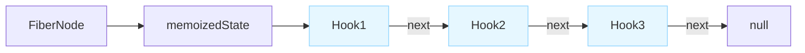

# React Hooks链表实现

这个包提供了React Hooks链表存储与更新系统的实现，基于React Fiber架构，模拟了React内部的Hooks机制。

## 功能特点

- 基于链表结构的Hooks存储系统
- 支持所有常用Hooks（useState, useReducer, useEffect, useMemo, useCallback, useRef）
- 批量更新处理机制
- Hooks调试和可视化工具
- 完整的Fiber节点支持

## 架构设计



## 使用方法

### 基本用法

```javascript
const { useState, useEffect, renderWithHooks, createFunctionComponentFiber } = require('hooks');

// 创建组件
function Counter(props) {
  const [count, setCount] = useState(0);

  useEffect(() => {
    console.log('Count changed:', count);
    return () => console.log('Cleanup');
  }, [count]);

  return { count, setCount };
}

// 创建Fiber节点
const fiber = createFunctionComponentFiber(Counter, {});

// 渲染组件
const result = renderWithHooks(fiber, Counter, {});

// 使用结果
console.log(result.count); // 0
result.setCount(1);
```

### 调试工具

```javascript
const { visualizeHooks, generateHooksDiagram } = require('hooks');

// 可视化Hooks链表
visualizeHooks(fiber);

// 生成Mermaid图表代码
const diagram = generateHooksDiagram(fiber);
console.log(diagram);
```

## Hooks实现原理

### Hook节点结构

```typescript
type Hook = {
  memoizedState: any,      // 当前状态值
  baseQueue: Update|null,  // 未处理的更新队列
  queue: UpdateQueue,      // 更新队列（含dispatch）
  next: Hook|null          // 下一个Hook指针
}

type UpdateQueue = {
  pending: Update|null,    // 待执行更新
  dispatch: (action)=>void // 更新触发器
}
```

### 更新机制

1. 组件首次渲染时，为每个Hook创建节点并构建链表
2. 状态更新时，创建更新对象并加入循环链表
3. 重新渲染时，按顺序遍历Hook链表，应用所有更新

## 高级特性

- **批量更新**：通过`batchedUpdates`合并多次状态更新
- **Hooks调用顺序检查**：确保每次渲染中Hooks的调用顺序一致
- **内存优化**：复用已有Hook节点，减少内存分配

## 参考资料

- [React Hooks源码解析](https://github.com/facebook/react/blob/main/packages/react-reconciler/src/ReactFiberHooks.js)
- [Fiber架构文档](https://github.com/facebook/react/tree/main/packages/react-reconciler)