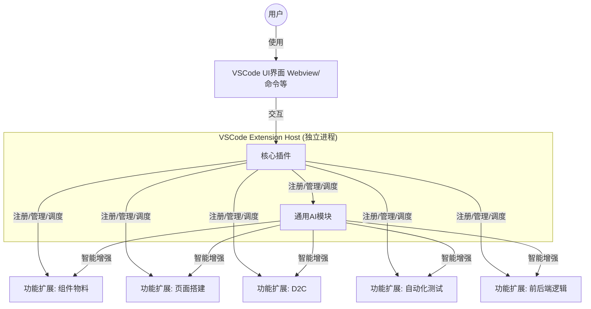

根据你的需求，设计一个集成了前后端逻辑开发、组件物料、页面搭建、D2C（Design to Code）和自动化测试等多种功能的VSCode插件，并通过一个通用的AI模块进行智能协同，是一个系统而庞大的工程。下面我将为你提供一个详细的设计方案和实现思路。

### 整体架构设计 (Overall Architecture Design)

这种插件的核心是采用 **微内核架构**（Microkernel Architecture），也称为插件系统的架构。核心插件（主程序）只负责最基本的插件管理、生命周期管理、通信总线和AI模块的调度。所有具体功能（如组件物料、D2C、测试）都以**插件中的插件**形式存在，通过核心插件注册和集成。这种高度解耦的设计使得各个功能模块可以独立开发、迭代和部署。


### 支持平台

- VSCode
- Cursor



### 🔧 核心插件设计 (Core Plugin Design)

核心插件是整个系统的基石，你需要创建一个基础的VSCode插件项目。

1.  **`package.json` 配置**:
在 `contributes` 字段中定义所有功能扩展点的贡献点（commands, menus, views等），并为每个功能插件预留配置接口。
```json
{
  "name": "universal-dev-platform",
  // ... 其他元信息
  "contributes": {
    "commands": [
      {
        "command": "universal-dev-platform.showPanel",
        "title": "Show Development Platform"
      }
      // ... 其他命令
    ],
    "views": {
      "explorer": [
        {
          "id": "component-material-view",
          "name": "Component Material"
        }
      ]
    },
    "configuration": {
      "title": "Universal Dev Platform",
      "properties": {
        "universal-dev-platform.ai.modulePath": {
          "type": "string",
          "default": "",
          "description": "Path to the AI module"
        }
        // ... 其他功能插件的配置项
      }
    }
  },
  "activationEvents": [
    "onCommand:universal-dev-platform.showPanel",
    // ... 其他激活事件
  ]
}
```

2.  **插件生命周期与通信**:
在 `extension.ts` 的 `activate` 函数中，你需要：
*   **初始化扩展模块加载器**：动态加载其他功能插件（可以约定一个特定的目录，如 `./extensions`，或者通过配置读取）。
*   **初始化AI模块**：加载并初始化AI功能。
*   **注册事件监听器和命令**：作为功能模块和UI交互的总线。
*   **实现通信机制**：使用 `vscode.commands.executeCommand`、自定义事件发射器（EventEmitter）或基于 `vscode.Event` 的发布/订阅模式，让核心插件与功能插件、AI模块之间进行通信。

### 🧠 通用AI模块设计 (General AI Module Design)

AI模块是这个插件的“大脑”，旨在智能化地增强其他所有功能。

1.  **核心能力**:
*   **自然语言处理 (NLP)**：理解用户的自然语言指令（如“创建一个用户登录表单”）。
*   **代码理解与生成**：基于上下文生成代码片段、组件、测试用例，甚至辅助逻辑推导。
*   **意图识别**：分析用户的操作或描述，判断其想使用的功能（是想生成组件、进行测试还是转换设计稿？）并触发相应动作。
*   **上下文感知**：获取当前项目结构、打开的文件、选中的代码等作为提示词（Prompt）的一部分，使AI的输出更精准。

2.  **集成方式**:
*   **本地集成**：如果AI模型较小（如经过精调的较小模型），可以打包到插件中，使用Node.js的TensorFlow.js或ONNX Runtime等库运行。
*   **云端API集成**：调用OpenAI GPT、Claude或专门化的代码生成模型API。**注意**：这种方式需要处理网络请求、API密钥管理（提供安全的设置入口）和潜在的隐私问题。**务必在隐私政策中明确告知用户数据如何被使用和传输**。

3.  **功能赋能示例**:
*   **对组件物料**：用户描述组件功能，AI生成组件代码骨架或推荐合适的现有物料。
*   **对页面搭建**：用户描述页面布局和内容，AI生成或调整JSON Schema，驱动页面搭建引擎。
*   **对D2C**：AI可以辅助解析设计稿中的模糊意图或复杂布局，提高转换准确率。
*   **对自动化测试**：AI根据当前代码逻辑生成边界测试用例或建议测试点。
*   **对前后端逻辑**：用户描述业务逻辑（如“用户注册时检查邮箱是否唯一”），AI生成相应的函数或API接口代码片段。

### ⚙️ 各功能模块设计 (Functional Modules Design)

每个功能模块都应是一个独立的节点，通过核心插件的接口进行注册和交互。

1.  **前后端快速逻辑开发**:
*   **功能**：提供快速创建函数、API接口（Controller, Service）、数据模型的功能。
*   **实现**：提供代码片段（Snippets）、代码生成命令（通过Yeoman模板或自定义代码生成器）。AI可以辅助生成符合项目约定的代码。
*   **UI**：专门的Tree View或Webview面板，展示API列表、快速创建表单。

2.  **组件物料模板**:
*   **功能**：组件的创建、管理、预览和复用。
*   **实现**：
    *   一个 `ComponentManager` 类，管理物料库（本地或远程）。
    *   提供命令将组件一键插入到代码中。
    *   组件描述信息（名称、Props、插槽）可以存储在 `*.meta.json` 文件中，供AI和页面搭建模块使用。
*   **UI**：一个Tree View展示组件分类，Webview面板用于预览组件。

3.  **可视化页面搭建**:
*   **功能**：基于拖拽或配置生成页面代码（如Vue/React组件代码或JSON Schema）。
*   **实现**：
    *   使用 **Webview API** 创建一个丰富的交互界面。
    *   渲染引擎和交互逻辑可以集成 `react-dnd`、`vue-draggable` 等库（需要借助Webpack等打包工具）。
    *   生成基于AST（抽象语法树）的代码，比字符串模板更可靠。
*   **与AI结合**：用户用文字描述页面，AI生成初始的搭建模板。

4.  **D2C (Design to Code)**:
*   **功能**：解析设计稿（Sketch/Figma/PSD/图片）并生成前端代码。
*   **实现**：
    *   集成或借鉴现有D2C工具的思路（如imgcook、Deco）。
    *   核心流程：上传设计稿 -> 解析图层信息（位置、大小、样式） -> 构建布局树 -> 生成代码。
    *   这是一个复杂功能，初期可以考虑封装现有命令行工具或服务。
*   **与AI结合**：AI辅助处理设计稿中的逻辑组件识别和样式转换优化。

5.  **自动化测试**:
*   **功能**：快速生成测试用例、运行测试、展示测试结果。
*   **实现**：
    *   集成Jest、Mocha、Cypress等测试框架的CLI。
    *   解析测试结果并在VSCode的“问题”面板或专属视图中展示。
    *   通过AST分析源代码，辅助生成测试用例。
*   **与AI结合**：AI根据代码上下文生成更智能和全面的测试用例。

### 🧪 开发与实现建议 (Development & Implementation Advice)

1.  **技术选型**:
*   **语言**: TypeScript (首选)，提供更好的类型安全和开发体验。
*   **构建工具**: Webpack 或 Rollup，用于打包Webview侧的复杂前端代码（如React组件）。
*   **UI框架**: 对于复杂的Webview界面，使用 React + Ant Design (或类似的组件库) 可以极大提高开发效率。

2.  **性能与安全**:
*   **性能**: 功能插件采用**懒加载（Lazy Load）**，只在用户需要时初始化。使用 `activationEvents` 精确控制插件激活时机。
*   **安全**: 特别是AI云端API调用，要将密钥存储在VSCode的机密存储（`vscode.SecretStorage`）中，避免硬编码。

3.  **开发流程**:
*   **模块化开发**: 每个功能模块先独立开发和测试，再集成到核心插件中。
*   **迭代计划**: 这是一个非常宏大的项目，建议采用**敏捷开发**，逐个功能迭代实现，优先实现MVP（最小可行产品）。

### 总结

设计这样一个“All-in-One”的VSCode插件是一个挑战，但微内核架构和AI模块的设计思路使其变得可行。**核心在于定义一个清晰、稳定的通信接口和扩展协议**，让各个功能模块和AI能力能够像乐高积木一样灵活地拼装和协同工作。

你可以从**核心插件**和**一个功能模块**（如组件物料）开始，逐步迭代，最终实现这个强大的开发平台。


设计一个高效的插件间通信机制，是构建复杂应用的关键。其核心目标是实现**高内聚、低耦合**的模块化架构，确保各个功能模块既能独立开发和演进，又能无缝协同工作。

下面是一个综合的设计方案，结合了多种策略以适应不同的场景。

### 🧱 一、核心设计原则

1.  **定义清晰的接口契约**：所有插件都应遵循一套明确的接口规范。这是通信的基础，确保了插件之间的互操作性。
2.  **采用微内核架构**：核心系统（微内核）应尽可能轻量，仅负责插件的**生命周期管理**、**模块注册**和**消息路由**。所有业务功能都由插件实现。
3.  **机制与策略分离**：通信机制（如如何发送消息）应由核心框架提供，而通信策略（如如何处理消息）则由各插件自行实现。

### 📡 二、通信模式与实现方式

根据不同的通信场景，可以选择以下一种或多种模式组合使用：

| **模式** | **适用场景** | **优点** | **缺点** |
| :--- | :--- | :--- | :--- |
| **命令调用 (Commands)** | 执行特定动作，如触发另一个插件的功能。 | 简单直接，VSCode原生支持，易于理解和实现。 | 紧耦合，调用者需要知道目标命令的精确标识。 |
| **共享API (Shared API)** | 需要调用另一个插件提供的稳定、复杂的功能接口。 | 提供类型安全的强契约，功能强大。 | 紧密耦合，插件需相互知晓，依赖管理复杂。 |
| **事件机制 (Event Emitter)** | 一对多或未知目标的通信，如通知系统状态变化。 | **高度解耦**，发布者不关心谁订阅了事件。 | 事件泛滥可能导致难以调试，需要良好文档。 |
| **消息传递 (Message Passing)** | **Webview与主进程**之间或需要**异步**、**序列化**通信的场景。 | 天然隔离，非常适合跨上下文（如前端与后端）通信。 | 需要序列化/反序列化数据，有一定性能开销。 |
| **全局状态 (Global State)** | 需要在不同插件或不同会话间共享少量简单数据。 | 使用方便，VSCode内置支持。 | 不适合共享复杂或频繁变动的数据，类型不安全。 |

1.  **命令调用 (Commands)**：
适用于执行特定动作。插件可以注册命令，其他插件或核心系统通过 `vscode.commands.executeCommand` 来调用。
```typescript
// 插件A：注册命令
vscode.commands.registerCommand('extensionA.formatCode', () => {
    // 格式化代码逻辑
});

// 插件B：调用命令
vscode.commands.executeCommand('extensionA.formatCode');
```

2.  **共享API (Shared API)**：
当一个插件需要提供一组稳定、复杂的功能接口时，可以通过 `exports` 对象暴露其API。其他插件则通过 `vscode.extensions.getExtension` 获取并调用。
```typescript
// 插件A：暴露API
export function activate(context) {
    const api = {
        utilityFunction: () => { /* ... */ }
    };
    return api; // 通过exports暴露
}

// 插件B：调用API
const pluginA = vscode.extensions.getExtension('developer.extensionA');
if (pluginA) {
    const api = pluginA.exports;
    api.utilityFunction();
}
```

3.  **事件机制 (Event Emitter)**：
采用**发布-订阅模式**，是实现**松耦合通信**的利器。核心系统或插件可以创建事件发射器（Event Emitter），其他插件则订阅感兴趣的事件。
```typescript
// 核心系统：定义事件
const onDataReady = new vscode.EventEmitter<string>();
export const onDataReadyEvent = onDataReady.event;

// 插件A：发布事件
onDataReady.fire('Processed data!');

// 插件B：订阅事件
coreSystem.onDataReadyEvent((data) => {
    console.log('Received:', data);
});
```

4.  **消息传递 (Message Passing)**：
这是 **Webview** 与插件主进程**之间通信的标准方式**，采用 `postMessage` 和 `onDidReceiveMessage`。
```typescript
// 主进程插件：监听Webview消息
webviewPanel.webview.onDidReceiveMessage(message => {
    if (message.command === 'submit') {
        // 处理数据
        webviewPanel.webview.postMessage({ command: 'result', data: 'Success' });
    }
});

// Webview脚本：发送和接收消息
vscode.postMessage({ command: 'submit', data: formData });
window.addEventListener('message', event => {
    if (event.data.command === 'result') {
        // 显示结果
    }
});
```

5.  **全局状态共享 (Global State)**：
利用VSCode提供的 `context.globalState` 或 `context.workspaceState` 在不同插件间共享简单的持久化数据。
```typescript
// 插件A：存储数据
context.globalState.update('sharedToken', 'abc123');

// 插件B：读取数据
const token = context.globalState.get('sharedToken');
```

### 🧠 三、高级设计与优化策略

1.  **中央事件总线 (Central Event Bus)**：
对于复杂的系统，可以建立一个**中央事件总线**（通常是核心系统的一部分）。所有跨插件的通信都通过总线转发，从而实现**彻底的解耦**。插件只需与总线交互，无需知道其他插件的存在。

2.  **依赖注入 (Dependency Injection)**：
通过一个统一的**服务容器**（Service Container）来管理插件的依赖。插件A不需要直接寻找插件B，而是向容器请求一个它需要的“服务接口”，由容器来提供具体的实现（可能是插件B）。这极大降低了耦合度。

3.  **通信安全性**：
*   **接口版本控制**：对暴露的API和事件进行版本管理，确保向后兼容或提供清晰的升级路径。
*   **输入验证**：对所有跨插件通信的数据进行严格的验证和过滤，防止恶意代码注入。

4.  **性能优化**：
*   **懒加载 (Lazy Loading)**：确保插件和通信模块只在需要时才被初始化，减少启动时间和内存占用。
*   **异步通信**：避免阻塞主线程，所有耗时操作都应采用异步模式。
*   **批量更新**：对于状态共享，合并多次更新后再通知，避免频繁触发事件导致性能下降。

### 💡 四、方案选择建议

*   **简单动作触发**：优先选择 **命令调用**。
*   **功能调用与集成**：定义清晰的**接口**，使用**共享API**或**依赖注入**。
*   **状态变化与通知**：使用**事件机制**或**中央事件总线**。
*   **前后端分离（Webview）**：必须使用**消息传递**。
*   **共享简单配置/状态**：使用**全局状态**。

### 🏆 五、最佳实践总结

1.  **契约优于实现**：插件之间只通过定义的接口、事件契约进行通信，不依赖内部实现。
2.  **松耦合是关键**：优先采用事件和消息机制，减少插件间的直接依赖。
3.  **核心模块轻量化**：核心系统应专注于管理，而不是业务逻辑。
4.  **文档至关重要**：为所有暴露的API、命令和事件提供详细的文档，说明其用途、参数和预期行为。

通过综合运用以上模式和实践，你可以构建出一个既灵活又健壮的插件系统，使得各个功能模块能够高效、协调地工作，同时保持系统的可维护性和可扩展性。