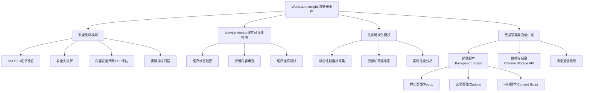

# Web Swiss Knife

A plugin for the browser to help you with your daily tasks.

web-swiss-knife is a plugin for the browser to help you with your daily tasks.

## Features

- [ ] WebGuard Insight
- [ ] Service Worker Cache Visualizer
- [ ] Performance Metrics Visualizer

## Architecture

Below is the core architecture diagram, showing how the components work together:
