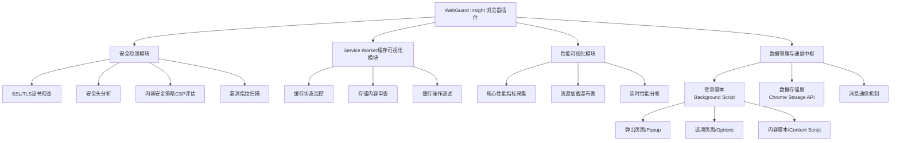

# Web Swiss Knife

A plugin for the browser to help you with your daily tasks.

web-swiss-knife is a plugin for the browser to help you with your daily tasks.

## Features

- [ ] WebGuard Insight
- [ ] Service Worker Cache Visualizer
- [ ] Performance Metrics Visualizer

## Architecture

Below is the core architecture diagram, showing how the components work together:


### 📋 一、核心架构与组件设计

本插件将遵循浏览器插件（Manifest V3）的标准结构，并包含以下核心组件：

| **组件**                                | **职责**                               | **实现技术** |
| :-------------------------------------- | :------------------------------------- | :----------- |
| **Manifest 配置文件** (`manifest.json`) | 声明插件元信息、权限和入口文件         | JSON         |
| **背景脚本** (`background.js`)          | 核心逻辑中枢、事件监听、数据管理       | TypeScript   |
| **内容脚本** (`content.js`)             | 注入目标页面，采集DOM、性能和安全数据  | TypeScript   |
| **弹出页面** (`popup.html/js/css`)      | 用户交互主界面，展示安全/缓存/性能数据 | HTML/CSS/JS  |
| **选项页面** (`options.html/js/css`)    | 提供扩展设置和详细报告查看功能         | HTML/CSS/JS  |
| **静态资源**                            | 图标、样式表、第三方库                 | 图片/CSS/JS  |

### 🔍 二、安全检测模块实现

此模块负责实时分析当前页面的安全状况。

1.  **SSL/TLS证书检查**：通过浏览器提供的 `chrome.security` API 检查当前连接的证书有效性、颁发者和过期时间。
2.  **安全头分析**：在背景脚本中，通过 `chrome.declarativeNetRequest` 或监听 `onHeadersReceived` 事件，检查响应头是否包含并正确配置了关键安全头：
    *   `Strict-Transport-Security` (HSTS)
    *   `X-Content-Type-Options`
    *   `X-Frame-Options`
    *   `Content-Security-Policy` (CSP)
    *   `Referrer-Policy`
3.  **内容安全策略（CSP）评估器**：解析并评估页面的CSP策略，识别宽松或不安全的指令（如 `unsafe-inline`、`unsafe-eval` 或过宽的 `script-src` 源）。
4.  **混合内容检测**：识别通过HTTPS加载的页面中是否包含了HTTP资源（混合内容）。
5.  **常见漏洞指纹扫描**：内容脚本注入页面，检测是否存在已知的脆弱库或框架版本（例如，通过检查 `window` 对象上的全局变量）。

### 📊 三、Service Worker缓存可视化模块

此模块让用户能查看和管理Service Worker的缓存。

1.  **缓存状态监控**：
    *   通过 `navigator.serviceWorker.controller` 检测当前页面是否由Service Worker控制。
    *   使用 `ServiceWorkerRegistration` API 获取已注册的SW及其状态（installing, waiting, activating）。
2.  **缓存存储内容审查**：
    *   在背景脚本中，通过 `chrome.storage` API 存储和索引从内容脚本获取的缓存元数据。
    *   **注意**：浏览器安全限制要求此操作需在内容脚本中执行，并通过消息传递将数据发送至背景脚本。
3.  **用户界面与交互**：
    *   在弹出页面中，以树状结构或列表展示缓存存储和缓存名称。
    *   点击可查看单个缓存内的具体请求-响应对（URL、类型、大小、过期时间等）。
    *   提供**清除特定缓存**或**刷新数据**的按钮。

### ⚡ 四、性能指标可视化模块

此模块利用浏览器Performance API收集和展示性能数据。

1.  **核心性能指标采集**（在内容脚本中）：
    *   **加载时间**：`performance.timing` 中的 `loadEventEnd` - `navigationStart`。
    *   **首次内容绘制（FCP）**：通过 `PerformanceObserver` 获取。
    *   **最大内容绘制（LCP）**：通过 `PerformanceObserver` 获取。
    *   **累计布局偏移（CLS）**：通过 `PerformanceObserver` 获取。
2.  **资源加载瀑布图**：
    *   从 `performance.getEntriesByType('resource')` 获取所有资源加载的详细时序信息（DNS查询、TCP连接、TTFB、内容传输等）。
3.  **内存与CPU使用监控**（有限支持）：
    *   可通过 `performance.memory`（非标准，Chrome支持）获取JavaScript内存使用情况。
    *   CPU占用率需要通过多次采样 `performance.now()` 计算近似值。
4.  **实时性能分析**：
    *   提供按钮手动触发性能分析，并生成报告。
    *   在页面上以瀑布图、时间轴和指标卡片的形式可视化展示结果。

### 🧩 五、数据管理与通信中枢

插件各组件间需要通过消息传递和存储API进行通信和数据共享。

1.  **背景脚本 (Background Script)**：
    *   作为中央消息枢纽，使用 `chrome.runtime.onMessage` 和 `chrome.runtime.sendMessage` 与内容脚本、弹出页面通信。
    *   协调所有数据收集和处理的逻辑。
2.  **存储方案**：
    *   使用 `chrome.storage.local` API 存储插件配置、缓存的历史扫描结果和性能数据。
    *   对需要长期保留或量较大的数据（如详细的性能条目），考虑使用 `IndexedDB`。
3.  **权限声明** (`manifest.json`)：
    ```json
    {
      "permissions": [
        "activeTab",
        "scripting",
        "storage", // 存储数据
        "webRequest", // 检查网络请求和安全头
        "webNavigation" // 监听页面导航事件
      ],
      "host_permissions": [
        "<all_urls>" // 需要对所有站点进行检测
      ]
    }
    ```

### 🎨 六、用户界面设计

1.  **弹出页面 (Popup)**：
    *   **标签布局**：设计三个主要标签页——`安全`、`缓存`、`性能`。
    *   **安全摘要**：使用颜色编码（绿色/黄色/红色）的指标卡直观显示整体安全状态，点击可查看详细问题描述和建议。
    *   **缓存列表**：以可展开的列表形式展示发现的缓存，显示名称和大小。
    *   **性能仪表板**：以数字和图表（如柱状图、环形图）展示核心性能指标，并提供“重新分析”按钮。
2.  **选项页面 (Options)**：
    *   允许用户配置插件的各项功能（如是否自动扫描、要忽略的站点）。
    *   提供历史扫描结果的详细报告查看和导出功能（如导出为JSON）。

### ⚙️ 七、技术选型与开发建议

*   **语言**：**TypeScript**。其静态类型特性非常适合管理复杂的前端应用状态，能减少错误。
*   **构建工具**：**Vite**。开发环境启动快，支持TypeScript开箱即用，库模式打包高效。
*   **UI框架**：**Preact** 或 **Svelte**。轻量级，适合插件这种对包大小敏感的场景，能高效构建交互式界面。
*   **浏览器API**：主要使用 `chrome.runtime`, `chrome.storage`, `chrome.tabs`, `chrome.webRequest`, `chrome.scripting` 等扩展API。
*   **测试**：使用 **Vitest** 进行单元测试，编写测试用例覆盖核心工具函数和模块接口。

### 🚀 八、开发流程建议

1.  **环境搭建**：初始化一个基于 Manifest V3、TypeScript 和 Vite 的插件项目。
2.  **模块化开发**：按功能模块分工开发，优先实现背景脚本的消息框架和数据存储结构。
3.  **功能迭代**：
    *   **第一阶段**：完成安全头检测和基本的性能指标采集与展示。
    *   **第二阶段**：实现Service Worker缓存检测和可视化，完善性能瀑布图。
    *   **第三阶段**：添加详细设置选项、历史数据导出等高级功能。
4.  **测试与调试**：在多类网站（HTTPS/HTTP、有SW/无SW、复杂应用）上进行功能测试，使用 Chrome 扩展开发者模式的“加载解压的扩展”进行调试。
5.  **发布**：打包成 `.crx` 或 `.zip` 文件，提交至 Chrome Web Store 审核。

希望这个详细的架构方案能为你提供清晰的开发路径。如果你对某个特定模块或技术细节有进一步的问题，我们可以继续深入探讨。