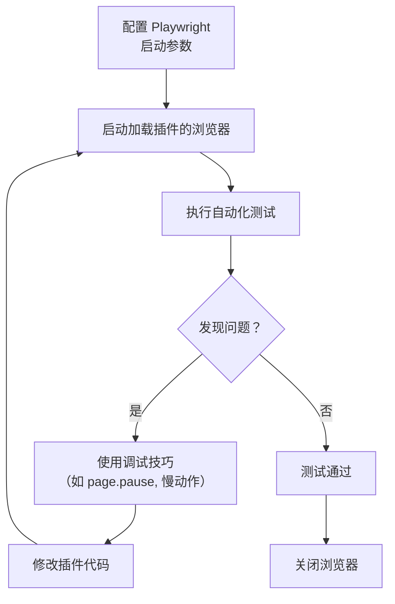

使用 Playwright 对现有的 Chrome 插件项目进行本地开发和调试，核心在于**让 Playwright 启动一个加载了你本地插件目录的浏览器实例**，并在此环境下进行自动化测试和交互。以下是具体步骤和代码示例。

### 核心配置：启动加载了本地插件的浏览器

关键在于在 `playwright.config.ts` 中或直接在使用 `browserType.launch` 时，通过 `args` 选项指定 `--disable-extensions-except` 和 `--load-extension` 参数。

**1. 指定插件路径和启动参数**

在你的 Playwright 测试文件（例如 `tests/extension.spec.ts`）中，这样启动浏览器：

```typescript
import { test, chromium } from '@playwright/test';

test('测试已加载的插件', async () => {
  // 启动浏览器，并加载位于指定路径的插件
  const browser = await chromium.launch({
    headless: false, // 设为 false 以便观察浏览器行为
    args: [
      `--disable-extensions-except=/path/to/your/extension/dist`, // 替换为你的插件项目根目录的绝对路径
      `--load-extension=/path/to/your/extension/dist` // 同上
    ]
  });

  const context = await browser.newContext();
  const page = await context.newPage();

  // 你的测试逻辑...
  await page.goto('https://example.com'); // 导航到目标页面，测试插件功能

  // 例如，测试插件的弹出页 (popup)
  // 获取插件的背景页或弹出页可能需要通过 page.backgroundPages() 或 page.popups() 等（具体API请查阅Playwright文档）

  await browser.close();
});
```

**重要提示**：
*   **路径替换**：请将 `/path/to/your/extension/dist` 替换为你本地 Chrome 插件项目**构建输出目录或源码目录的绝对路径**。例如，在 Windows 上可能是 `C:\Users\Username\projects\my-extension\dist`，在 macOS 或 Linux 上可能是 `/home/username/projects/my-extension/dist`。
*   **Manifest 版本**：确保你的插件项目使用的是 **Manifest V3**，因为 Playwright 对 V3 的支持最好。

### 常用调试技巧

**1. 启用无头模式和慢动作 (Slow Mo)**
在调试初期，建议显示浏览器窗口并降低操作速度，以便观察。
```typescript
await chromium.launch({
  headless: false, // 显示浏览器
  slowMo: 500, // 每个操作后延迟500毫秒
  args: [
    `--disable-extensions-except=/path/to/your/extension/dist`,
    `--load-extension=/path/to/your/extension/dist`
  ]
});
```

**2. 使用 `page.pause()` 进入调试模式**
在你的测试代码中插入 `page.pause()`，Playwright 会自动打开 Inspector，允许你逐步执行和检查。
```typescript
await page.goto('https://example.com');
await page.pause(); // 执行到这里会暂停，并打开调试器
// ... 后续代码
```

**3. 与插件页面交互**
要与插件的弹出页 (popup) 或选项页 (options page) 交互，你需要先定位到这些页面。这通常可以通过 `context.backgroundPages()` 或等待特定的弹出窗口事件来实现（具体方法请查阅 Playwright 关于处理弹出窗口和新页面的文档）。

### 进阶配置（可选）

**在 `playwright.config.ts` 中全局配置**
如果你希望所有测试都默认加载此插件，可以在配置文件中进行全局设置：
```typescript
import { defineConfig } from '@playwright/test';

export default defineConfig({
  use: {
    // ... 其他配置
    launchOptions: { // 全局启动选项
      args: [
        `--disable-extensions-except=/path/to/your/extension/dist`,
        `--load-extension=/path/to/your/extension/dist`
      ]
    }
  },
  // ... 其他配置
});
```

### 工作流程概要

以下是使用 Playwright 进行 Chrome 插件本地调试的工作流程概要：



### 💡 注意事项

*   **插件权限**：Playwright 启动的浏览器实例中的插件，其权限仍然由插件的 `manifest.json` 文件定义。
*   **浏览器选择**：此示例使用的是 `chromium`。你也可以尝试用 `chrome`（如果 Playwright 支持你系统上的 Chrome），但通常使用 Chromium 即可。
*   **热重载**：修改插件代码后，通常需要**重启 Playwright 启动的浏览器**才能生效，因为插件是启动时加载的。

通过以上配置，你就可以使用 Playwright 自动化测试和调试你现有的 Chrome 插件项目了。

测试 Chrome 插件中 Background Script 和 Content Script 之间的通信非常关键。由于它们运行在不同的上下文中，你需要模拟或触发这些交互并验证行为。下面为你介绍几种主流的测试方法、工具和最佳实践。

### 🔧 一、核心通信方式与测试关注点

Background Script (后台脚本) 和 Content Script (内容脚本) 之间主要通过以下两种方式进行通信，这也是你测试的重点：

| 通信方式 | 特点 | 适用场景 | 关键测试点 |
| :--- | :--- | :--- | :--- |
| **短期连接**<br>(`chrome.runtime.sendMessage` / `chrome.runtime.onMessage`) | 一次性请求-响应模式 | 简单的数据请求、执行一次性操作 | 消息能否正确发送和接收；响应数据是否正确；错误处理是否健全 |
| **长连接**<br>(`chrome.runtime.connect` / `port.postMessage`) | 建立持久连接，可多次双向通信 | 持续的数据交换（如日志流）、大文件分片传输、长时间的状态监听 | 连接能否正确建立；通过端口(`port`)的消息能否正确来回传递；连接超时或断开处理是否正常 |

### 🧪 二、测试策略与实用方法

你可以根据项目规模和阶段选择合适的测试方法。

1.  **手动测试与调试**：非常适合开发初期快速验证。
*   **使用 `console.log`**：在 Background Script 和 Content Script 的关键位置（如消息监听器、消息发送后）添加日志，然后在 Chrome 开发者工具中查看输出。
*   **查看 Background Script 日志**：访问 `chrome://extensions/`，找到你的插件，点击 **“服务工作者”** 或 **“背景页”** 链接来打开调试控制台。
*   **查看 Content Script 日志**：在你的目标网页上打开开发者工具 (F12)，Console 标签页会显示注入的 Content Script 的日志。Sources 标签页中也能找到并调试 Content Script 文件。

2.  **单元测试 (Unit Testing)**：用于独立测试脚本的逻辑，**需要模拟 Chrome API**。
*   **核心思想**：使用测试框架(如Jest)和模拟库(如`sinon-chrome`)来模拟 `chrome.runtime.sendMessage`, `chrome.runtime.onMessage` 等 API 的行为，让你能在无需启动浏览器的情况下测试消息处理逻辑。
*   **示例 (测试 Background Script 的消息监听器)**：
```javascript
// background.js (待测试代码)
chrome.runtime.onMessage.addListener((request, sender, sendResponse) => {
  if (request.action === 'getUser') {
    sendResponse({ name: 'Alice', id: 123 });
  }
});

// background.test.js (测试代码 - 以Jest为例)
const chrome = require('sinon-chrome'); // 需要先安装 sinon-chrome
// 在测试前加载你的background.js，这通常会重新注册监听器

test('background script 应响应 getUser 消息', () => {
  // 模拟一个请求消息
  const mockRequest = { action: 'getUser' };
  const mockSender = { tab: { id: 1 } };
  const mockSendResponse = jest.fn();

  // 模拟 chrome.runtime.onMessage 的监听器被调用
  // 假设你的监听器已通过某种方式暴露给测试文件
  myMessageListener(mockRequest, mockSender, mockSendResponse);

  // 验证 sendResponse 被正确调用
  expect(mockSendResponse).toHaveBeenCalledWith({ name: 'Alice', id: 123 });
});
```

3.  **集成测试 (Integration Testing)**：**在（无头）浏览器中启动你的插件**，模拟真实用户操作来测试整个通信流程。**Playwright** 或 **Puppeteer** 等浏览器自动化工具非常适合此场景。
*   **优势**：能更真实地模拟扩展环境，包括弹出页(popup)、选项页(options)与背景页/服务工作者(service worker)的交互。
*   **示例 (使用 Playwright 测试消息发送)**：
```javascript
const { test } = require('@playwright/test');

test('content script 应能向 background script 发送消息并获响应', async ({ page }) => {
  // 1. 加载一个测试页面，该页面已注入你的 content script
  await page.goto('https://example.com');

  // 2. 在页面上下文中执行代码，模拟 content script 发送消息
  const response = await page.evaluate(async () => {
    return new Promise((resolve) => {
      chrome.runtime.sendMessage({ action: 'getData' }, (response) => {
        resolve(response);
      });
    });
  });

  // 3. 断言来自 background script 的响应
  expect(response).toEqual({ data: 'some expected data' });
});
```
*   **启动配置**：通常需要通过 `--load-extension` 标志启动浏览器，并指定你的插件目录，以便在测试中加载插件。

4.  **端到端测试 (E2E Testing)**：这是最全面的测试，**模拟真实用户在与网页和插件交互时的完整流程**。同样可使用 Playwright 或 Puppeteer 等工具，覆盖从页面交互触发 Content Script 通信，到 Background Script 处理并可能更新插件界面（如弹出页）的整个链条。

### 📋 三、测试用例示例：短期通信

假设你的 Content Script 向 Background Script 发送一个 `getData` 请求，Background Script 返回特定数据。

1.  **Content Script 测试思路**：
*   在单元测试中，模拟 `chrome.runtime.sendMessage` 并断言它被以正确的参数调用。
*   在集成测试中，在页面上下文中调用发送消息的函数，并验证是否收到预期的响应。

2.  **Background Script 测试思路**：
*   在单元测试中，模拟 `chrome.runtime.onMessage.addListener` 被调用，并触发监听器回调，检查 `sendResponse` 是否以预期数据被调用。
*   以下是一个使用 Jest 和 `jest-chrome` (或其他模拟库) 的单元测试示例：
```javascript
// background.test.js
const chrome = require('sinon-chrome'); // 假设使用 sinon-chrome

// 假设这是你的背景脚本中的消息监听器
const messageHandler = (request, sender, sendResponse) => {
  if (request.action === 'getData') {
    sendResponse({ data: 'mock data from background' });
  }
};

test('background 应处理 getData 动作并返回数据', () => {
  const mockSendResponse = jest.fn();
  const mockSender = { tab: { id: 123 } };

  // 调用消息处理器
  messageHandler({ action: 'getData' }, mockSender, mockSendResponse);

  // 验证响应函数被正确调用
  expect(mockSendResponse).toHaveBeenCalledWith({ data: 'mock data from background' });
});
```

### 📋 四、测试用例示例：长连接通信

测试使用 `chrome.runtime.connect` 建立的持久连接，例如 Content Script 向 Background Script 持续发送日志。

1.  **建立连接测试**：
*   单元测试中，模拟 `chrome.runtime.connect`，断言它被调用，并返回一个模拟的 `port` 对象。
*   模拟 `port.onMessage.addListener` 和 `port.postMessage`，验证消息监听器是否设置正确。

2.  **消息流测试**：
*   模拟通过端口发送消息，验证另一端是否正确接收和处理。
*   示例 (测试 Background Script 端的连接处理)：
```javascript
// background.test.js (单元测试)
test('background 应处理通过端口的消息', () => {
  // 创建一个模拟的 port 对象
  const mockPort = {
    name: 'test-connection',
    onMessage: { addListener: jest.fn() },
    postMessage: jest.fn(),
    onDisconnect: { addListener: jest.fn() }
  };
  const mockListener = (msg) => {
    if (msg.type === 'log') {
      mockPort.postMessage({ received: true });
    }
  };
  mockPort.onMessage.addListener.mockImplementation(mockListener);

  // 模拟 chrome.runtime.onConnect 的监听器被触发
  // 假设你的连接处理器已暴露
  myConnectionHandler(mockPort);

  // 模拟通过端口发送一条消息
  const testMessage = { type: 'log', data: 'test log entry' };
  const messageListener = mockPort.onMessage.addListener.mock.calls[0][0];
  messageListener(testMessage);

  // 验证 background 是否通过端口返回了响应
  expect(mockPort.postMessage).toHaveBeenCalledWith({ received: true });
});
```

### 🛠️ 五、工具推荐

*   **Jest**: 非常流行的 JavaScript 测试框架，适合单元测试，配合模拟库使用。
*   **Sinon.js + sinon-chrome**: 常用于模拟 Chrome API。
*   **Playwright**: 强大的浏览器自动化工具，非常适合进行集成测试和端到端测试，能加载插件并进行测试。
*   **Puppeteer**: 与 Playwright 类似，也是常用的浏览器自动化工具。
*   **Chrome DevTools**: 不可或缺的**手动调试**工具，用于查看 console 日志、设置断点、检查网络请求等。

### 💡 六、最佳实践与注意事项

*   **测试尽可能独立**：单元测试应只关注自身脚本的逻辑，充分模拟外部依赖（如 Chrome API）。
*   **重视异步处理**：Chrome 的 messaging API 是异步的。确保你的测试框架能妥善处理异步操作（如使用 `async/await`）。
*   **清理测试状态**：避免测试间相互影响（例如，在 `afterEach` 中重置模拟函数）。
*   **模拟错误场景**：测试网络错误、超时、无效消息等情况下的脚本行为，确保其健壮性。
*   **安全考虑**：测试时应对消息来源 (`sender`) 进行验证，确保只有预期的标签页或扩展才能与你的 Background Script 通信。

---

**总之**，测试 Chrome 插件通信需要结合多种方法。从**手动调试**和**单元测试**（快速反馈）到**集成测试**和**端到端测试**（真实环境验证），根据你的需求选择合适的策略和工具，才能有效保证插件通信的可靠性。

希望这些信息能帮助你更好地测试 Chrome 插件的通信功能！如果你在特定工具的使用或测试场景上遇到更具体的问题，我很乐意提供更多细节。