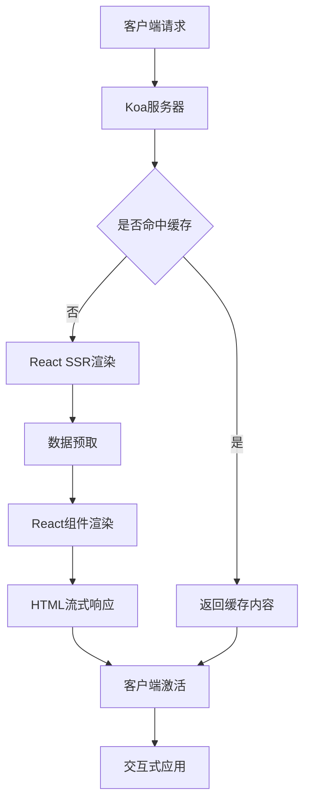
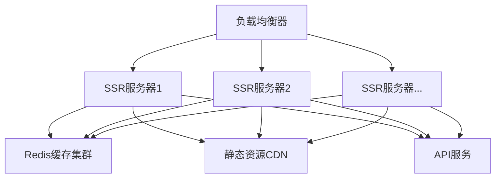

# React 19 + Koa + TypeScript 高性能SSR服务实现

## 1. 技术架构

### 1.1 核心技术栈
- **前端框架**: React 19
- **服务端框架**: Koa 2
- **开发语言**: TypeScript
- **构建工具**: Vite 6
- **包管理工具**: pnpm

### 1.2 架构设计




### 1.3 性能优化设计
1. **流式渲染**: 利用React 19的流式SSR功能
2. **多级缓存**: 页面级、组件级、数据级缓存
3. **并发模式**: 利用Node.js集群模式处理高并发
4. **懒加载**: 组件和数据的懒加载
5. **资源优化**: 静态资源压缩、CDN分发

## 2. 项目结构

```
ssr/
├── src/
│   ├── client/                # 客户端入口
│   │   └── entry-client.tsx
│   ├── server/                # 服务端代码
│   │   ├── middleware/        # Koa中间件
│   │   │   ├── cache.ts       # 缓存中间件
│   │   │   ├── render.ts      # SSR渲染中间件
│   │   │   └── error.ts       # 错误处理中间件
│   │   ├── utils/             # 工具函数
│   │   │   ├── stream.ts      # 流处理工具
│   │   │   └── cache.ts       # 缓存工具
│   │   ├── config.ts          # 服务器配置
│   │   ├── cluster.ts         # 集群模式实现
│   │   └── index.ts           # 服务器入口
│   ├── shared/                # 前后端共享代码
│   │   ├── App.tsx            # 应用根组件
│   │   ├── routes.ts          # 路由配置
│   │   └── store.ts           # 状态管理
│   ├── components/            # 页面组件
│   │   ├── Home.tsx           # 首页组件
│   │   ├── About.tsx          # 关于页面组件
│   │   └── NotFound.tsx       # 404页面组件
│   └── entry-server.tsx       # 服务端入口
├── public/                    # 静态资源
├── dist/                      # 构建输出
├── tests/                     # 测试文件
├── vite.config.ts             # Vite配置
├── tsconfig.json              # TypeScript配置
├── tsconfig.server.json       # 服务端TypeScript配置
└── package.json               # 项目依赖
```

## 3. 核心功能实现

### 3.1 SSR渲染流程
1. 客户端请求到达Koa服务器
2. 检查缓存，如命中则直接返回
3. 未命中缓存时，执行React SSR渲染流程
4. 数据预取：根据路由获取所需数据
5. 使用React的renderToPipeableStream进行流式渲染
6. 将HTML流式发送到客户端
7. 客户端接收HTML并进行激活(Hydration)
8. 应用变为可交互状态

### 3.2 高性能设计

#### 3.2.1 多级缓存策略
- **页面级缓存**: 完整HTML页面缓存
- **组件级缓存**: 缓存重复使用的组件渲染结果
- **数据级缓存**: 缓存API响应和数据查询结果
- **缓存策略**: LRU算法 + TTL过期时间

#### 3.2.2 集群模式
利用Node.js的cluster模块创建多进程应用，充分利用多核CPU：
- 主进程负责请求分发
- 子进程处理实际渲染工作
- 进程间通信共享缓存状态

#### 3.2.3 流式渲染
使用React 19的`renderToPipeableStream`实现流式渲染：
- 更快的首屏内容展示
- 优先渲染关键路径内容
- 支持Suspense和并发特性

#### 3.2.4 性能监控
- 请求响应时间监控
- 内存使用监控
- 缓存命中率监控
- 错误率监控

### 3.3 错误处理
- 全局错误边界捕获React渲染错误
- 服务端错误日志记录
- 优雅降级策略：SSR失败时回退到CSR

## 4. API设计

### 4.1 服务端渲染API
```typescript
interface SSROptions {
  url: string;              // 请求URL
  template: string;         // HTML模板
  manifest?: Record<string, string[]>;  // 资源清单
  preloadedState?: object;  // 预加载状态
  context?: object;         // 上下文对象
}

interface SSRResult {
  html: ReadableStream;     // HTML流
  state: object;            // 状态对象
  head: {                   // 头部信息
    title: string;
    meta: string;
    links: string;
    scripts: string;
  };
}

function renderToStream(options: SSROptions): Promise<SSRResult>;
```

### 4.2 缓存API
```typescript
interface CacheOptions {
  ttl: number;              // 过期时间(ms)
  maxSize: number;          // 最大缓存项数
  namespace?: string;       // 缓存命名空间
}

interface CacheManager {
  get<T>(key: string): Promise<T | null>;
  set<T>(key: string, value: T, ttl?: number): Promise<void>;
  delete(key: string): Promise<void>;
  clear(): Promise<void>;
  stats(): Promise<{
    hits: number;
    misses: number;
    size: number;
    hitRate: number;
  }>;
}

function createCache(options: CacheOptions): CacheManager;
```

## 5. 部署与扩展

### 5.1 部署架构




### 5.2 扩展性设计
- **水平扩展**: 增加服务器节点
- **垂直扩展**: 增加单机资源
- **微服务架构**: 将SSR服务拆分为多个微服务
- **按需加载**: 动态导入组件和路由

### 5.3 监控与告警
- 使用Prometheus收集性能指标
- Grafana可视化监控面板
- 配置关键指标告警阈值

## 6. 开发与测试

### 6.1 开发流程
1. 本地开发使用Vite的开发服务器
2. SSR模式下的热更新支持
3. TypeScript类型检查

### 6.2 测试策略
- 单元测试: 组件、工具函数
- 集成测试: SSR渲染流程
- 性能测试: 负载测试、并发测试
- E2E测试: 完整用户流程测试

## 7. 安全考虑
- XSS防护: 内容转义
- CSRF防护: 令牌验证
- 输入验证: 参数校验
- 依赖安全: 定期更新依赖

## 8. 启动与配置指南

### 8.1 环境要求
- Node.js 18+
- pnpm 8+

### 8.2 开发环境启动
```bash
# 安装依赖
pnpm install

# 开发模式启动
pnpm dev

# 构建
pnpm build

# 生产环境启动
pnpm start
```

### 8.3 配置选项
可通过环境变量或配置文件设置：
- `PORT`: 服务器端口
- `NODE_ENV`: 环境(development/production)
- `CACHE_TTL`: 缓存过期时间
- `WORKERS`: 工作进程数量