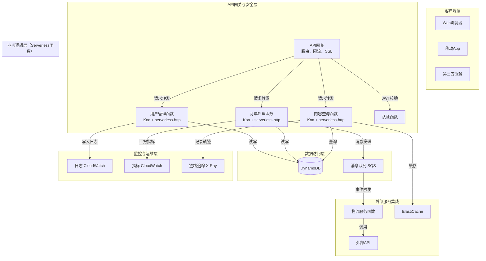

基于你提出的需求，我为你设计一个基于 Node.js + Koa 的 Serverless 技术方案。此方案综合了业界实践，注重高内聚低耦合、高可用性与高扩展性。

# 基于 Node.js + Koa 的 Serverless 完整技术方案

## 1 技术选型

综合你的需求及业界实践，核心技术与平台选择如下：

| **组件类型**       | **技术选型**                                                                 | **选型依据与说明**                                                                                                                                |
| :----------------- | :--------------------------------------------------------------------------- | :------------------------------------------------------------------------------------------------------------------------------------------------ |
| **Serverless 框架**  | Serverless Framework                                                         | 开源且生态丰富，支持多云部署（AWS、Azure、阿里云等），提供一致的开发和部署体验，插件生态系统强大 。                                       |
| **Node.js Web 框架** | Koa.js                                                                       | 轻量级、基于异步async/await，洋葱圈模型中间件机制，适合构建高效且可维护的API 。                                                 |
| **云平台提供商**     | **AWS Lambda** (主推) / **阿里云函数计算** (国内备选)                            | AWS Lambda 生态成熟，支持语言版本多，全球区域覆盖广 。阿里云函数计算国内访问速度快，符合国内监管要求 。                 |
| **Serverless适配库** | serverless-http                                                            | 将Koa应用转换为Serverless函数处理的库，兼容性好，支持多种事件触发器 。                                                                     |
| **数据库**           | **Amazon DynamoDB** (Serverless NoSQL) / **阿里云表格存储（Table Store）**        | 无缝集成Serverless，按需付费，自动扩展，适合非结构化数据 。关系型数据库可选**Amazon Aurora Serverless**或**阿里云PolarDB**（需配置VPC）。 |
| **认证与安全**       | JWT (JSON Web Tokens)                                                        | 无状态认证，适合Serverless架构，减少会话状态管理 。                                                                                      |
| **监控与可观测性**   | **AWS CloudWatch** / **阿里云日志服务** + **X-Ray** (AWS) / **ARMS** (阿里云) | 内置日志、指标收集和链路追踪能力，用于监控函数性能、调用链和故障诊断 。                                                                     |

**其他考量：**
*   **冷启动优化**：优先选择支持 `Provisioned Concurrency`（预置并发）的平台（如AWS ），或通过优化代码（减小包体积、精简依赖）降低影响。
*   **开发工具**：AWS SAM（Serverless Application Model）或Serverless Framework CLI，用于本地测试和部署 。

## 2 项目架构说明与设计

### 2.1 架构原则
*   **高内聚低耦合**：按业务域划分函数，每个函数职责单一；通过事件和消息进行异步通信。
*   **高可用**：依托云平台跨可用区部署、自动故障转移和弹性伸缩能力。
*   **高扩展**：利用Serverless函数和托管服务的自动水平伸缩特性；采用无状态设计。

### 2.2 系统架构图

### 2.3 架构组件详解

*   **API网关层**：所有外部请求首先经过API网关。它负责路由、协议转换、限流、认证（可集成JWT初步验证）等，将请求映射到对应的Serverless函数 。
*   **业务函数层（FaaS）**：
    *   这是核心业务逻辑承载层。每个函数对应一个特定的业务领域（如`用户服务`、`订单服务`）。
    *   每个函数内部是一个**独立的Koa应用**。使用`serverless-http`库包装Koa app，使其能处理Lambda函数的事件格式 。
    *   函数之间应**避免直接同步调用**，通过事件、消息或API网关进行解耦，确保各自的独立性和扩展性。
*   **数据层**：
    *   使用**DynamoDB**等Serverless数据库，其自动扩展特性与FaaS模式完美匹配。
    *   **重要**：在函数中，**不要**在每次调用时创建新的数据库连接。利用Lambda的执行上下文重用（在函数handler外部初始化连接池），并通过环境变量配置连接参数 。
*   **异步处理与集成**：
    *   耗时操作（如发送邮件、处理图像）应通过**消息队列（如SQS）** 异步触发另一个函数处理，从而加速主函数的响应。
    *   使用云平台提供的**事件源映射**（如S3事件触发函数）来自动响应基础设施事件。
*   **安全架构**：
    *   **身份认证**：API网关可集成Cognito（AWS）进行用户池管理，或在Koa中间件中使用JWT验证逻辑 。
    *   **访问控制**：为每个函数分配最小权限的IAM角色，严格控制其对其他云资源的访问。
    *   **网络安全**：将函数部署到VPC内以访问私有资源（如RDS），但需注意这可能增加冷启动时间，需权衡。
*   **可观测性**：
    *   在`serverless.yml`中配置将函数的日志和指标自动发送到**CloudWatch**。
    *   使用**AWS X-Ray** SDK在Koa中间件中记录请求链路，便于分布式追踪和性能分析 。

## 3 方案优势与考量

### 3.1 优势
1.  **成本效益**：真正按执行付费，无闲置资源浪费 。
2.  **弹性与高可用**：无需人工干预，自动应对流量波动，并内置跨可用区容灾。
3.  **开发运维效率**：开发者聚焦业务代码，无需管理服务器；Serverless Framework标准化了部署流程 。
4.  **技术一致性**：沿用熟悉的Koa开发范式，迁移和开发成本低 。

### 3.2 需要关注与优化的点
1.  **冷启动延迟**：这是Serverless的常见挑战。可通过预置并发、优化代码包体积（tree-shaking）、选择轻量运行时（Node.js较新版本）来缓解 。
2.  **状态管理**：函数是无状态的。切勿在内存或文件系统中存储状态，所有状态应持久化到外部存储（数据库、S3、ElastiCache）。
3.  **本地测试与调试**：使用`serverless-offline`等插件在本地模拟Lambda和API网关环境进行开发和调试 。
4.  ** vendor锁定**：深度使用某云平台的特定服务（如DynamoDB）会带来一定的迁移成本。可通过抽象核心业务逻辑，或采用Serverless Framework等多云方案来减轻 。

## 4 部署与运维流程

1.  **环境隔离**：使用Serverless Framework的`--stage`参数（如`dev`, `staging`, `prod`）严格隔离不同环境。
2.  **CI/CD集成**：将部署流程集成到GitHub Actions等CI/CD工具中，实现自动化测试和部署 。
3.  **监控告警**：在CloudWatch中为函数错误率、持续时间等关键指标设置告警。

此方案为你构建了一个现代化、高性能且成本优化的Serverless后端架构。你可以根据实际业务场景，在此框架内填充具体的业务逻辑。

在现有的 Serverless 服务上扩展 React SSR（Server-Side Rendering）模块，能显著提升应用的首屏加载速度和搜索引擎优化（SEO）效果。由于 Serverless 的弹性扩缩和按需付费特性，它能为 SSR 提供成本低廉且高效的运行环境。

下面是如何规划和实施这一扩展的详细介绍。

### 🔧 一、React SSR 的核心实现方式

实现 React SSR 主要有两种方式，你可以根据团队的技术储备和项目需求进行选择。

1.  **使用成熟的框架（推荐）**：使用像 **Next.js** 这样的框架，它能极大简化 SSR 的开发配置。Next.js 内置了 `getServerSideProps` 等方法，让你可以轻松地在服务端获取数据并渲染页面。许多云厂商也为其提供了开箱即化的 Serverless 组件。
2.  **手动配置**：如果你需要更精细的控制，可以选择手动配置。这通常涉及使用 `express` 或 `koa` 作为服务器，利用 `react-dom/server` 的 `renderToString` 方法将 React 组件渲染为 HTML 字符串，并通过 `hydrate` 方法在客户端激活。但这要求你自行处理路由、数据获取和构建配置，复杂度较高。

### 🚀 二、与 Serverless 结合的部署要点

将 React SSR 应用部署到 Serverless 环境需要注意以下几点：

1.  **创建 Serverless 函数**：每个页面（或一组页面）的逻辑可以封装为一个 Serverless 函数。当接收到页面请求时，函数负责执行服务端渲染并返回完整的 HTML。
2.  **调整入口文件**：对传统的 Node.js SSR 应用进行轻微改造，使其符合云函数的入口规范。通常需要导出一个接收 `event` 和 `context` 参数的异步函数。
3.  **分离静态资源**：**强烈建议将静态资源（如 JS、CSS、图片）托管到对象存储（如 COS）并通过 CDN 加速**，而不是全部通过云函数输出。这能显著减轻函数压力、降低冷启动概率，并大幅提升资源加载速度。在 Next.js 中，可以通过配置 `assetPrefix` 实现。

### 📝 三、具体实现步骤

1.  **项目初始化与依赖安装**：
    *   在现有项目中安装 React、ReactDOM 以及 SSR 相关依赖。
    *   如果选用 Next.js，可以使用 `create-next-app` 直接初始化项目。

2.  **编写同构代码**：
    *   确保 React 组件**同构**，即一份代码可在服务端和客户端同时运行。避免在组件中使用浏览器独有的对象（如 `window`、`document`），除非在生命周期钩子如 `useEffect` 或 `componentDidMount` 中。
    *   在 Next.js 中，在 `page` 目录下创建页面组件，并使用 `getServerSideProps` 进行服务端数据获取。

3.  **配置 Serverless 部署**：
    *   使用 **Serverless Framework** 或 **云厂商提供的 CLI 工具**（如腾讯云的 Serverless CLI）进行部署。
    *   编写 `serverless.yml` 配置文件，指定函数入口、运行时环境、触发器（通常是 HTTP 触发器）等信息。

4.  **处理静态资源**：
    *   在构建后，将 `.next/static` 等静态资源目录上传至对象存储（如 COS）。
    *   在项目中配置静态资源的公共路径（如 Next.js 的 `assetPrefix`），指向 COS 的 CDN 地址。

5.  **部署与验证**：
    *   运行部署命令（如 `serverless deploy`）将应用部署到云端。
    *   访问生成的 URL，检查页面是否正确渲染，并可通过查看网页源代码验证 SSR 是否生效（能看到渲染好的 HTML 内容）。

### ⚙️ 四、性能优化与最佳实践

*   **缓存策略**：
    *   对渲染结果或获取的数据进行**缓存**（例如使用 Redis 或云函数自身的缓存机制），可以显著减少渲染时间和数据库查询压力，降低冷启动影响。
    *   对静态资源配置**强缓存**，对 HTML 文档配置**协商缓存**。
*   **降级方案**：做好**服务降级**预案。当 SSR 服务因某些原因（如高并发、内部接口超时）响应过慢或不可用时，应能自动降级为 CSR（客户端渲染），保证页面最基本的功能可用。
*   **监控与告警**：利用云平台提供的监控功能，关注函数的**冷启动时间**、**执行时间**、**错误率**等关键指标，并设置告警。

### ⚠️ 五、注意事项

*   **环境差异**：注意服务端和浏览器环境的差异。避免在服务端执行只有浏览器中才有意义的代码（如直接操作 DOM）。
*   **内存管理**：Serverless 函数通常有内存限制。确保你的渲染逻辑不会造成内存泄漏。
*   **成本考量**：虽然 Serverless 按需付费，但如果流量非常大，SSR 频繁执行产生的调用次数和资源消耗也可能带来可观成本。需结合缓存策略综合评估。

### 💎 总结

在 Serverless 架构上扩展 React SSR 服务，本质上是**将渲染工作负载从固定的服务器转移到可弹性伸缩的云函数上**，从而兼顾了 SSR 的技术优势和 Serverless 的运维与成本优势。

> 建议你从 Next.js 开始尝试，并优先使用现成的 Serverless 组件进行部署，这能帮你绕过许多复杂配置，快速上手。之后可以根据业务需求，再逐步探索更定制化的方案。